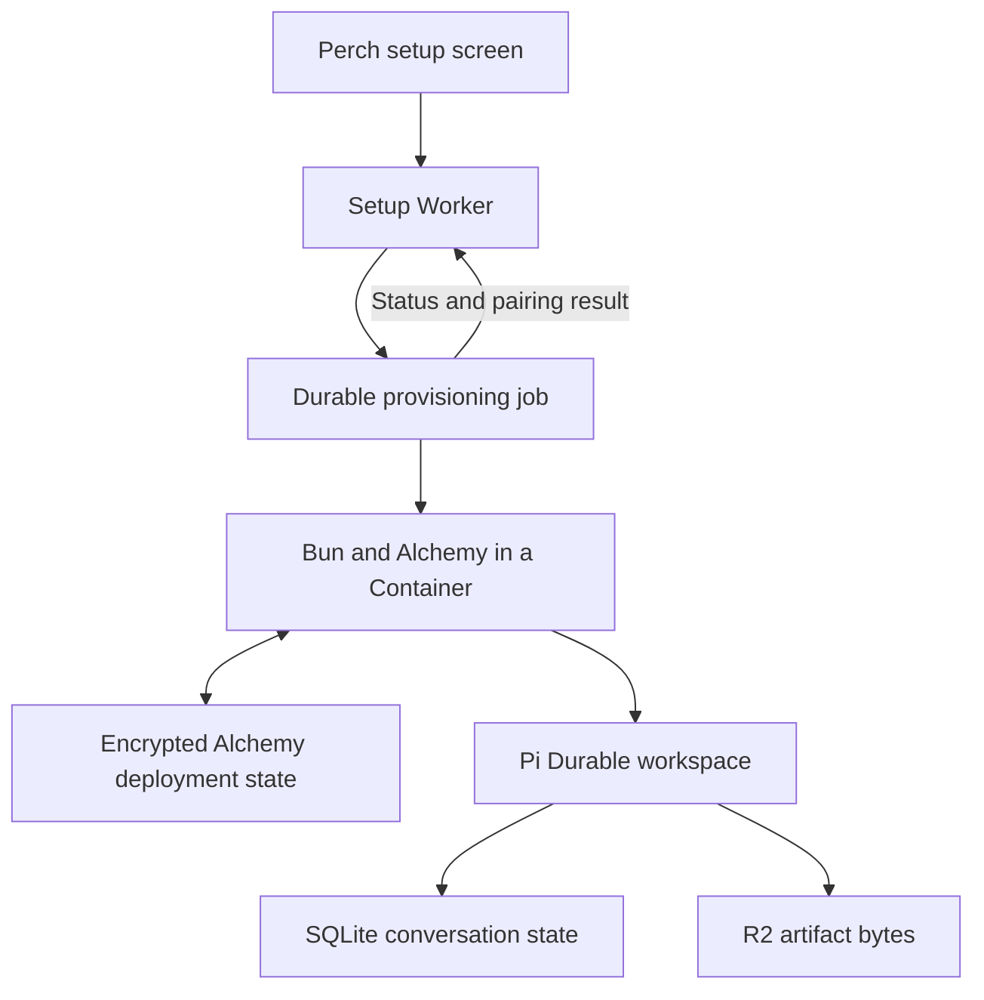

# On-demand Cloudflare provisioning with Alchemy

Research checked on 7 October 2026. **This is a proposed next layer for Perch;
the 0.6 release uses the tested Wrangler setup runner. No Alchemy deployment or
live Cloudflare provisioning was performed.**

## Recommendation

Perch can turn cloud setup into an app action backed by an Alchemy job. Run
the deployment engine under Bun in an on-demand Cloudflare Container. A setup
Worker accepts the request, a durable coordinator tracks progress, and the
completed job returns the existing workspace URL and device token.

Cloudflare explicitly supports starting containers from Worker code for
applications that need a full filesystem or a particular Linux runtime.
Using that environment for Alchemy is the proposed composition, not a claim
that an Alchemy-specific Cloudflare integration has been deployed here.
[Cloudflare Containers][containers]

| Meaning of runtime provisioning | Fit |
| --- | --- |
| A phone requests a new cloud workspace and a backend job applies its stack | Fits Alchemy's programmatic/CLI deployment model |
| A normal Worker handler imports the entire stock Alchemy deployment engine | Not a verified drop-in execution path in the versions inspected |
| A Worker calls management APIs to create a bucket or upload a prebuilt Worker | Feasible custom provisioning path; it must own reconciliation and credentials |
| A deployed Worker starts a new chat or agent instance | Use its existing Durable Object namespace and application state |
| A Worker loads generated JavaScript into a sandbox | Cloudflare Worker Loader provides a separate runtime code-execution primitive |

## Why the runner has a Bun environment

Alchemy v2's documented phases separate planning from request handling.
Binding declarations discover deployment requirements during planning; deployed
handlers receive clients for those resources. Selecting a Cloudflare state
store does not change where the deployment engine executes. [Phases][phases]

At inspected commit `507c6d53b2bd5c54e02756a58f79131d7f070e87`, package
`alchemy` is `2.0.0-beta.81`. The programmatic `Deploy.deploy` entry calls
`evalStack`. That function supplies the standard platform, file logging,
profile, and credential services. `PlatformServices` chooses Node or Bun,
including filesystem and child-process services; it has no stock Worker
platform branch. Inline Worker source can skip bundling, but does not remove
that deployment-engine setup. [Deploy source][deploy-source]
[Stack source][stack-source] [Platform source][platform-source]

The older async API is explicitly marketed as an embeddable provisioning
library. Its REST-backed resource operations, custom state stores, and inline
prebuilt Worker uploads make a limited edge adapter plausible. [v1 design][v1-design]

The inspected async package is `0.94.0`, commit
`ae168f2e206fc14e1f37fef3925ce2644bbf5014`. Its ordinary `alchemy(...)`
entry calls `AsyncLocalStorage.enterWith`, which Workers explicitly omits.
Its scoped callback path uses `run`, so a tailored adapter may avoid that
entry point, but still needs a dependency and state-store compatibility test.
No verified stock Worker-side provisioner was established. Do not mix v1 async
examples with v2 Effect APIs. [Async entry source][v1-entry] [Workers caveats][als]

## Proposed setup service

The setup service and pinned runner image need an initial deployment. They can
live in a Perch-operated account and provision a user's selected account with
that user's grant, or be installed as a user-owned setup service. The phone can
start subsequent jobs once that control service exists.

The job uses a trusted stack and validated configuration. The app can reconnect
to its status after closing, switching networks, or restarting. Publishing a
pairing result remains conditional on authenticated workspace health and
discovery, as it is in the current runner.

This design preserves the existing workspace contract. Alchemy would manage
infrastructure; the current native harness drivers and artifact readers would
consume the resulting endpoint. The provisioner does not make an OMP, OpenCode,
or Codex process durable by declaring its container.

### What belongs in each state store

| State | Owner |
| --- | --- |
| Resource identities, inputs, outputs, and reconciliation status | Alchemy state |
| Approved setup request, job ownership, progress, and final pairing result | Provisioning coordinator |
| Chats, model selections, operations, and agent continuation | Perch/Pi Durable |
| Generated file bytes | Artifact bucket |

Alchemy's Cloudflare store uses a Worker and SQLite Durable Object, with its
authentication token and encryption key in Cloudflare Secrets Store. It is
shared by stacks/stages in that account and requires a one-time bootstrap.
This is infrastructure state, separate from the assistant's conversation
database. [State store][state]

### Serialize deployment jobs

Use one active job per account, stack, and stage. Also serialize bootstrap and
upgrades of the shared account state service. The inspected Cloudflare store
performs individual resource get/set operations; it does not establish a lock
around a complete plan/apply run. The official CI example likewise serializes
deployments and disables cancellation of the in-flight run. [Store source][store-source]
[CI guide][ci]

A lost heartbeat is not proof that the old runner stopped. Confirm termination
before replacing an active runner. Treat a shared state bearer token as
account-wide state access: separate stage names do not create per-user
authorization boundaries.

### Keep bootstrap visible

The current Perch `setup:cloud --plan` performs no Cloudflare authentication or
provisioning. An Alchemy remote-state plan has a different first-run boundary:
its state backend may need creation before planning can complete. In inspected
v2 source, `--yes` also permits state-store creation or upgrades; even
`deploy --dry-run --yes` can therefore mutate that state infrastructure.
Include bootstrap resources in the reviewed setup job rather than describing
that command as an offline plan. [State-store initialization source][state-init]

## Credentials and deployment ownership

For deployment into the user's Cloudflare account, the job needs their account
ID and an authorized provisioning grant. Alchemy's CI provider accepts
`CLOUDFLARE_ACCOUNT_ID` and `CLOUDFLARE_API_TOKEN`; environment credentials take
precedence over a saved profile. The trusted runner receives credentials
through protected input, not command-line arguments. [Profiles][profiles]

Only selected model providers need model credentials. The app retains the
workspace credential after setup. An in-app Cloudflare OAuth experience is
separate work; the existence of Wrangler device login does not establish that
Perch has a registered cloud-account OAuth integration. Wrangler's own
`login --device` uses the OAuth Device Authorization Grant. [Wrangler login][login]

Hosting every customer inside a platform-owned account is another ownership
model. Workers for Platforms provides dispatch namespaces and routing for
persistent customer Workers. It is not required for a personal deployment into
the user's own Cloudflare account. [Workers for Platforms][platforms]

## Worker-only alternative and generated code

A setup Worker or Workflow can call Cloudflare's management API and upload a
prebuilt backend bundle. That avoids a Linux provisioning runner, but leaves
resource reconciliation, partial failure recovery, and ownership checks with
our code. The current setup script already implements some of that behavior.
[Worker upload API][upload]

Worker Loader serves a different need: executing dynamically supplied code
inside a separate Worker isolate. Durable Object Facets can give such code an
isolated SQLite database under a supervisor. These may be useful for agent
plugins and executable artifacts. They do not replace provisioning of the
supervisor, its bindings, or the workspace, and Pi Durable compatibility with
facets has not been tested. [Worker Loader][loader] [DO Facets][facets]

## Next implementation boundary

Keep the current configuration validation, workspace discovery, and pairing
result. Add a provisioner interface with review, apply, status, and explicit
cleanup operations. The Alchemy runner can implement that interface behind
the setup service. Pin its version and qualify partial-failure recovery before
replacing the current provisioning backend.

[containers]: https://developers.cloudflare.com/containers/
[phases]: https://alchemy.run/infrastructure-as-effects/phases/
[deploy-source]: https://github.com/alchemy-run/alchemy/blob/507c6d53b2bd5c54e02756a58f79131d7f070e87/packages/alchemy/src/Deploy.ts
[stack-source]: https://github.com/alchemy-run/alchemy/blob/507c6d53b2bd5c54e02756a58f79131d7f070e87/packages/alchemy/src/Stack.ts
[platform-source]: https://github.com/alchemy-run/alchemy/blob/507c6d53b2bd5c54e02756a58f79131d7f070e87/packages/alchemy/src/Util/PlatformServices.ts
[store-source]: https://github.com/alchemy-run/alchemy/blob/507c6d53b2bd5c54e02756a58f79131d7f070e87/packages/alchemy/src/Cloudflare/StateStore/Store.ts
[state-init]: https://github.com/alchemy-run/alchemy/blob/507c6d53b2bd5c54e02756a58f79131d7f070e87/packages/alchemy/src/Cloudflare/StateStore/State.ts
[state]: https://alchemy.run/state-store/
[ci]: https://alchemy.run/environments/ci/
[profiles]: https://alchemy.run/environments/profiles/
[login]: https://developers.cloudflare.com/workers/wrangler/commands/general/#login
[platforms]: https://alchemy.run/cloudflare/compute/workers-for-platforms/
[upload]: https://developers.cloudflare.com/api/resources/workers/subresources/scripts/methods/update/
[loader]: https://alchemy.run/cloudflare/compute/worker-loader/
[facets]: https://developers.cloudflare.com/dynamic-workers/usage/durable-object-facets/
[v1-design]: https://v1.alchemy.run/blog/2025-07-01-how-alchemy-is-different/
[v1-entry]: https://github.com/alchemy-run/alchemy-async/blob/ae168f2e206fc14e1f37fef3925ce2644bbf5014/alchemy/src/alchemy.ts
[als]: https://developers.cloudflare.com/workers/runtime-apis/nodejs/asynclocalstorage/#caveats
