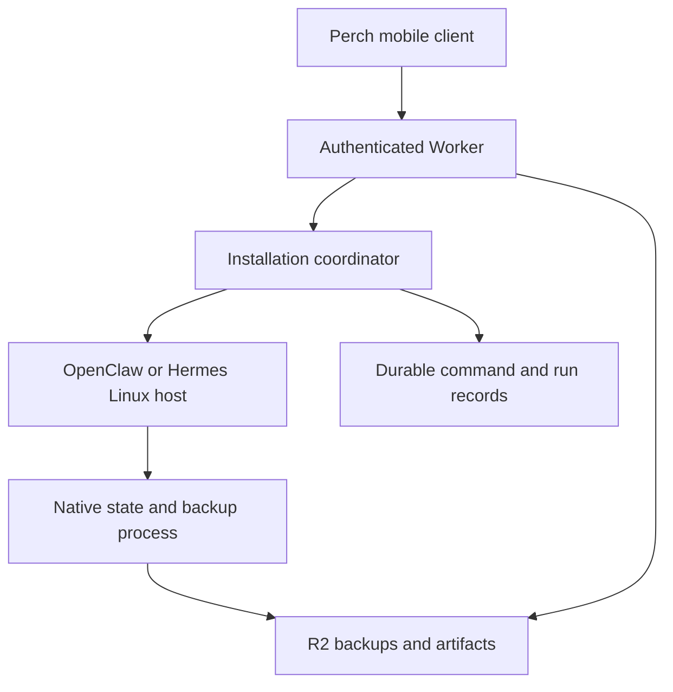

# Cloudflare hosting and recovery for assistant connections

**Research and proposed architecture · sources checked 7 October 2026 · no deployment or runtime test performed**

For an existing OpenClaw installation, the relevant Cloudflare starting point is now **OpenClaw's own experimental Containers template**, included in stable **v2026.9.8**. It runs the ordinary Gateway in Linux, with a Worker, a named Durable Object, and Litestream replication to R2. Cloudflare's older `moltworker` example is a separate, substantially older proof of concept. [OC-CF] [OC-PACKAGE] [MW]

For **Nous Research Hermes Agent**, the verified deployment foundation is its official Linux/Docker installation. A Cloudflare container adaptation is technically plausible, but this research did not find a first-party recipe for hosting Hermes itself on Cloudflare. Treat that route as an integration to build and validate. For the first Perch connection, a supervised homelab or ordinary Linux server preserves the documented deployment model. [H-DOCKER]

These are connections to assistants that own their conversations, tools, and recovery policies. They can coexist with the proposed **Pi Durable assistant owned by Perch** in [PI-DURABLE.md](PI-DURABLE.md). A Durable Object around an existing assistant supplies durable coordination; Pi Durable places the agent's own recorded execution inside that durability boundary. [CF-PI]

## Evidence and version boundaries

| Surface examined | Pinned or dated evidence | What this establishes |
| --- | --- | --- |
| OpenClaw's Cloudflare template | Stable `v2026.9.8`, commit `fc23bc864e4553c2d215e479eeec47b67a0bf943`; `scripts/cloudflare` and install guide read at that commit | A first-party, explicitly experimental deployment recipe exists |
| Template dependencies | `@cloudflare/containers` **0.3.7**, Wrangler **4.135.0**, Litestream **0.5.17** | This recipe uses the Container class, independently of the current Sandbox 1.0 examples [OC-PACKAGE] [OC-DOCKER] |
| Cloudflare Sandboxes | Current documentation updated **30 September 2026**; examples use Sandbox **1.0.0** | Linux execution, R2 directory backups/mounts, and public-beta filesystem snapshots are available building blocks [CF-SANDBOX] [CF-BACKUP] |
| Hermes | Source commit `0e37a439bda15ef3c28a4d20593964d7c6a527a6`, main observed **7 October 2026**; official Docker guide | A stock Linux image and persistent data-directory model, rather than a verified Worker port [H-DOCKER] [H-SOURCE] |
| Perch's Pi Durable evaluation | Pi Durable **1.0.4**, Agents SDK **0.26.0** | Existing local crash-test evidence is recorded in [PI-DURABLE.md](PI-DURABLE.md); it does not validate Cloudflare deployment |

The template's source revision and its deployed image are separate pins. Its Dockerfile requires the operator to supply an immutable official OpenClaw image digest; the template does not already contain a usable production image digest. [OC-DOCKER]

## OpenClaw: what the current template actually provides

The source contains a small hosting wrapper around the stock Gateway:

| Component | Verified behavior | Consequence for Perch |
| --- | --- | --- |
| Worker routing | All HTTP/WebSocket traffic resolves `openclaw-installation`, one stable Durable Object name [OC-WORKER] | Preserve this installation boundary when routing native clients |
| Container definition | `standard-2`, `max_instances: 1`, SQLite-backed Durable Object class [OC-WRANGLER] | The template represents one installation; it is not a multi-tenant service template |
| Gateway readiness | Port `8080`, helper checks `/healthz` [OC-CONTAINER] | Transport readiness and complete assistant/channel readiness are different checks |
| Database replication | Litestream watches `state/*.sqlite` and recursively watches `agents/**/*.sqlite`, with a one-second sync interval [OC-LITESTREAM] | Database writes reach R2 asynchronously; custom database roots need explicit coverage |
| Boot | Lists R2 replica objects, validates database paths, restores discovered databases, then launches Gateway under Litestream [OC-ENTRYPOINT] | Restoring a fresh instance precedes the assistant's own startup reconciliation |
| Secrets | Explicit allowlist copies configured Worker variables/secrets into the Linux process [OC-CONTAINER] | Additional providers or channels may require extending that list; stock credentials remain a host concern |
| Idle behavior | `OPENCLAW_WEBHOOK_ONLY=false` suppresses idle shutdown; `true` permits the helper's ten-minute idle stop [OC-CONTAINER] | An installation relying on socket channels or resident background services should remain awake |

**The template's durability is incomplete by design.** Its first-party guide identifies asynchronous replication loss, ephemeral non-database files, and possible brief overlap of old and replacement containers. A single Durable Object name is useful coordination, but the guide does not claim a transactional, zero-loss failover of the whole assistant. It also distinguishes this hosting template from an OpenClaw `cloudWorkers` execution provider. [OC-CF]

For a usable Perch-hosted installation, add a recovery path for the full state tree. OpenClaw's supported archive command captures its managed SQLite databases through SQLite's online backup API and includes configuration, credential files, configured agent roots, and workspaces. Store the archive outside the container. Restore stages a new tree; activation is an offline deployment action. Installed plugin dependencies may still need reinstalling. [OC-BACKUPS]

There is another coverage gap when **cold transcript storage** is used: some historical payloads live in immutable files referenced by SQLite. Litestream does not embed those files. The supported OpenClaw backup commands do; a plain database replica needs the corresponding cold archive files retained separately. Consequently, “the database restored” is insufficient evidence that all history and artifacts are available. [OC-BACKUPS]

The practical recommendation is to evaluate this current template with a disposable installation before moving a real assistant. Verify database recovery, full-state bootstrap/restore, native client reconnection, and the assistant's treatment of interrupted runs together. No such end-to-end test was performed here.

### The older Moltworker example

`cloudflare/moltworker` remains explicitly experimental and unsupported. At inspection, main was `7b00c1d7292190f2327e93bdcc7a0eabb0a26123`, dated **29 March 2026**; its Dockerfile pins OpenClaw **2026.3.23-2**, Sandbox **0.7.20**, and Node **22.22.1**. It is useful prior art, not evidence of current OpenClaw capability or the current Sandbox API. [MW] [MW-COMMIT] [MW-DOCKER]

Its README describes five-minute R2 synchronization, but the inspected source had moved persistence into Worker-side SDK backup/restore, with a manual backup route. The scheduled handler checks when to wake for cron jobs. Do not promise a five-minute recovery point from that README without verifying the deployed revision's actual backup schedule. [MW-PERSISTENCE] [MW-API] [MW-CRON]

## Hermes: a custom Cloudflare Linux adaptation

The official Hermes image separates application code from `$HERMES_HOME=/opt/data`. Its documented data directory contains configuration, credentials, memories, skills, scheduled jobs, logs, subprocess home directories, and the SQLite session store. Normal Docker deployment mounts persistent host storage there. [H-DOCKER] [H-SOURCE]

That Docker volume declaration does **not** establish persistent Cloudflare container storage. Current Cloudflare Containers documentation describes ephemeral local disks, filesystem snapshots, and FUSE/object-storage alternatives. The adaptation must explicitly restore `/opt/data`, preserve its permissions and ownership, and recreate the assistant's required process supervision. [CF-FAQ]

Hermes's image uses an entrypoint dispatcher and s6 supervision when it owns PID 1. Its dispatcher takes a fallback path without the supervised services when a hosting platform wraps the image under another init. A Cloudflare implementation should verify which entrypoint path runs, whether the chosen API/gateway service starts, and whether its child processes are reaped. This is an integration requirement, not a tested incompatibility. [H-ENTRYPOINT]

Keep Hermes's live SQLite files on a suitable local filesystem. The current Docker guide discusses WAL and shared-memory requirements and recommends native volumes where applicable. R2's mounted-file interface has different locking and atomic-replacement behavior, so treating an R2 mount as Hermes's normal live database volume is not a sound default. [H-DOCKER] [CF-MOUNT]

The Cloudflare-related Hermes material found in the checked documentation included skills for deploying generated Workers and sites, API/MCP integrations, and tunnels for webhooks. A skill that deploys a Worker does not demonstrate that the Hermes runtime itself runs in a Worker. No first-party Hermes-on-Cloudflare hosting recipe was verified. [H-DEPLOY-SKILL]

## Durable coordination and durable agent execution

| Layer | What can survive | What must still be recovered |
| --- | --- | --- |
| Native client connection | Host-owned conversation and run records, if the assistant committed them | Socket/SSE connection and native client projection |
| Durable Object coordinator | State explicitly written to its storage; recorded commands, native run IDs, backup references | In-memory controller state and any unacknowledged external handoff |
| Linux container | Files only when the instance survives, or when saved through an appropriate backup mechanism | Processes, open sockets, pending callbacks, browser sessions, and unfinished commands after replacement |
| Pi Durable with PiHarness | Recorded transcripts, inbox/tasks, and checkpoint-based continuation, with wake-up integration | Model/tool execution according to Pi's replay policy and external effects that need reconciliation |

The Cloudflare distinction follows the documented sandbox lifetime and snapshot behavior. The Pi distinction follows its harness integration, rather than the mere fact that it runs in a Durable Object. Current OpenClaw and Hermes have their own run-recovery features; their capabilities must be assessed from the selected native API and version, not inferred from this table. [CF-LIFETIME] [CF-SNAPSHOTS] [CF-PI]

For example, a coordinator can durably record “submit this command,” wake a container, and reconnect to its saved session. If the container dies after an external action completes but before the result is recorded, the coordinator still needs the assistant's run state and an external receipt or idempotency mechanism to decide what happened. Restarting the container cannot reveal the vanished process's local variables. This is a design consequence of the separate persistence boundaries.

PiHarness instead stores Pi's own working transcript, inbox, and task records in Durable Object SQLite and uses a lifecycle job to wake and reopen them after eviction. Its documented recovery distinguishes model retries, safe tool replay, and interrupted unsafe calls. It is beta, and it does not make all external tool effects exactly once. The existing [Perch evaluation](PI-DURABLE.md) remains the detailed comparison and local evidence. [CF-PI]

Wrapping an entire native assistant turn in one Workflow step does not turn that assistant's inner operations into checkpoints. Workflows resumes/retries the steps written in the Workflow; its guidance explicitly calls for small steps and idempotent effects. A useful wrapper is “submit once, retain native run ID, wait/reconcile status, export result,” with application logic for ambiguous outcomes. [CF-WORKFLOWS]

## Cloudflare persistence and lifetime boundaries

| Facility | Current documented boundary | Implementation implication |
| --- | --- | --- |
| Local container disk | Ephemeral; a new instance starts from its image unless a recovery mechanism supplies saved files [CF-FAQ] | Do not keep the only copy of completed work there |
| Container snapshot | Writable filesystem; excludes mounted directories, memory, and running processes; tied to its image version [CF-SNAPSHOTS] [CF-AUTOSAVE] | Restart the assistant and tools after restoration; preserve an independent upgrade/restore path |
| Snapshot availability | Requires `durable_object` scheduling; maximum **20 GB**; expires **30 days** after creation or last restore [CF-SNAPSHOTS] [CF-LIMITS] | This capability is separate from the stock OpenClaw template; do not silently add it to the template's guarantees |
| Directory backup to R2 | Saves a directory, returns a record with identity/size/hash; writers must stop for a consistent file set [CF-BACKUP] | Store the record durably and verify a restored generation before using it |
| R2 mount | Objects presented through `s3fs`; rename, locking, permissions, and replacement semantics differ from local disk [CF-MOUNT] | Use local disk for databases/build trees and object storage for exports/backups |
| Running instance | No fixed maximum runtime is promised, but platform events can stop active instances [CF-FAQ] | “Always on” is a lifecycle preference, not a process-survival guarantee |
| Inactivity timeout | New Durable Object Container API permits up to **six hours**; container CPU activity does not renew it; reapply it after a DO restart [CF-LIFETIME] | Keep a durable wake/check schedule while work remains |

The current Sandbox automatic-save example demonstrates alarms that checkpoint and stop an idle instance. It also warns that a background writer can leave a partial file in a snapshot. Its checkpoint interval is an example policy, not a platform promise to capture every write. A durable snapshot handle cannot make an inconsistent saved file consistent. [CF-AUTOSAVE]

For SQLite, use the application's supported backup operation or SQLite's online backup API/`VACUUM INTO`. A raw copy during a transaction can mix old and new pages; recovery journals must not be mismatched or discarded. When several databases and ordinary files form one application state, also define a consistent application generation or pause the relevant writers. [SQLITE-BACKUP] [SQLITE-CONSISTENCY]

### Wake-ups and background jobs

Durable Object alarms have **at-least-once** execution, one scheduled alarm per object, and bounded automatic retries. Alarm handlers have a **15-minute wall-time limit**. Persist pending work, make checks repeatable, and schedule the next wake explicitly; an in-memory timer is insufficient. Several responsibilities in one object must share its alarm scheduler. [CF-ALARMS] [CF-DO-LIMITS]

Use **Workflows** when the operation spans services or long external waits and benefits from explicit step records. Use **Queues** for independent export, indexing, cleanup, or delivery jobs. Queues also delivers at least once, so duplicate handling belongs in the job design. Neither product supplies arbitrary Linux process continuation. [CF-WORKFLOWS] [CF-QUEUES]

For stock assistants with internal scheduled work or persistent channel connections, retaining an awake host is initially simpler. A later sleep policy needs durable knowledge of the next required wake and reconciliation after a missed or repeated check. The phone's backgrounding must not be the event that ends the backend task.

## Proposed Perch architecture

This is a proposed transport and hosting design, not an implemented Perch adapter. For one existing assistant installation, use one ownership boundary around its shared native state; individual conversations can remain native sessions inside it. Do not start an additional general agent loop merely to control a connected assistant.

The coordinator should record accepted commands with stable IDs, forward the native protocol's idempotency identifiers where supported, retain native session/run IDs, and reconcile ambiguous submissions before issuing them again. On mobile reconnect, read authoritative native state and resume the event stream using that API's supported cursor or fresh snapshot behavior. Preserve native approvals and interruption states.

Make exported artifacts independent of both the conversation socket and the container lifetime. A proposed Perch manifest can retain artifact ID, origin run/session, filename, media type, revision/hash, and an R2 object reference. Upload completed bytes first, then publish their manifest; reconcile an interrupted upload/manifest pair by stable identity. Keep sensitive assistant backups separate from user-downloadable artifact objects.

| Hosting option | Recommended role | What remains to operate |
| --- | --- | --- |
| Homelab or Linux VM | First stock OpenClaw/Hermes connection | Supervisor, native persistent disk, consistent off-host backups, native API authentication |
| Homelab plus Cloudflare Tunnel | Remote reachability while retaining the existing assistant host | `cloudflared`, origin availability, and an authentication path supported by the mobile client |
| OpenClaw's Containers template | Focused experiment for one Cloudflare-hosted OpenClaw installation | Full-state recovery beyond Litestream, lifecycle policy, native adapter, upgrade rehearsal |
| Custom Hermes Container | Later option after the native adapter works | Entrypoint/supervision compatibility, data restore, SQLite consistency, run reconciliation |
| Pi Durable in a Durable Object | Perch's own assistant, following the existing design | Perch tools, approvals, artifact transport, and Linux execution when needed |

Cloudflare Tunnel establishes outbound connections from the origin and can expose its HTTP service without a public origin address. It supplies connectivity, while the native app still needs a compatible authentication/session flow. A home host remains the owner of execution and availability in that route. [CF-TUNNEL]

For the Cloudflare route, keep credentials in the host's private configuration. Current Sandbox outbound interception can inject a token into permitted API calls while keeping the raw token in the Worker; this is an option for custom tool integrations. It does not automatically replace a stock assistant's OAuth files or Litestream's S3 credentials. Snapshot and backup access must account for any credential files included in their contents. [CF-SECRETS] [OC-CONTAINER] [CF-AUTOSAVE]

Workers' Node compatibility includes a nonfunctional `node:child_process` stub; Python Workers run through Pyodide and have different threading/filesystem behavior. Stock Node/Python assistant installation instructions are therefore not evidence of compatibility with a plain Worker isolate. Linux Containers are the evaluated hosting boundary for these stock assistants. [CF-NODE] [CF-PYTHON] [CF-SANDBOX]

## Operating decision and next evidence

Containers/Sandboxes require Workers Paid. While a container runs, provisioned memory and disk are billed even when its assistant is idle; CPU is charged on active use. Workers, Durable Objects, storage, logs, network, and model usage remain additional dimensions. An actual workload measurement is needed before comparing a continuously running assistant with a small VM or the homelab. [CF-PRICING]

The next useful implementation sequence is:

1. Connect Perch to a stock assistant on a persistent Linux host and verify native history, approvals, interruption status, and artifacts across mobile disconnects.
2. Rehearse process restart and full-state restoration separately; inspect what the assistant resumes and what it marks interrupted.
3. For OpenClaw, evaluate the pinned official Cloudflare template with a disposable installation and confirm both SQLite replication and complete file/history recovery.
4. For Hermes, build the equivalent image/lifecycle/backup adapter only after the native connection works.
5. Introduce sleep, alarms, and background job queues when their recovery behavior has been measured.

The evidence in this note is documentation and source inspection. It does not establish a working Cloudflare deployment, a successful restore, account/provider access, or a completed native-device round trip.

## Primary sources

All live documentation below was checked on **7 October 2026**. OpenClaw source links use stable commit `fc23bc864e4553c2d215e479eeec47b67a0bf943`; Hermes source uses `0e37a439bda15ef3c28a4d20593964d7c6a527a6`; Moltworker source uses `7b00c1d7292190f2327e93bdcc7a0eabb0a26123`.

[OC-CF]: https://github.com/openclaw/openclaw/blob/fc23bc864e4553c2d215e479eeec47b67a0bf943/docs/install/cloudflare.md
[OC-PACKAGE]: https://github.com/openclaw/openclaw/blob/fc23bc864e4553c2d215e479eeec47b67a0bf943/scripts/cloudflare/package.json
[OC-DOCKER]: https://github.com/openclaw/openclaw/blob/fc23bc864e4553c2d215e479eeec47b67a0bf943/scripts/cloudflare/Dockerfile
[OC-WORKER]: https://github.com/openclaw/openclaw/blob/fc23bc864e4553c2d215e479eeec47b67a0bf943/scripts/cloudflare/src/index.ts
[OC-WRANGLER]: https://github.com/openclaw/openclaw/blob/fc23bc864e4553c2d215e479eeec47b67a0bf943/scripts/cloudflare/wrangler.jsonc
[OC-CONTAINER]: https://github.com/openclaw/openclaw/blob/fc23bc864e4553c2d215e479eeec47b67a0bf943/scripts/cloudflare/src/container.ts
[OC-LITESTREAM]: https://github.com/openclaw/openclaw/blob/fc23bc864e4553c2d215e479eeec47b67a0bf943/scripts/cloudflare/litestream.yml
[OC-ENTRYPOINT]: https://github.com/openclaw/openclaw/blob/fc23bc864e4553c2d215e479eeec47b67a0bf943/scripts/cloudflare/entrypoint.sh
[OC-BACKUPS]: https://docs.openclaw.ai/install/backups
[MW]: https://github.com/cloudflare/moltworker/blob/7b00c1d7292190f2327e93bdcc7a0eabb0a26123/README.md
[MW-COMMIT]: https://github.com/cloudflare/moltworker/commit/7b00c1d7292190f2327e93bdcc7a0eabb0a26123
[MW-DOCKER]: https://github.com/cloudflare/moltworker/blob/7b00c1d7292190f2327e93bdcc7a0eabb0a26123/Dockerfile
[MW-PERSISTENCE]: https://github.com/cloudflare/moltworker/blob/7b00c1d7292190f2327e93bdcc7a0eabb0a26123/src/persistence.ts
[MW-API]: https://github.com/cloudflare/moltworker/blob/7b00c1d7292190f2327e93bdcc7a0eabb0a26123/src/routes/api.ts
[MW-CRON]: https://github.com/cloudflare/moltworker/blob/7b00c1d7292190f2327e93bdcc7a0eabb0a26123/src/cron/handler.ts
[H-DOCKER]: https://hermes-agent.nousresearch.com/docs/user-guide/docker
[H-SOURCE]: https://github.com/NousResearch/hermes-agent/blob/0e37a439bda15ef3c28a4d20593964d7c6a527a6/Dockerfile
[H-ENTRYPOINT]: https://github.com/NousResearch/hermes-agent/blob/0e37a439bda15ef3c28a4d20593964d7c6a527a6/docker/entrypoint-dispatch.sh
[H-DEPLOY-SKILL]: https://hermes-agent.nousresearch.com/docs/user-guide/skills/optional/web-development/web-development-cloudflare-temporary-deploy
[CF-SANDBOX]: https://developers.cloudflare.com/sandbox/
[CF-FAQ]: https://developers.cloudflare.com/containers/faq/
[CF-LIFETIME]: https://developers.cloudflare.com/sandbox/concepts/lifetime/
[CF-SNAPSHOTS]: https://developers.cloudflare.com/containers/guides/snapshots/
[CF-LIMITS]: https://developers.cloudflare.com/containers/platform/limits/
[CF-AUTOSAVE]: https://developers.cloudflare.com/sandbox/files/save-a-sandbox-automatically/
[CF-BACKUP]: https://developers.cloudflare.com/sandbox/files/back-up-a-directory-to-r2/
[CF-MOUNT]: https://developers.cloudflare.com/sandbox/reference/s3-mounts/
[CF-ALARMS]: https://developers.cloudflare.com/durable-objects/api/alarms/
[CF-DO-LIMITS]: https://developers.cloudflare.com/durable-objects/platform/limits/
[CF-WORKFLOWS]: https://developers.cloudflare.com/workflows/build/rules-of-workflows/
[CF-QUEUES]: https://developers.cloudflare.com/queues/reference/delivery-guarantees/
[CF-PI]: https://developers.cloudflare.com/agents/harnesses/pi/
[CF-TUNNEL]: https://developers.cloudflare.com/cloudflare-one/networks/connectors/cloudflare-tunnel/
[CF-SECRETS]: https://developers.cloudflare.com/sandbox/network/call-an-authenticated-api/
[CF-NODE]: https://developers.cloudflare.com/workers/runtime-apis/nodejs/
[CF-PYTHON]: https://developers.cloudflare.com/workers/languages/python/stdlib/
[CF-PRICING]: https://developers.cloudflare.com/containers/platform/pricing/
[SQLITE-BACKUP]: https://sqlite.org/backup.html
[SQLITE-CONSISTENCY]: https://sqlite.org/howtocorrupt.html
