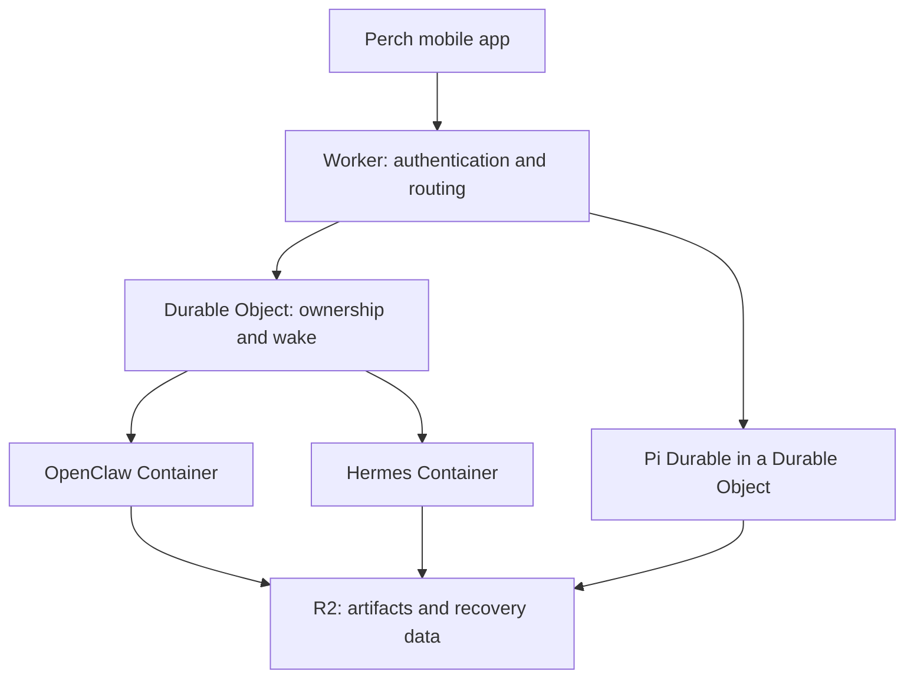

# OpenClaw and Hermes in Perch

**Integration and hosting proposal · sources checked 7 October 2026**

**Yes: Perch can be extended to support both as complete assistant backends.** OpenClaw has an experimental first-party Cloudflare Containers template. Hermes has a plausible Cloudflare Linux-container route that requires custom deployment and persistence work. Neither adapter is implemented in Perch 0.4, and neither Cloudflare deployment was tested in this review. [1][2][3][14][15]

## What the user would choose

The main choice should be the assistant and its model. Advanced settings can expose its runtime and hosting arrangement.

| Choice | Example | Responsibility |
| --- | --- | --- |
| Assistant | Researcher, personal assistant, coding workspace | Identity, memory, skills, scheduled work |
| Runtime | OpenClaw, Hermes, OMP, OpenCode, Pi Durable | Agent loop, tools, authoritative sessions |
| Model | A host-advertised provider/model pair | Inference and model access |
| Host | Homelab or Cloudflare | Execution, networking, persistence |

This is a proposed product model. A stock OpenClaw or Hermes assistant brings its runtime and state conventions with it. Changing its model or moving its installation does not imply that its memory, pending approvals, plugins, and live tasks can be transferred to a different assistant engine.

Perch should continue to render host-owned state through its existing assistant-ui external runtime. A new adapter translates the protocol; the phone does not add another model/tool loop around the assistant.

## How the two adapters would work

| Backend | Preferred integration | What it can expose |
| --- | --- | --- |
| **OpenClaw** | Operator Gateway over WebSocket | Assistant identity, sessions, host model selection, streamed chat/tools, abort, questions, approvals, workspace files, managed artifact retrieval |
| **Hermes** | Interactive Gateway over WebSocket for the full client; REST Runs for a separate background-run mode | Sessions, streamed messages/tools, model overrides, questions and decisions through the interactive protocol; HTTP runs, status, stop, approvals, and scheduled jobs through the API server |

OpenClaw publishes client/protocol packages and a browser-safe client entrypoint. Expo still needs a verified transport, device signing, pairing, and secure token-storage implementation. The official mobile guidance prefers paired-device Gateway access. Its OpenAI-compatible `model` field selects an assistant target; it is not the underlying provider-model picker. [1][4]

Hermes explicitly documents its interactive Gateway for custom hosts. It carries server-to-client requests such as approvals and clarification questions, plus in-flight snapshots and outstanding requests on resume. The Runs API supplies a useful independent HTTP job interface, including approval resolution; it does not reproduce every interactive Gateway request. Select the transport per supported mode, and avoid having two adapters compete to submit turns to the same session. [2][5]

For long tasks after phone suspension, use the independent Runs lifecycle or verify the interactive Gateway's orphan-session policy. A disconnected interactive session is not a promise of unlimited background execution: stale work can be interrupted and reaped. [12][19]

For model selection, query the host's actual catalog and respect its policy. Hermes's rich API picker is `/api/model/options`; its compatibility `/v1/models` list serves a different purpose. Perch should show the provider/model that actually served the turn when the host reports fallback, rather than assume the requested model ran. [5]

## What “durable” means here

Three separate questions determine the user experience:

1. **Did the host receive my request?** A stable receipt lets the phone reconcile a lost connection without starting duplicate work.
2. **Can the assistant recover its state and continue?** This depends on the runtime, transport, and preserved storage.
3. **What happened to the interrupted tool?** A restored transcript does not establish whether an external action completed.

### Current recovery behavior

The table assumes the required persistent data survives. Cloudflare container replacement adds the storage conditions in the next section.

| Runtime / path | Recovery behavior | Consequence for Perch |
| --- | --- | --- |
| **OpenClaw Gateway** | SQLite-backed state supports recovery of eligible interrupted main-session turns. Startup reconstructs work from saved state; children and other runtime types have their own ownership rules. | Reconnect to authoritative history and run state. Show recovery separately from completion. |
| **Hermes interactive Gateway** | Live sessions can be reattached. The pinned implementation can start a bounded continuation on cold resume when a fresh crash marker remains. | Resuming a session can trigger work under `desktop.auto_continue`; make that host policy deliberate. |
| **Hermes REST Runs** | With durable storage available and an `Idempotency-Key`, creation reserves a recoverable receipt. A restarted active run settles as interrupted. | Retry creation only under the same key/payload contract. Surface interrupted status; do not silently create a replacement run. |
| **Hermes messaging Gateway** | Active-turn markers and a delivery ledger let eligible interrupted turns continue, or deliver an already-saved answer without regenerating it. | A custom channel must integrate this lifecycle to claim those guarantees; an arbitrary HTTP call does not inherit them. |
| **Pi Durable / PiHarness** | Continues from checkpoints; replays tools marked safe and reports other interrupted tools to the model. Cloudflare's harness adds wake-up alarms. | Strong foundation for a Perch-owned assistant with explicit tool replay policy. It does not wrap stock OpenClaw or Hermes transparently. |

Sources: OpenClaw restart recovery [6]; Hermes interactive recovery implementation [7], API server [5], and messaging lifecycle [8]; Cloudflare PiHarness [9].

Two receipt boundaries deserve explicit implementation. OpenClaw's accepted chat-input custody is richer than a socket acknowledgment, but `sessions.create` deduplication is process-local and short-lived. Hermes's Runs receipts are separate from its bounded in-memory SSE replay buffer. Neither feature licenses blind replay of all mutations after reconnect. [10][11][12]

These systems have more recovery than “reload the conversation from disk.” None of the reviewed paths guarantees that every arbitrary external tool effect happens exactly once. For an action whose response was lost, recovery must inspect the result or use the action's own idempotency mechanism.

## Cloudflare architecture

Each assistant installation/profile needs a defined owner and storage namespace. The diagram shows alternative backends behind a common Perch entry point, not three engines executing the same turn.

### OpenClaw: a concrete experimental starting point

OpenClaw's own template runs its official Linux image behind a Worker and one named Durable Object. Litestream replicates SQLite databases to R2 and restores them before the Gateway starts. The template is explicitly experimental. [3]

The practical limits are significant:

- Replication is asynchronous, so abrupt replacement can lose recent writes.
- SQLite replication does not preserve configuration files, credential files, installed plugin files, workspaces, or file-backed cold transcript content. Those need a complete backup/bootstrap path.
- The normal mode remains running for socket-based channels. Webhook-only idle sleep requires restorable configuration and an intentional wake policy.
- A brief overlap between old and replacement containers is an admitted experimental tradeoff. The stable Durable Object route is not a proof of exactly-once effects. [3][13]

Use this current first-party template as the starting reference. The older Cloudflare Moltworker experiment is useful context, but its version and persistence behavior should not define the current design.

### Hermes: feasible, with deployment work to do

Hermes is a Python application; its official Docker path uses Linux. It needs host tools and subprocesses. A Linux Container is the credible Cloudflare hosting route for the full application; this review did not establish a supported, turnkey Hermes-on-Cloudflare deployment. This is an engineering inference from the runtime and container contracts. [14][15]

The custom deployment would need to restore the Hermes profile, database, memory, skills, workspace, and scheduler state; start the selected gateway; retain ownership while work runs; and reconcile jobs after restart. SQLite must use a database-consistent backup or replication method. Copying a live directory to object storage is not sufficient evidence of a recoverable database.

Keep socket channels and polling schedulers alive, or arrange an external wake path before sleeping the container. The existence of a saved schedule does not itself wake a stopped Python process. A Worker/DO wrapper can coordinate wake and receipt reconciliation; it does not change Hermes's underlying tool-recovery semantics.

### Which Cloudflare products matter

| Product | Role in this proposal |
| --- | --- |
| Workers | Authenticated API entry, routing, artifact download authorization |
| Durable Objects | Assistant ownership, wake coordination, control metadata; PiHarness execution for a Perch-owned assistant |
| Containers | Run the stock OpenClaw or Hermes Linux application |
| Sandbox SDK | Optional Linux command/file/preview controls, especially for generated multi-file projects |
| R2 | Artifact bytes and portable recovery data; not a replacement for a live local SQLite filesystem |
| Workflows | Optional orchestration spanning assistants/services and long waits |

A container filesystem snapshot restores files, not the running process or its memory. Artifact storage, database recovery, runtime recovery, and command deduplication remain separate responsibilities. [15][16][17]

## The artifact experience

The common artifact record should be independent of any one assistant's message format:

| Record | Purpose |
| --- | --- |
| Assistant, session, run, source identity | Show where the output came from |
| Stable artifact ID and revision | Keep selection stable as work changes |
| Filename, MIME type, size | Choose a reader and present the download accurately |
| Full bytes or a refreshable download reference | Preserve source and export fidelity |
| Optional isolated project-preview reference | Experience a generated multi-file app |

This is a proposed extension to Perch's current transcript-derived artifacts. OpenClaw's `artifacts.list/get/download` supplies an immediate discovery/retrieval path, including provenance filters and scoped downloads. Unsupported sources must remain explicit. It does not automatically give Perch immutable revision storage. [18]

For Hermes, start with complete transcript content and documented attachment/file surfaces. Its authenticated dashboard file routes can retrieve retained files, but do not establish stable artifact revision storage. Where a generated workspace file is not available through the chosen API, add a narrowly scoped export bridge; do not treat truncated tool-progress previews as the full artifact. Details and concrete API gaps are recorded in the Hermes research note. [12][20]

The intended mobile flow is simple: start a task, leave the app, return to its authoritative status, and open the resulting document or app in a spacious artifact reader. If recovery leaves the task interrupted, the UI should say so and retain its partial work. Generated widgets and live project pages require a deliberate rendering integration; they should not silently acquire the app's authority.

## Recommended sequence

1. **OpenClaw operator adapter against a self-hosted Gateway.** Verify pairing, history, model selection, tools, questions, abort, reconnect, and artifact downloads before adding hosting variables.
2. **Hermes interactive adapter.** Preserve its rich decisions and session behavior. Add REST Runs as a clearly separate background-run mode when its contract fits the task.
3. **Shared assistant and artifact records.** Keep capabilities truthful; expose memory and schedules only when a backend API supports the intended action.
4. **Cloudflare recovery trial.** Use the current OpenClaw template and a separately pinned Hermes container. Exercise process death, complete container replacement, receipt reconciliation, scheduled wake, and artifact restoration.
5. **Retain Pi Durable for a Perch-owned assistant.** Its checkpoint/tool replay model and portable core remain valuable. Existing assistant backends remain responsible for their own execution.

## Verification and current delivery

This turn reviewed official documentation and pinned source. It did not install either assistant, run a Cloudflare deployment, exercise an external model account, or test native integration on a Pixel. Perch 0.4 still implements OMP Collab, Pi RPC, and OpenCode. The existing APK is unchanged.

Source baselines: OpenClaw **v2026.9.8**, commit `fc23bc864e4553c2d215e479eeec47b67a0bf943`; Hermes commit `0e37a439bda15ef3c28a4d20593964d7c6a527a6`. Current documentation can change independently of those pins. The source archive contains detailed capability and deployment notes in `docs/OPENCLAW.md`, `docs/HERMES.md`, and `docs/ASSISTANT-CLOUDFLARE.md`.

## Primary references

1. [OpenClaw: building a Gateway client](https://docs.openclaw.ai/gateway/clients).
2. [Hermes: programmatic integration](https://hermes-agent.nousresearch.com/docs/developer-guide/programmatic-integration).
3. [OpenClaw: Cloudflare Containers](https://docs.openclaw.ai/install/cloudflare).
4. [OpenClaw: OpenAI-compatible HTTP API and native-client guidance](https://docs.openclaw.ai/gateway/openai-http-api).
5. [Hermes: API server](https://hermes-agent.nousresearch.com/docs/user-guide/features/api-server).
6. [OpenClaw: restart recovery](https://docs.openclaw.ai/gateway/restart-recovery).
7. [Hermes: pinned interactive auto-continuation implementation](https://github.com/NousResearch/hermes-agent/blob/0e37a439bda15ef3c28a4d20593964d7c6a527a6/tui_gateway/session_auto_continue.py).
8. [Hermes: gateway session lifecycle and recovery](https://hermes-agent.nousresearch.com/docs/developer-guide/gateway-session-lifecycle).
9. [Cloudflare: PiHarness recovery and limits](https://developers.cloudflare.com/agents/harnesses/pi/).
10. [OpenClaw: session-control and input-receipt RPCs](https://docs.openclaw.ai/gateway/protocol/rpc-session-control).
11. [OpenClaw: pinned session-create deduplication](https://github.com/openclaw/openclaw/blob/fc23bc864e4553c2d215e479eeec47b67a0bf943/src/gateway/server-methods/session-create-idempotency.ts).
12. [Hermes: pinned Runs implementation](https://github.com/NousResearch/hermes-agent/blob/0e37a439bda15ef3c28a4d20593964d7c6a527a6/gateway/platforms/api_server_runs.py).
13. [OpenClaw: backups and cold transcript payloads](https://docs.openclaw.ai/install/backups).
14. [Hermes: official Docker deployment](https://hermes-agent.nousresearch.com/docs/user-guide/docker).
15. [Cloudflare: Containers](https://developers.cloudflare.com/containers/).
16. [Cloudflare: container snapshots](https://developers.cloudflare.com/containers/guides/snapshots/).
17. [Cloudflare: S3Mount mounted-file behavior](https://developers.cloudflare.com/sandbox/reference/s3-mounts/#mounted-file-behavior).
18. [OpenClaw: agent, workspace, and artifact RPCs](https://docs.openclaw.ai/gateway/protocol/rpc-talk-config-and-agents).
19. [Hermes: pinned interactive session lifecycle](https://github.com/NousResearch/hermes-agent/blob/0e37a439bda15ef3c28a4d20593964d7c6a527a6/tui_gateway/session_lifecycle.py).
20. [Hermes: pinned dashboard file routes](https://github.com/NousResearch/hermes-agent/blob/0e37a439bda15ef3c28a4d20593964d7c6a527a6/hermes_cli/web_routers/files.py).
