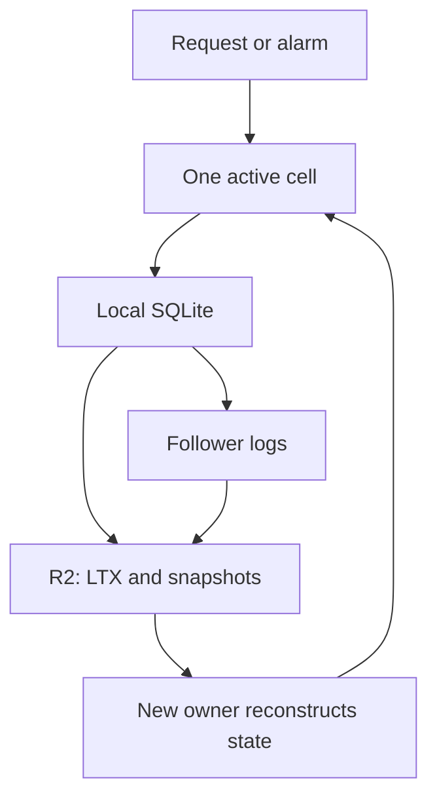

# celld storage as a substrate for persistent agents

Research checked **2026-10-07**. Scope: celld's current storage, ownership, and wake guarantees; a proposed Perch integration. No celld fleet, R2 bucket, or Pi-on-celld integration was deployed or tested.

Repository pin: [`denoland/celld` `f2bf648663a610eefde71f3547ad61e9b896b1f0`](https://github.com/denoland/celld/tree/f2bf648663a610eefde71f3547ad61e9b896b1f0), commit `v0.6.1`, 2026-10-01T10:48:21Z. The [limitations page](https://celld.dev/docs/limitations/) calls this release beta. The revision and timestamp were read through GitHub's commit API.

## Answer

**Yes: a durable agent can use this architecture.** celld can own the agent's identity, SQLite state, placement, and wake schedule. An agent runtime must additionally know which model or tool operation to continue after reconstruction. Restoring the database alone does not restore a JavaScript call stack or establish that an external action happened exactly once.

For Perch, these are complementary responsibilities:

| Layer | Responsibility |
|---|---|
| celld | One active owner, durable database, activation, alarms |
| Durable agent runtime | Pending work, completed steps, interruption and replay policy |
| Tool implementation | External receipts, idempotency, reconciliation |
| Perch | Stable submission IDs, reconnect, authoritative run state, artifacts |

The division above is a proposed design, not an assertion that Pi Durable already runs unchanged on celld.

## What is actually stored

Each cell executes against its own local SQLite database through `ctx.storage`. Committed database changes become LTX replication segments. Long-term storage contains epoch-specific segments and snapshots, not a `.sqlite` file opened through a generic S3 filesystem mount. Local state is reconstructed on activation; JavaScript memory is discarded. A hibernatable client socket survives same-node hibernation but closes when ownership moves. The client must reconnect. [Durable Objects / Cells](https://celld.dev/docs/services/durable-objects/)

The diagram abstracts ownership metadata and recovery gates; its arrows do not imply all writes wait for both destinations.

## When a successful write is safe

| Configuration | Proof before acknowledgment | Consequence |
|---|---|---|
| One node | Bucket upload | No acknowledged-write window waiting for a periodic backup |
| `CELLD_DURABILITY=fleet`, multiple nodes | Required follower disks or bucket upload, whichever proves durability first | Bucket can lag acknowledged state |
| `CELLD_DURABILITY=bucket` | Bucket upload even with peers | Stronger match for recovering solely from R2 after losing all compute disks |

`fleet` is the default. Peer replication reduces acknowledgment latency; a single node falls back to the bucket. These are documented modes, not measurements of this deployment. [Configuration and lifecycle](https://celld.dev/docs/)

**Inference:** losing every required follower disk before the delayed upload completes removes the evidence needed for full recovery. Therefore “R2 contains every acknowledged write” is justified by bucket mode, not by the default mode's name. A power outage with intact disks differs from permanent destruction of all those disks.

## Ownership, fencing, and takeover

A conditional bucket create or compare-and-swap claims ownership. Each activation advances an epoch. Replication keys include that epoch, preventing stale writers from overwriting the successor's prefix. Bucket-based acknowledgment also checks current ownership. A fenced process exits and needs a supervisor to restart it.

With fleet acknowledgments, takeover first seals the predecessor's log session and recovers required follower tails into the bucket. It cannot simply restore an older bucket image. Missing completeness evidence blocks recovery rather than permitting a knowingly incomplete activation. This trades availability for preservation of the acknowledgment contract.

R2 is a qualified backend. Required storage properties include conditional create/update, consistent reads, and correct ranged reads; epoch garbage collection also requires consistent listings. “S3 compatible” alone is insufficient. [Guarantees](https://celld.dev/docs/guarantees/)

## Waking is separate from saving

Alarms persist in SQLite, with discoverable wake entries in the bucket. Successful alarm-setting responses wait for a durable wake entry. One running node holds the fleet waker role; live owners handle their own alarms. [Durable Objects / Cells](https://celld.dev/docs/services/durable-objects/)

**Inference:** when every fleet process is stopped, R2 cannot execute an alarm. Another system must start compute, or a supervisor must restart a node. The recovered schedule can then run late. Agent sleep is inexpensive; stopping the entire hosting fleet requires a separate wake mechanism.

## Pi integration boundary

celld implements Durable Object SQLite and alarms, but its Node.js compatibility is partial. Its filesystem surface is restricted, and unsupported Node calls can fail at runtime. A Node-based SQLite adapter is not automatically usable inside a cell. A DO storage adapter and a Workers-compatible agent bundle are the appropriate candidates. [Cloudflare compatibility](https://celld.dev/docs/cloudflare-compat/)

For the next experiment, use one named cell per agent session, persist accepted input and its operation ID before acknowledgment, resume pending work on activation/alarm, and store large artifact bytes separately with references in SQLite. Keep safe tool replay distinct from external actions needing receipts. Test ownership transfer and complete disk replacement as separate cases. These are proposed acceptance criteria, not completed verification.

The upstream project publishes model-checking, simulation, and live-fleet fault testing. Those results support its documented substrate; they do not validate our agent dependency bundle or external tools. [Testing](https://celld.dev/docs/testing/)
