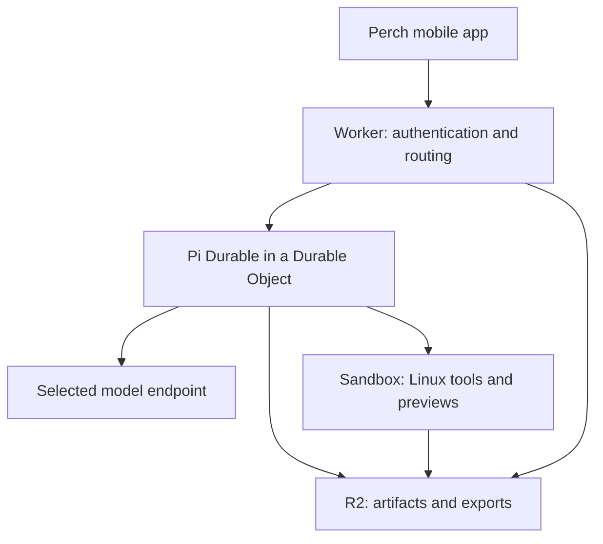

# Cloudflare hosting for Perch

**Proposed design · sources checked 7 October 2026 · no Cloudflare runtime deployed**

Cloudflare can host the agent backend while Perch remains a native, model- and harness-independent client. For Perch's own persistent assistant, use **Workers, Pi Durable in Durable Objects, and R2**, adding **Sandbox** when a tool needs Linux. Retain ordinary Pi/OMP/OpenCode hosts for compatibility with their existing setups. The [Pi Durable evaluation](PI-DURABLE.md) now includes real local process-crash tests.

For complete existing assistants, see [OpenClaw and Hermes integration](ASSISTANT-INTEGRATIONS.md) and [their Cloudflare hosting review](ASSISTANT-CLOUDFLARE.md). OpenClaw now has a first-party experimental Container/Litestream/R2 template; Hermes would require a custom Linux adaptation. Both have native recovery features whose guarantees depend on the selected API and preserved storage. These are proposed connections, not implemented Perch adapters.

## What exists today

| Boundary | Status |
| --- | --- |
| Native assistant-ui chat and Markdown/HTML/code readers | Implemented |
| OMP Collab, including OMP inside Tern | Implemented |
| Authenticated Pi RPC bridge | Implemented; agent process survives phone disconnects |
| OpenCode Go through Pi | Pi's bundled `opencode-go` provider can use a host-configured subscription key; user entitlement and connectivity remain untested |
| OpenCode harness adapter | Added in 0.4; remote sessions, host models, and artifact projection; see [its guide](OPENCODE.md) |
| Pi Durable | Core recovery experiments plus the 0.5 [backend/native connection](DURABLE-BACKEND.md); Cloudflare deployment and real R2 remain unprovisioned |
| Cloudflare execution, durable cloud history, and hosted previews | Proposed; no account, deployment, or paid resource created |

See [Pi setup](../server/pi-bridge/README.md), [the harness boundary](../src/harness/README.md), and [verification](VERIFICATION.md). Provider support does not establish that a particular account can access a model.

## Keep three choices independent

| Choice | Question | Examples |
| --- | --- | --- |
| Model access | Which model responds, and whose allowance pays? | OpenCode Go, another provider, a self-hosted endpoint |
| Harness | Which system owns tools, execution, and history? | Pi CLI, Pi Durable, OMP, OpenCode |
| Execution host | Where does that harness run? | Homelab, Durable Object, Linux container |

Changing the host should preserve Perch's session contract. A subscription supplies model access; it does not pay for Cloudflare compute or automatically make its login usable by every harness.

## Minimal cloud architecture

| Product | Responsibility | When to add it |
| --- | --- | --- |
| **Workers** | Authenticate clients; route commands, streams, and downloads | First cloud version |
| **Durable Objects + Agents SDK PiHarness** | Store conversation state and pending work; resume the Pi Durable harness after eviction | First cloud version |
| **Containers / Sandbox tooling** | Run shell, Git, dependencies, and preview servers; alternatively host an established CLI harness | When Linux is needed |
| **R2** | Store artifacts, uploads, exports, and workspace backups | First cloud version |
| **Workflows** | Coordinate business jobs across services and long external waits | When that workflow extends beyond an ordinary durable agent turn |
| **AI Gateway** | Optional provider routing, usage visibility, limits, and key management | Only for compatible API routes; keep direct providers available |
| **Workers AI** | Another selectable inference provider | Optional |
| **D1** | Query accounts and conversation listings across workspaces | When the listing needs relational queries |
| **Vectorize** | Semantic retrieval from documents and history | When search needs embeddings |

Workers cannot run the current bridge's subprocess: `node:child_process` is a nonfunctional compatibility stub. Containers provide Linux execution. Cloudflare publishes examples for both [OpenCode](https://developers.cloudflare.com/sandbox/coding-agents/opencode/) and [Pi](https://developers.cloudflare.com/sandbox/coding-agents/pi/).

Sources: [Node compatibility](https://developers.cloudflare.com/workers/runtime-apis/nodejs/), [Containers](https://developers.cloudflare.com/containers/), [storage choices](https://developers.cloudflare.com/workers/platform/storage-options/), [Workflows](https://developers.cloudflare.com/workflows/), [AI Gateway](https://developers.cloudflare.com/ai-gateway/), [Workers AI](https://developers.cloudflare.com/workers-ai/).

## Two ways to host Pi

| Route | Fit for Perch | Tradeoff |
| --- | --- | --- |
| **Existing Pi CLI in a container** | Reuse our bridge and host configuration | We must checkpoint its files and restart its process |
| **Pi Durable with `PiHarness` in a Durable Object** | Recommended foundation for Perch's own persistent assistant | Experimental beta; mobile transport, approval persistence, and Sandbox execution integration remain to build |

Cloudflare's [PiHarness guide](https://developers.cloudflare.com/agents/harnesses/pi/) documents SQLite-backed transcripts, pending work, sessions, and snapshot-first event streams. Its current limitations include no tool-approval step, no conversation deletion, and no event replay cursor. Our [isolated experiment](../experiments/pi-durable/README.md) verified real core recovery for a safe tool, an unsafe tool, and a model stream. The same core runs self-hosted with Node SQLite. This does not validate Cloudflare alarms or automatically port Pi CLI extensions.

Use Pi's ordinary provider registry to preserve broad coverage. The optional [Cloudflare Pi AI provider](https://developers.cloudflare.com/agents/models/pi-ai/) currently handles only four API families and excludes several native Pi routes. The [provider audit](PROVIDERS.md) distinguishes catalog coverage from configured and tested access.

## Running work must survive a sleeping phone

The proposed coordinator should:

1. Persist a command with a stable operation ID before acknowledging it.
2. Start or reconnect to the harness and publish its authoritative state.
3. Keep a Durable Object alarm active while work remains.
4. Persist completed messages and artifact metadata independently of the socket.
5. Send a fresh snapshot on reconnect, without resubmitting a prompt.
6. Checkpoint the workspace and stop its container after an idle grace period.

Pi Durable and PiHarness already supply much of the submission/checkpoint/wake lifecycle. Perch still owns authentication, its client protocol, artifact export, and execution-host policy. Our ordinary Pi CLI bridge would need an operation ledger and recovery implementation. An established assistant such as OpenClaw or Hermes instead needs integration with its native receipt and recovery contract. Container CPU activity alone does **not** keep an instance alive. The inactivity timeout is at most six hours and must be reapplied after a Durable Object restart. See [sandbox lifetime](https://developers.cloudflare.com/sandbox/concepts/lifetime/).

### A snapshot restores files, not a running agent

[Container snapshots](https://developers.cloudflare.com/containers/guides/snapshots/) require the public-beta `durable_object` scheduling policy. They exclude memory and running processes, remain tied to their image version, and expire after 30 days unless restored. The [maximum snapshot size](https://developers.cloudflare.com/containers/platform/limits/) is 20 GB.

Resume must restart the harness and reopen its saved conversation. Keep important artifacts and portable backups in R2 independently of snapshot retention. Keep Git, dependencies, and harness databases on local container disk: [R2 mounts](https://developers.cloudflare.com/sandbox/files/mount-an-r2-bucket/) have different rename, locking, and permission behavior from a local filesystem.

## Credentials belong to the connection

For the current Go path, configure the subscription credential on the Pi host as described in [the bridge guide](../server/pi-bridge/README.md). The phone receives model metadata, not the provider key.

For cloud hosting, keep credentials separate from exported workspaces. [Cloudflare's outbound interception](https://developers.cloudflare.com/sandbox/network/) lets the Worker add a token to approved requests while the sandbox holds no raw token. An upstream OAuth flow that requires harness-local credential files needs its own private restore and refresh implementation.

[AI Gateway BYOK](https://developers.cloudflare.com/ai-gateway/configuration/bring-your-own-keys/) stores provider API keys; it is not a universal subscription-import mechanism. Supported provider authentication still determines access. The OpenCode sandbox tutorial uses `--auto`; Perch should preserve explicit interactive approvals instead of inheriting that tutorial setting.

## Richer artifact previews

Keep native Markdown, highlighted code, and isolated single-document HTML. For a multi-file web project, a later adapter can start its actual development server and give the artifact reader an authenticated preview URL.

Use a separate preview domain and a distinct hostname per workspace. Keep application cookies and management routes away from those hosts. Cloudflare's [preview hostname guide](https://developers.cloudflare.com/sandbox/previews/serve-previews-on-their-own-hostnames/) describes this boundary. R2 stores files; it does not execute a project.

## Hybrid homelab path

[Cloudflare Tunnel](https://developers.cloudflare.com/cloudflare-one/networks/connectors/cloudflare-tunnel/) can expose the existing Pi bridge through outbound connections from the homelab. OMP Collab can continue using its existing connection path. A cloud agent can also call a protected model endpoint at home.

[Access Managed OAuth](https://developers.cloudflare.com/cloudflare-one/access-controls/applications/http-apps/managed-oauth/) is a possible future native login integration. It requires a compatible OAuth client; adding Tunnel alone does not implement that login in Perch.

## Staged rollout

| Stage | Deliverable | Evidence before proceeding |
| --- | --- | --- |
| 1. Existing hosts | Pi, OMP, and OpenCode connections | Real local runtime fixtures, then the user's account/device round trip |
| 2. Durable assistant | Pi Durable submit/snapshot/history, a document tool, protected artifact download | Crash recovery, deduplicated admission, stable artifact identity |
| 3. Durable decisions | Persisted approval and explicit resume workflow | Crash/reconnect while waiting for a decision; no unintended side effect |
| 4. Cloud execution | PiHarness, R2, and on-demand Sandbox | Runtime eviction/alarms; filesystem restore; artifact recovery |
| 5. Rich previews | Protected multi-file preview URLs | Origin separation, access checks, and restart behavior |

Containers currently requires the **$5/month Workers Paid plan**, plus usage. Memory and disk are billed while provisioned; CPU reflects active usage. Other services and egress can add charges. Checkpointing and sleeping matter even while a CLI merely waits for another message. See [current pricing](https://developers.cloudflare.com/containers/platform/pricing/).
