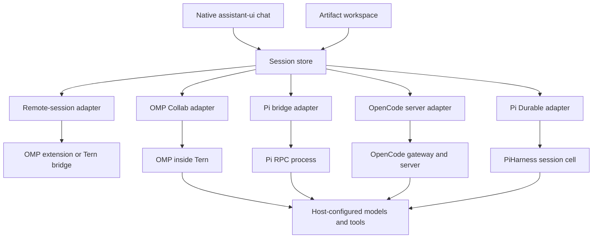

# Perch: model and harness independent mobile chat

## Product intent

Make it comfortable to talk to a self-hosted agent, follow its work, and inspect the things it creates from a phone. An artifact should get enough space to read as a document, inspect as source, or experience as a small page.

The model choice belongs to the host configuration. The harness supplies execution, tools, extensions, and session history. Perch supplies conversation and artifact presentation.

## Boundaries

| Boundary | Owns | Does not own |
| --- | --- | --- |
| Harness | Agent loop, providers, tools, authoritative history | Phone layout |
| Adapter | Authentication, protocol translation, reconnect, capabilities | Rendering or inventing tool success |
| Session store | Active connection, snapshots, demo, action guards | Model execution |
| assistant-ui adapter | Thread projection, composer synchronization, native slots | A second authoritative transcript |
| Artifact model | Derivation, stable identity, filename, full content | Host filesystem access |
| Artifact readers | Preview, source, selection, copy, export | Agent authority or credentials |

The phone does not run a second agent loop around OMP, Pi, Pi Durable, or OpenCode. There is no additional model provider SDK in the chat path. The native assistant-ui external runtime projects the existing session store. Infrastructure is chosen through the connected server; the adapter is the same whether that server runs at home or in a cloud container.

This version exposes one active real connection at a time. Adding a harness means implementing the driver/update contract and a connection method, declaring capabilities, and translating its events. The chat and artifact readers remain unchanged. This is a small working boundary rather than a universal wire protocol.

## Native remote workspaces

[The remote-workspace design](REMOTE-WORKSPACE-DESIGN.md) grounds the next slice:
one host session browser, explicit attachment to an existing runtime, and
same-process prompt/interrupt controls. The new `perch-remote` adapter contract
supports both an OMP extension and a Tern window plugin with a loopback bridge.
It retains this session store and the native assistant-ui projection.

Connection discovery does not select an arbitrary runtime. Reconnect checks
host epoch, runtime generation, and known conversation identity, then reads
snapshots and forwarding receipts. It never reposts commands. Capabilities and
snapshot limitations are explicit. A Tern window-backed bridge is not yet a
daemon-only client or a full TSP/terminal renderer. Implementation evidence is
tracked in [the remote results](REMOTE-WORKSPACE-RESULTS.md).

## One setup per workspace

`src/workspace` owns pairing, workspace discovery, and saved connection access.
A protected `/perch/workspace` response advertises the workspace identity,
deployment, available harness connections, and default. HTTP/WS connector paths
stay relative to the paired origin. The self-hosted gateway translates the one
phone credential to each configured local adapter's separate credential. An OMP
invitation is an explicit exception: it is delivered through authenticated
discovery and used by the existing encrypted Collab client.

The native app stores up to eight workspace profiles in SecureStore and loads
their list without contacting a host. Opening a saved profile refreshes discovery
before connecting; switching its harness does not repeat setup. No model or
infrastructure secret appears in a profile or display catalog. Forget is ordered
with credential writes, invalidates pending discovery, and detaches the current
connection without deleting server chats. The browser preview uses memory only.
See [workspace setup](WORKSPACE-SETUP.md).

## Durable backend

The Pi Durable adapter talks to `server/pi-durable` through a small protected HTTP
contract. A token chooses one workspace catalog; every chat owns a separate
PiHarness cell. Pi stores its transcript, continuation, admission reservations,
and artifact manifests in SQLite. Lifecycle supplies wake alarms. A distinct
`ARTIFACTS` binding holds immutable file bytes. On celld, the artifact binding occupies its `r2/<bucket_name>/` namespace in the
fleet bucket, while celld manages SQLite state under its own prefixes.

The model persists a file by calling `write_artifact`: memoize identity, upload
bytes under a hash, then commit the manifest on Pi's transaction queue. This
ordering can leave an orphaned blob after a crash, but cannot announce a file
before its bytes exist. Replay verifies an existing object and reuses the same
manifest. A successful tool return is only emitted after that commit.

The mobile reader obtains a manifest in the authoritative snapshot and loads its
bytes on selection. Both server and client verify size and SHA-256. A workspace
or session change invalidates the result. HTML retains the existing isolated
renderer; an API download never serves a privileged HTML document.

Stable operation IDs distinguish an uncertain response from a new request. The
backend rejects reused IDs with different input. Reconnect first reads operation
status and snapshots. Deliberate retry can reuse the unresolved prompt ID;
idempotent creation can replay its exact ID. Pending IDs are memory-only; paired
workspace tokens use native secure storage. See [the protocol spec](DURABLE-BACKEND-SPEC.md) and
[setup and measured limits](DURABLE-BACKEND.md).

Snapshot projection uses one published Pi ConversationView, so the live generation
identity and committed entries come from the same frame. Assistant task identity
and message ordinal stay stable when a partial becomes a completed response;
actual tool task IDs remain attached to their artifacts. Malformed provider labels
are normalized for display. Individual text fields are capped at 2,000,000
characters, and the encoded snapshot is capped at 10 MiB. Recent conversation text
gets space before tool output; truncation and any omitted older rows are explicit.
The full transcript stays on the host, and stored manifests and file bytes are
unchanged. The phone does not yet provide pagination into omitted history.

## Capabilities and model choice

Model metadata is separate from harness identity. A host without model metadata is shown as host-configured. Pi, Pi Durable, and OpenCode's model chooser uses only the host's advertised models. Search and provider filters run on metadata; a virtualized list bounds mounted model rows. Selection uses provider plus model ID, because different providers can advertise the same ID. See [the reproducible provider audit](PROVIDERS.md).

An action requires adapter support, write access, and a suitable connection/session state. Capability support does not override read-only access. Unsupported question types remain unresolved and direct the user to the host.

## Conversation behavior

New chat is the initial screen. The sidebar contains conversation history, Artifacts, and Connection & settings. It stays visible at 900 logical pixels and wider; phones use a dismissible drawer. Chat occupies the main content area and keeps the composer at the bottom for both empty and populated conversations. The welcome content can scroll independently when space is limited. Native question sheets keep the current input request explicit.

The demo creates a new thread with a unique identity and derives its title from the first prompt. A new thread preserves the previous thread's draft and running work. Current OMP and Pi adapters advertise no `sessionCreation` capability. Their New chat action explains the single-session boundary and offers explicit connection choices without clearing the host transcript or switching silently into demo mode.

OpenCode owns its remote history and creates/selects sessions through its API. `sessions` carries that list while `session` identifies the active authoritative transcript. During `sessionAction`, the current transcript stays visible and mutations are guarded. The replacement session and its content become visible together. Session creation is never replayed automatically after a connection drop; check host history when the result is ambiguous.

The host owns the transcript. assistant-ui receives stable message and tool-call identities through ExternalStoreRuntime. Its composer writes to session-scoped draft memory. Client-side tool invocation is disabled.

Drafts are namespaced by mode, connection credential epoch, and session. A submitted real message gets a recoverable copy. Restoring it only changes the composer. A drop after sending is ambiguous; reconnect must not become an implicit retry.

For Pi, a long-lived bridge owns the subprocess across socket disconnects. Each reconnect refreshes the snapshot; epoch and revision identify its authority and order. For OMP, the pinned guest client owns protocol synchronization.

For OpenCode, an authenticated SSE connection supplies narrowly projected text events and triggers coalesced authoritative reads. A temporary text overlay shows live output between persisted part updates. Completed host text replaces it, including any final plugin transformation; removal events prevent old snapshots from restoring deleted text. The upstream stream has no replay cursor, so a mid-part reconnect can require waiting for the complete text. Mutations are never replayed. Native requests use Expo's streaming fetch implementation; the browser uses ordinary fetch and requires gateway CORS configuration. See [OpenCode](OPENCODE.md) for verified protocol, question mappings, and limits.

OMP questions stay visible until host dismissal. Pi RPC does not acknowledge extension UI responses, so the bridge removes a question after a successful stdin write; that establishes forwarding, not proof that an extension processed it. Stale question IDs remain invalid in either adapter.

## Artifact experience

Substantial Markdown answers can become documents. Fenced code with language/filename metadata becomes its own artifact. Complete inputs to known file-writing tools can provide files; tool success text is never treated as file contents.

Identity comes from the source message or tool and fence position. Streaming updates change content while preserving selection. This version does not merge same-named files or track file revisions across messages.

Markdown uses native text and virtualized blocks. Code becomes highlighted native text spans. HTML lives in a separate document with no app bridge. Scripts require an explicit per-artifact toggle and stay off while content streams. Source and export retain the full derived contents.

## Visual choices

| Choice | Purpose |
| --- | --- |
| Warm surfaces and restrained sage accents | Keep long sessions quiet |
| A separate artifact workspace | Give generated work the screen |
| Preview/Source at the top of the reader | Relate the output to its code |
| Collapsed tool cards | Keep execution detail available without dominating chat |
| A persistent question banner | Keep an outstanding decision within reach |
| Separate connection/activity labels | A disconnected phone does not imply a stopped host |
| Explicit synthetic labels | Distinguish examples from host results |

## Remaining boundaries

Tern's plugin SDK and TSP are not transplanted into the phone. OMP Collab remains
available alongside the remote-session adapters. Arbitrary terminal, Luau, or
TSP widgets need a separate rendering adapter.

The phone saves paired workspace access in SecureStore. Direct Advanced
credentials, drafts, pending operation IDs, and its current view remain in
memory. The Pi Durable backend persists host history, continuation, model
selection, and artifact manifests, with exact file bytes in a bucket binding.
GrapheneOS notification delivery, Android process suspension, attachments, and
multi-host management still need additional implementation or device trials.

Pi Durable is the implemented foundation for a persistent assistant owned by
Perch. [The initial evaluation](PI-DURABLE.md) and [the connected backend
results](DURABLE-BACKEND-RESULTS.md) record the separate local crash tests.
The Cloudflare setup runner is implemented; live deployment and real R2
qualification remain outstanding. Switching
existing harnesses does not imply portable transcripts, approvals, or plugins.
The artifact workspace supports both derived transcript artifacts and persisted
file references; cross-message file revisions remain future work.

[The OpenClaw and Hermes proposal](ASSISTANT-INTEGRATIONS.md) extends this design to complete assistant backends. A future assistant profile should identify the selected assistant, runtime, host, and model independently of the existing active-subagent summary. These backends own their memory, schedules, execution, and recovery policies. A native adapter should preserve their capabilities and reconcile authoritative state without adding a second agent loop. The OpenClaw and Hermes adapters and their artifact transports remain proposed; Pi Durable stored artifacts are implemented separately.

EAS services are optional. Manual build/test workflows are included; no account or project ID is invented. OTA updates remain disabled until a real destination and runtime policy are configured.

## References

- [assistant-ui native integration](https://www.assistant-ui.com/docs/react-native/existing-app)
- [assistant-ui native elements](https://www.assistant-ui.com/docs/react-native/elements)
- [OMP guest client](https://github.com/can1357/oh-my-pi/tree/3f7276200adf434fda1d97357ccc7fcd344066fe/packages/collab-web)
- [Pi RPC](https://github.com/earendil-works/pi/blob/main/packages/coding-agent/docs/rpc.md)
- [Tern](https://docs.stencil.so/tern/)
