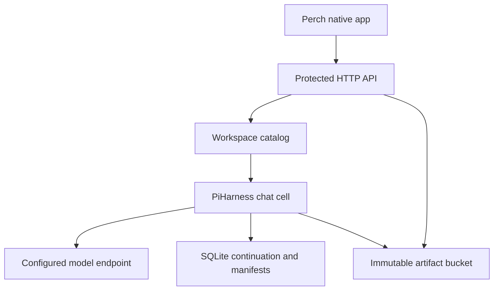

# Perch 0.5: durable chats and saved artifacts

Perch now includes a native connection to its own Pi Durable backend. The phone
can create and reopen chats, choose a configured model, submit work, stop a run,
and open saved Markdown, HTML, and source files. Host state remains authoritative
when the phone disconnects.

## What is connected



The token chooses a workspace. Its catalog owns chat identities; each chat owns
its PiHarness, transcript, continuation, and artifact references. Model keys stay
on the server. The app receives only safe model descriptors and generated output.

The same backend source targets a Workers-compatible host. The measured local
runtime is celld 0.6.1 with Agents SDK 0.26.0 and Pi Durable/Pi AI/Chord 1.0.4.
Cloudflare deployment, real R2 durability, and multi-node takeover require their
own deployment checks. A successful local run does not establish those results.

## Start your backend

Use Node 22.19 or newer. From the source root:

```sh
bun install --frozen-lockfile
bun install --cwd server/pi-durable --frozen-lockfile
bun run --cwd server/pi-durable test
bun run --cwd server/pi-durable build
cd server/pi-durable
cp wrangler.example.jsonc wrangler.jsonc
cp .dev.vars.example .dev.vars
```

Edit the copied development settings. `.dev.vars` is ignored by Git. For a real
deployment, use your runtime's secret mechanism.

| Setting | Configure |
| --- | --- |
| `PERCH_TOKENS` | A JSON map from workspace IDs to distinct random tokens, each 32–512 printable characters |
| `PERCH_MODELS` | Explicit models, endpoints, and credentials; first model is the new-chat default |
| `PERCH_ALLOWED_ORIGINS` | Exact browser origins; `[]` allows native requests without Origin |
| `PERCH_WORKSPACE_NAME` | Display name returned by authenticated workspace discovery |
| `PERCH_DEPLOYMENT` | `self-hosted` (default) or `cloudflare`; Cloudflare setup sets this explicitly |
| `PERCH_CATALOGS` | SQLite object namespace for `PerchCatalog` |
| `PERCH_SESSIONS` | SQLite object namespace for `PerchSession` |
| `ARTIFACTS` | An R2-style bucket binding for generated files |

The backend supports Pi's `openai-completions`, `openai-responses`, and
`anthropic-messages` implementations. The optional `api` field selects one;
omitting it preserves the original OpenAI-completions behavior. A model entry
looks like this:

```json
{
  "provider": "local",
  "id": "your-model-id",
  "name": "My local model",
  "baseUrl": "http://127.0.0.1:8080/v1",
  "keyless": true,
  "contextWindow": 32768,
  "maxTokens": 4096
}
```

Use `apiKey` instead of `keyless` when your endpoint requires a key. The endpoint
is resolved from the backend host, so loopback means that host. Models under one
provider ID must share credential settings. Each model keeps the base URL for
its selected API family. The model must support
the tool-calling behavior needed by `write_artifact`.

With celld installed, start the development project:

```sh
bun run dev
```

The Bun script command makes the locally installed esbuild available to celld. The
development object store is local. An actual celld deployment also needs its
own supported S3/R2 backing-store configuration and acknowledgment policy. On
celld, the artifact binding uses `r2/<bucket_name>/` in the fleet bucket, separate
from its internal SQLite-state objects. On Cloudflare, the binding points to an
R2 bucket alongside managed DO storage. See
[the earlier celld experiment](PI-CELLD.md) and the backend's
[configuration guide](../server/pi-durable/README.md).

Expose a remote host through HTTPS. Perch permits cleartext HTTP only for
loopback development; even private LAN addresses must use HTTPS. Native requests
need the workspace token. To connect from a browser, serve the preview over
HTTP(S) and add that page's exact Origin (scheme, host, and port) to the configured
allowlist. Opening the standalone HTML as a local file is suitable for its demo;
a live browser connection needs the served origin.

## Open it on your phone

1. Install the standalone Perch 0.6 ARM64 APK.
2. Open the sidebar and choose **Connect a workspace**.
3. Paste the pairing code from [workspace setup](WORKSPACE-SETUP.md), or use
   **Enter an address and token** for the current backend. For an older backend,
   choose **Advanced connection → Pi Durable** and enter its address/token.
4. Choose **New chat**, select a model if needed, and send a prompt.
5. Ask for a complete document or file. The backend's `write_artifact` tool saves
   it for **Artifacts**, where you can preview, inspect source, copy, or export.

For example: “Create a short Markdown plan and a self-contained HTML summary.
Save both as artifacts so I can read them on my phone.”

The application keeps the traditional chat layout: New chat home, sidebar
navigation, main conversation, and bottom composer. A paired workspace can
advertise OMP, Pi RPC, and OpenCode alongside Pi Durable. The durable route still
exposes fewer provider APIs than the full Pi RPC catalog. Subscription OAuth
and full Linux harness hosting remain separate integrations.

## What survives a disconnect

| Event | Behavior |
| --- | --- |
| Phone loses connection | Host work continues; the phone keeps its last view and draft in memory |
| Phone reconnects | Fetch current history, operation status, selected snapshot, and manifests |
| Submission receipt is lost | Look up the original operation ID; no automatic second prompt |
| User deliberately retries unresolved text | Reuse the original ID while it remains in this client process |
| Chat creation receipt is lost | Replay the original idempotent create ID, never a replacement ID |
| User changes workspace | Invalidate old requests, drafts' credential scope, and artifact readers |
| Phone process restarts | Reopen the saved workspace and inspect host history; Advanced direct tokens, local drafts, and pending IDs are gone |
| Backend execution is interrupted | Pi's persisted continuation and Lifecycle wake-up resume eligible work according to the runtime's storage guarantees |

The phone polls authoritative snapshots every 750 ms while working and every six
seconds while idle. There is no push channel or guarantee that Android keeps a
background request alive. Server continuation does not require one.

## Why artifact persistence is useful

`write_artifact` first memoizes its artifact identity, then uploads exact UTF-8
bytes under a workspace/session/SHA-256 key, then commits the visible manifest
through Pi's own transaction queue. An interrupted upload can leave an
unreferenced object. A replay verifies that object's content and finishes the
same manifest instead of creating a second file identity.

The snapshot contains references, not every file's bytes. Perch loads only the
selected file, and both backend and client check its length and SHA-256. A file
is never fetched from an arbitrary URL suggested by generated text. A failed
check leaves a readable error and Retry action; copy, export, and preview remain
disabled until the file loads successfully.

Markdown uses the native document reader. Code is highlighted as source. HTML
uses the existing isolated preview, with scripts disabled initially and an
explicit interaction toggle. The API itself returns downloads as attachments
with `application/octet-stream` and `nosniff`. A filename does not grant HTML
execution rights; the manifest's recognized MIME type selects the reader.

## Reproduce the checks

From the source root:

```sh
bun install --frozen-lockfile
bun install --cwd server/pi-durable --frozen-lockfile
bun run typecheck
bun run verify
bun run verify:artifacts
bun run --cwd verification/durable test
bun run --cwd server/pi-durable test
CELLD_BIN=/absolute/path/to/celld node verification/durable-runtime/verify.mjs
CELLD_BIN=/absolute/path/to/celld node verification/durable-runtime/verify.mjs --production-provider
```

The celld integration uses an independent local provider fixture and the actual
SessionStore, driver, PiHarness, Lifecycle, SQLite, and artifact bucket binding.
It never calls a paid model or uses a user's workspace. The second command
loads the production worker and exercises Pi's real OpenAI-completions adapter
against a controlled loopback HTTP/SSE model endpoint. The recovery report is
`verification/durable-runtime/results/latest.json`; the production adapter report
is `verification/durable-runtime/results/production-provider.json`. Per-run logs
stay under the ignored `.runs` directory. [Measured results](DURABLE-BACKEND-RESULTS.md)
record the final passes and their limits. [The protocol spec](DURABLE-BACKEND-SPEC.md) defines the
HTTP boundary and required recovery checks.

## Current limits

This is a working prototype backend. Workspace tokens grant access to that
workspace; there is no per-user membership UI or read-only token role. There is
no deletion/retention UI, offline file cache, persistent phone outbox, credential
vault, push notification service, voice, or attachment upload. The backend does
not install a shell or browser tool. OpenClaw and Hermes remain future adapters.

Each artifact is limited to 2,000,000 UTF-8 bytes. Existing reader rendering and
highlighting limits still apply, while copy/export use complete verified content.
The phone snapshot caps each display text field at 2,000,000 characters and the
encoded response at 10 MiB. It prioritizes recent conversation text, then tool
output. Oversized text carries a truncation notice; an exceptional history can
omit older rows with an explicit notice. At most 10,000 message rows and 10,000
tool rows are projected. These display limits do not alter stored artifact bytes
or manifests. The full transcript stays on the host; older-history pagination is
not implemented in the phone.

A workspace admits at most 2,000 sessions. A session admits at most 2,000 submit
operation IDs and 1,000 artifacts. These are prototype limits, with no retention
or deletion service to reclaim them yet. Production provisioning, a real model
endpoint, R2 qualification, and a physical Pixel trial remain separate from the
local protocol and recovery checks.

## Primary runtime references

- [PiHarness, submission identity, and recovery](https://developers.cloudflare.com/agents/harnesses/pi/)
- [celld local development, bindings, and durability configuration](https://celld.dev/docs)
