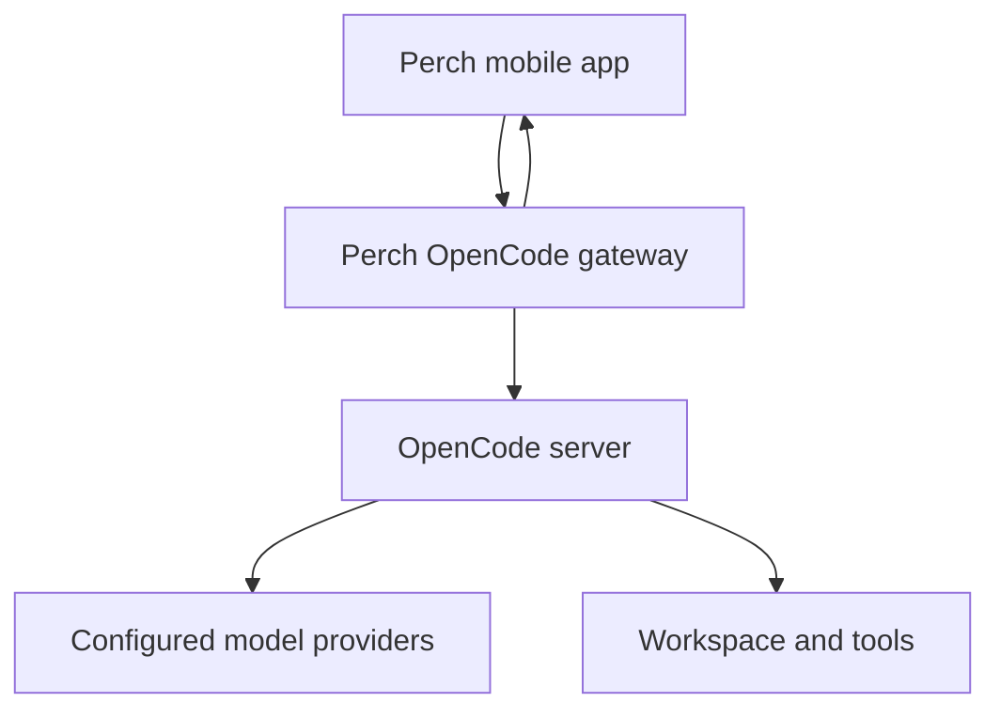

# OpenCode in Perch

**Implemented:** a mobile client for server-owned OpenCode chats, connected-provider model selection, live text, tools, permission requests, single questions, and generated artifacts. The app connects through the included gateway; OpenCode continues to run the agent and its provider integrations.

Verified against **OpenCode 1.18.35**, upstream tag commit `53d1eabb61e21162157817bf677da0a4ad3332e3`. The mobile adapter uses HTTP and streaming fetch, so adding it does not bundle the OpenCode process or a provider SDK into the app.



The return path carries normalized history, safe model descriptors, text events, and tool results. The location of these host processes can change without changing the chat or artifact components. A homelab, VM, or Linux cloud container can host the same gateway and OpenCode process; this change does not provision a cloud runtime.

## What the phone supports

| Surface | Behavior |
| --- | --- |
| History | Lists the most recent 200 root sessions in the selected host workspace. A verified active session remains available if it falls outside that list. |
| New chat | Calls the host's session-creation API and switches only after loading that chat's authoritative history. Connecting to an empty workspace creates nothing. |
| Switching | Retains the previous transcript while loading the selected session. It blocks writes during the transition. |
| Models | Shows every model advertised by connected providers, including custom provider IDs. The selected provider/model pair is attached to the next prompt. |
| Conversation | Text prompts, incremental assistant text, completed history, interruption, and host tool cards. |
| Permissions | Explicit **Allow once** or **Deny**. Perch never automatically approves or adds an “always allow” rule. |
| Questions | One single-choice question or a custom text response. Multiple questions or selections remain visible and must be answered on the host. |
| Artifacts | Existing Markdown and code-fence readers, plus complete `write` inputs using OpenCode's `filePath` and `content` fields. |
| Reconnect | Reloads host-owned history; never automatically repeats a prompt, answer, interrupt, or New chat request. |

Model selection is a per-session in-memory choice for the next prompt. Sending that prompt records the model through OpenCode's usual session history. Merely selecting a model does not modify global provider configuration. Provider support still depends on the host's configured credentials, model permissions, and harness support; a catalog entry is not proof that a particular account can run it.

New chat omits a custom title so OpenCode can apply its normal title generation. A creation request whose response is lost may already have created a host session. Perch reports the uncertainty and refreshes history instead of repeating the mutation.

## Why a gateway is required

In the pinned server, `/provider` calls `Provider.toPublicInfo`. Despite its name, that function serializes the provider object and does **not** remove its `key`, `options`, or model request options. The real integration fixture proves this with a public synthetic API key before checking that the gateway response removes it. [Provider route source](https://github.com/anomalyco/opencode/blob/53d1eabb61e21162157817bf677da0a4ad3332e3/packages/opencode/src/server/routes/instance/httpapi/handlers/provider.ts) · [Provider serialization source](https://github.com/anomalyco/opencode/blob/53d1eabb61e21162157817bf677da0a4ad3332e3/packages/opencode/src/provider/provider.ts)

The gateway therefore:

- Uses **separate phone and upstream Basic credentials**. It substitutes the upstream header rather than forwarding the phone password.
- Projects the provider response down to display fields and exposes only connected providers.
- Allows only the read and write routes the adapter uses. Provider authentication, configuration, arbitrary file reads, shell, sharing, deletion, and permission-rule changes are not exposed.
- Accepts only a text prompt and optional provider/model IDs. It strips unrelated fields such as system prompts and tool overrides.
- Reduces upstream events to text-part identifiers/content, part/message removals, or a change notification. Reasoning deltas, raw tool inputs, metadata, and provider configuration do not cross the event stream.
- Replaces upstream HTTP error bodies with a generic status message.
- Requires an exact browser-origin allowlist for web clients. Native clients may omit Origin.

Perch first requests `/perch/health` and requires `{ protocol: "perch-opencode", version: 1, healthy: true }`. It rejects an ordinary OpenCode endpoint before requesting `/provider`. This is protocol validation for the host endpoint the user chooses, not an independent attestation of a remote server's implementation.

The gateway is an authenticated client boundary, not a sandbox around the agent. Authorized prompts still invoke the host's normal tools under its permissions. Conversation text and tool output are user-facing workspace data; this gateway does not inspect them for secrets the agent itself may print.

## Run it on a host

### 1. Install the pinned development server

The repository includes an isolated installation for local verification:

```sh
bun install --cwd verification/opencode --frozen-lockfile
```

It provides `verification/opencode/node_modules/opencode-ai/bin/opencode`. A separately installed OpenCode 1.18.35 server can also be used.

### 2. Prepare separate environment files

Copy [upstream.env.example](../server/opencode-gateway/upstream.env.example) and [gateway.env.example](../server/opencode-gateway/gateway.env.example) to private files outside the repository. Replace the upstream password in both files and create a different gateway password with at least 24 characters. The short gateway placeholder intentionally fails validation if left unchanged.

Keep provider logins and subscription credentials in OpenCode's host configuration. The phone stores only its gateway connection fields in memory. Do not load the gateway environment file into the OpenCode agent process: it includes the separate phone credential.

### 3. Start OpenCode in the agent workspace

```sh
cd /absolute/path/to/agent-workspace
node --env-file=/absolute/private/upstream.env /absolute/path/to/perch/verification/opencode/node_modules/opencode-ai/bin/opencode serve --hostname 127.0.0.1 --port 4096
```

The working directory becomes the default workspace. The gateway privately resolves it through OpenCode's `/path` endpoint. A user-supplied workspace directory can override it; directories are interpreted on the host.

### 4. Start the gateway

From the Perch repository:

```sh
node --env-file=/absolute/private/gateway.env server/opencode-gateway/index.mjs
```

| Variable | Purpose | Default |
| --- | --- | --- |
| `OPENCODE_URL` | Upstream OpenCode endpoint | `http://127.0.0.1:4096` |
| `OPENCODE_SERVER_USERNAME` | Upstream Basic username | `opencode` |
| `OPENCODE_SERVER_PASSWORD` | Upstream password | Required |
| `PERCH_OPENCODE_USERNAME` | Phone-facing Basic username | `perch` |
| `PERCH_OPENCODE_PASSWORD` | Separate phone password | Required; 24+ characters |
| `PERCH_OPENCODE_HOST` | Gateway bind address | `127.0.0.1` |
| `PERCH_OPENCODE_PORT` | Gateway port | `4097` |
| `PERCH_OPENCODE_ORIGINS` | Comma-separated exact browser origins | Empty; native clients only |

### 5. Connect the phone

For a remote phone, provide an **HTTPS** reverse proxy or private HTTPS tunnel to the gateway. It must preserve Authorization and incremental SSE delivery. Enter that gateway URL, username `perch`, and the gateway password in Perch's OpenCode form. Provider API keys are not entered on the phone.

For an attached Android development device, `adb reverse tcp:4097 tcp:4097` can map the gateway into the phone's loopback address. The app accepts `http://127.0.0.1:4097` for that development case. A laptop's loopback address is otherwise not reachable as the phone's loopback address.

## Streaming and reconnection

OpenCode's legacy history endpoint persists a text part at its start and end. While it streams, `message.part.delta` carries text separately; repeated history reads alone therefore show an empty in-progress part. At completion, a plugin may transform the final text. [Streaming processor](https://github.com/anomalyco/opencode/blob/53d1eabb61e21162157817bf677da0a4ad3332e3/packages/opencode/src/session/processor.ts) · [Session event implementation](https://github.com/anomalyco/opencode/blob/53d1eabb61e21162157817bf677da0a4ad3332e3/packages/opencode/src/session/session.ts)

Perch combines full authoritative history with a temporary text overlay. The gateway explicitly classifies text parts before forwarding their deltas. The phone requires a known full starting part, deduplicates event IDs, and applies each subsequent delta in order. A completed full part or message replaces that overlay, including a shorter or different plugin-transformed result. Removal events prevent an older snapshot from resurrecting deleted text. A request sequence prevents a slower old snapshot from replacing a newer one.

The SSE endpoint has no cursor replay. Reconnecting halfway through an uncommitted text part cannot recover a missing prefix from legacy history. Perch discards an uncertain baseline and waits for a full part or its completed host history. It does not display a tail as if it were a complete response. [Event endpoint](https://github.com/anomalyco/opencode/blob/53d1eabb61e21162157817bf677da0a4ad3332e3/packages/opencode/src/server/routes/instance/httpapi/handlers/event.ts) · [Event schema](https://github.com/anomalyco/opencode/blob/53d1eabb61e21162157817bf677da0a4ad3332e3/packages/schema/src/v1/session.ts)

Reconnect retains the selected session even when it has aged out of the 200-row recent list, and checks its history directly. A failed reconnect preserves the last transcript rather than selecting another chat. Both successful and rejected snapshot reads are ignored after their connection, selection, or request has been superseded.

The prototype coalesces event-triggered snapshot reads at 150 ms and also refreshes every 15 seconds while connected. This favors clear host authority over a full client-side event replica, at the cost of extra HTTP reads. Each response is capped at 12 MiB; the existing artifact reader has separate rendering limits. Large text-part events fall back to bounded history reads.

## Observed verification

```sh
bun run --cwd server/opencode-gateway test
bun run --cwd verification/opencode test
bun run --cwd verification/opencode test:integration
```

The first two checks use independent loopback fixtures. They cover authentication, credential removal, allowed origins/routes/command fields, text-versus-reasoning event filtering, model identity, snapshot/session switching, explicit creation from the actual `SessionStore`, stale and duplicate questions, transformed final text, removals, provider-catalog filtering, and raw-server rejection before any catalog read.

The integration fixture launches **the actual pinned OpenCode binary**, the actual gateway, and the mobile adapter in a temporary workspace. Its model is a local OpenAI-compatible SSE server with public synthetic credentials. It verifies two host-owned sessions, a chosen model reaching the provider request, incremental text, an explicit permission before a real HTML file is written, a complete write artifact, a real question tool, interruption that cancels the provider request, session switching, and reconnection without another model request. It also proves the raw catalog credential issue and the sanitized gateway result.

No live provider account, user's server, Cloudflare deployment, physical Pixel, or Android background execution was tested by these checks. Expo's native streaming fetch wrapper is typechecked and bundled, but device networking still needs a trial.

## Current limits

- One active connection; connection fields, model choices before submission, and drafts are in app memory.
- Most recent 200 root sessions; no search or pagination of older host history yet.
- No attachment upload, subagent conversation browser, todo/task renderer, terminal pane, provider login UI, or direct filesystem browser.
- Multiple-choice selections and multi-question batches remain host actions. Closing a question sheet does not reject the host request.
- No guarantee of background connectivity on Android. The host remains responsible for agent lifetime and durable workspace storage.
- Complete `write` input can be previewed before the tool succeeds. Its status stays visible separately; logs and partial edits are never treated as full file contents.

## Primary API references

- [OpenCode server](https://opencode.ai/docs/server/)
- [OpenCode SDK](https://opencode.ai/docs/sdk/)
- [Pinned SDK schemas](https://github.com/anomalyco/opencode/blob/53d1eabb61e21162157817bf677da0a4ad3332e3/packages/sdk/js/src/v2/gen/types.gen.ts)
- [Permission routes](https://github.com/anomalyco/opencode/blob/53d1eabb61e21162157817bf677da0a4ad3332e3/packages/opencode/src/server/routes/instance/httpapi/groups/permission.ts)
- [Question routes](https://github.com/anomalyco/opencode/blob/53d1eabb61e21162157817bf677da0a4ad3332e3/packages/opencode/src/server/routes/instance/httpapi/groups/question.ts)
- [Session routes](https://github.com/anomalyco/opencode/blob/53d1eabb61e21162157817bf677da0a4ad3332e3/packages/opencode/src/server/routes/instance/httpapi/groups/session.ts)
