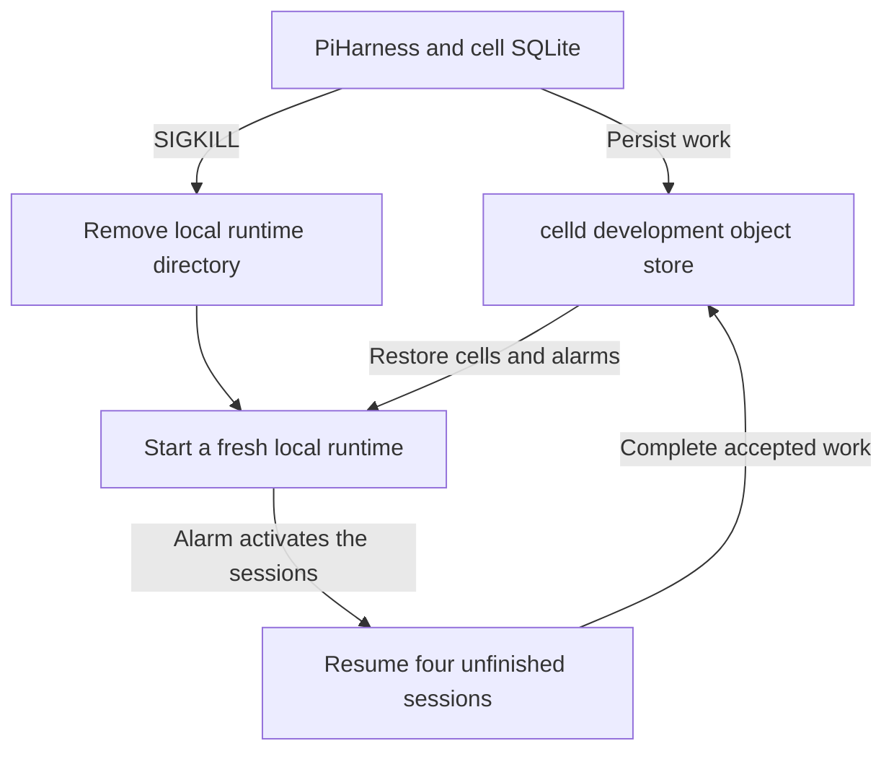

# Pi Durable on celld: execution results

**7 October 2026 · two passing runtime runs · R2 and fleet takeover still unverified**

## Verdict

**The core integration works locally.** Official PiHarness and Lifecycle ran
inside celld, accepted work durably, and resumed it after abrupt process death.
The strongest run deleted celld's entire local runtime directory while four
sessions still had unfinished work. Celld reconstructed their databases from
its development object store, activated them through alarms, and completed all
eight accepted operations without any client request touching those sessions.

This moves the proposal from API compatibility reasoning to an executed
backend prototype. It establishes neither a deployed R2 backend nor a working
mobile connection. The existing Perch app is unchanged.

## The tested boundary



The backing store in this test is celld's own local SQLite implementation of
an object store. Its file and SQLite sidecars remain outside the deleted runtime
directory. A separate loopback observer retains tool effects and artifact bytes.
Only these test fixtures and the application bundle survive the runtime reset.

## Observed results

Each run exercises five sessions. The four interrupted sessions each have a
main operation and one queued follow-up.

| Check | Ordinary restart | Local runtime deleted while work is pending |
|---|---|---|
| Official PiHarness loads and completes a tool-backed session | Passed | Passed |
| Four sessions reach recorded interruption points with follow-ups queued | Passed | Passed |
| Alarms activate and complete eight operations without a client session request | Passed | Passed |
| Safe tool reruns with the same artifact ID and exact bytes | Passed: two attempts | Passed: two attempts |
| Unsafe interrupted tool is not automatically rerun | Passed: one effect | Passed: one effect |
| Interrupted model partial is retained as aborted and inference restarts | Passed | Passed |
| Lost HTTP receipt can be retried without duplicate input | Passed | Passed |
| Completed tool and transcript reopen without another execution | Passed | Passed |
| After a further cache removal, all five completed transcripts restore unchanged | Passed | Passed |

Both runs also preserve provider-facing session identity. Each interrupted
session finishes with exactly two user inputs and an empty pending queue.
The safe and lost-receipt sessions each make two tool attempts using one durable
artifact ID. The unsafe session makes one tool attempt and records an interrupted
tool result. The fixture model then declines another equivalent action.

These are **nine verification groups per run**, not a benchmark or eighteen
independent failure distributions. The fault points are controlled and the
model is deterministic.

## How the evidence was obtained

The test runs the released celld executable and the real npm packages. It does
not replace the SQLite adapter, scheduler, or alarm implementation. The worker
is a plain DurableObject composed with PiHarness and Lifecycle. Esbuild leaves
only `cloudflare:workers`, `node:async_hooks`, and
`node:diagnostics_channel` external; no Node SQLite opener is used.

The runner waits for recorded state before killing the development supervisor
with SIGKILL. On Linux, celld configures its child node to receive SIGKILL when
that parent dies. The runner also requires the public listener to close before
starting a replacement. It does not use graceful shutdown or infer host PIDs.

For the lost receipt, a loopback proxy receives the committed upstream receipt
and destroys the downstream connection. The client genuinely loses the HTTP
response. Its retry uses the original operation ID and receives `accepted:false`.

During the alarm-only phase, only top-level health and the observer are inspected.
Each unfinished session's new boot explicitly reports `activatedBy:"alarm"`,
and both distinct operation IDs report completion before session reads resume.

Startup attaches result waiters. Upstream PiHarness already calls `pi.resume()`
before that host callback; `wait()` also idempotently nudges the scheduler.
The waiters do not submit input. The evidence demonstrates this complete
composition, including unattended alarm activation, without claiming a separate
no-waiter experiment.

## Versions and reproducibility

| Component | Tested version |
|---|---|
| celld | 0.6.1, official Linux x86_64 binary |
| Agents SDK / PiHarness | 0.26.0 |
| Pi Durable, Pi AI, Chord | 1.0.4 |
| Node | 24.19.0 |
| esbuild | 0.28.2 |

From `experiments/pi-celld` in the source checkout, using the current Bun lock:

```sh
bun install --frozen-lockfile
bun run build
CELLD_BIN=/absolute/path/to/celld bun run test
CELLD_BIN=/absolute/path/to/celld bun run test --fresh-cache-on-crash
```

The experiment README includes the exact binary download and verified SHA-256.
The lockfile pins dependencies. `results/summary.json` records source hashes;
the two full JSON reports contain events, receipts, snapshots, counts, and kill
records. Runtime logs are retained alongside them. The first report also records
stricter post-run checks of alarm origins and distinct completed operation IDs;
those assertions are part of the second run's executable test.

## What remains unverified

| Boundary | Why it is still open |
|---|---|
| Real Cloudflare R2 | No scoped R2 credentials were available |
| Production S3 path | The local MinIO executable cannot start: this workspace denies its required route-netlink interface enumeration with `EPERM` |
| Concurrent fleet ownership and fencing | The Pi runs use one celld development node at a time |
| Physical machine or power loss | SIGKILL and directory removal do not test drive flushes, hardware failure, or remote storage durability |
| R2 artifact persistence | The observer retains local fixture bytes; no artifact was uploaded to R2 |
| Real provider/OAuth and Linux execution | The model and tool endpoints are controlled loopback fixtures |
| Perch mobile transport | No native adapter was added by this experiment |

The official MinIO binary was downloaded and its hash verified. Its startup
failure occurs before CLI configuration; it is an environment limitation, not
evidence that celld's S3 recovery fails. The archive includes a prepared external
bucket lab with precise commands and recorded blocker evidence. That runbook
is unexecuted, and the current Pi driver still needs a fleet lifecycle adapter
before it can drive those external nodes.

## Engineering decision

**Keep the existing PiHarness adapter as the starting point.** No adapter fork
or replacement storage implementation was needed for these runs. The small
composition root configures a provider, installs tools, forwards HTTP requests,
and connects Lifecycle to the cell's alarm handler.

The next integration boundary is a protected Perch backend exposing durable
submit, authoritative snapshots, and artifact references. A dedicated R2 test
should then run the same interruption cases through the production S3 path with
fresh node directories and explicit owner-failure checks. Provider credentials,
artifact storage, and Linux execution remain separate concerns.

## Evidence and primary sources

- Experiment: `experiments/pi-celld/README.md`, worker, fixture, and crash runner.
- Full runs: `experiments/pi-celld/results/local-dev.json` and
  `experiments/pi-celld/results/fresh-cache-pending.json`.
- Compact evidence: `results/summary.json` and `results/runtime-provenance.json`
  inside the experiment.
- [Cloudflare PiHarness documentation](https://developers.cloudflare.com/agents/harnesses/pi/).
- [celld cells and storage](https://celld.dev/docs/services/durable-objects/).
- [celld guarantees](https://celld.dev/docs/guarantees/).
- [celld 0.6.1 source: development runtime](https://github.com/denoland/celld/blob/f2bf648663a610eefde71f3547ad61e9b896b1f0/crates/celld/dev.rs).
- [celld 0.6.1 source: local backing object store](https://github.com/denoland/celld/blob/f2bf648663a610eefde71f3547ad61e9b896b1f0/crates/celld/local_store.rs).
