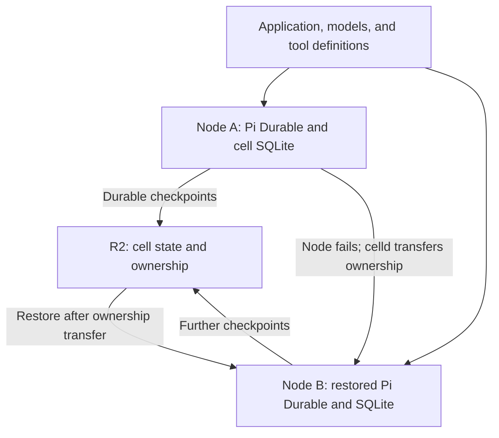

# Pi Durable on celld with R2

> Perch 0.5 follow-up: the [durable backend and native connection](DURABLE-BACKEND.md) now implement this direction. This document preserves the earlier architecture and experiment findings.

**Architecture and local execution evidence · checked 7 October 2026 · R2 and multi-node deployment still unverified**

**Yes. celld and Pi Durable cover complementary parts of a persistent agent.** celld can preserve a cell's database, control its owner, and wake it. Pi Durable knows how to reconstruct unfinished agent work from that database. The existing `PiHarness` Durable Object integration now passes [real celld runtime checks](PI-CELLD-RESULTS.md), including alarm-driven recovery of unfinished work after deleting the local runtime directory. No replacement storage adapter was needed. These runs use celld's development object store; R2 remains untested. [1][2][3]

## The persistent unit

Use one named cell for a top-level agent session and any closely related child conversations. Keep shared assistant profiles, independent workspaces, and artifact storage as explicit resources rather than silently sharing their mutable state across cells. This extends Perch's existing proposal; it is not an implemented hosting option.

The diagram shows the proposed bucket-durability mode and omits replication batching. Only the owner serves the cell. It does not show a live process moving between machines.

| Layer | Owns | Recovery responsibility |
|---|---|---|
| Perch | Client presentation and stable submission identity | Reconnect and show authoritative run/artifact state |
| Pi Durable | Transcripts, queued input, tasks, tool intent/results, replay policy | Reopen storage and continue pending tasks |
| celld | Cell identity, database persistence, ownership, alarms | Activate an owner and supply recoverable SQLite state |
| R2 | Durable object data | Retain replication data and exported artifacts |
| Tool hosts | Models, shell commands, browsers, remote services | Expose outcome lookup or idempotency where effects can be repeated |

These are proposed ownership boundaries. The Pi and celld capabilities come from their respective contracts. [1][3]

## What is actually in R2?

The cell uses SQLite on its serving node. celld captures committed database changes in LTX segments and keeps the durable history under ownership-epoch prefixes in the fleet bucket. Activation reconstructs a database from that history. Generic S3 filesystem mounting is not this mechanism. [3]

There is also a distinction from hosted Cloudflare: its Durable Object SQL database is managed, private storage exposed through the DO API. A celld fleet is a separate runtime on machines we operate, using our chosen bucket. API compatibility does not mean a hosted DO can simply attach a celld database object from R2. [4][5]

## Choose the acknowledgment boundary

| Mode | When celld can acknowledge a write | Design tradeoff |
|---|---|---|
| One node | After a bucket durability proof | Object-store latency on writes |
| `CELLD_DURABILITY=fleet` with peers | After the required follower disks or the bucket prove durability | Lower-latency peer path; bucket upload can lag |
| `CELLD_DURABILITY=bucket` | After bucket proof even when peers are available | Closest match for replacing every compute disk and restoring from R2 |

The default is `fleet`. These are documented guarantees, not benchmark results from our environment. [6]

For a homelab where R2 should contain every acknowledged checkpoint, start the experiment in **bucket mode**. This is a design recommendation. Test its actual latency before trading that recovery boundary for peer acknowledgments.

An owner is claimed using conditional writes, and each activation advances an epoch. A successor must recover required unuploaded follower data before restoring. If it cannot establish that the required history is complete, recovery waits or fails. R2 is qualified by celld; an arbitrary S3-compatible service still needs the required conditional-write, consistency, and range-read behavior. [7]

Consequently, intact disks after a power outage and permanent loss of every replica are different cases. Default fleet mode is not a promise that the bucket already contains every acknowledged write. A failed acknowledgment also does not prove a submission was never committed; the client still needs a stable operation ID.

## Agent recovery after a node fails

A proposed end-to-end recovery sequence is:

1. Submit a request with a stable operation ID and arrange a durable wake while work remains.
2. Pi persists the accepted input and task state through the cell's storage adapter.
3. celld satisfies its durability gate before the success becomes observable.
4. The serving process dies.
5. celld establishes a new owner, recovers any required log tail, and restores SQLite.
6. The new instance reinstalls the same application registry/model definitions, reopens Pi storage, and resumes pending tasks.
7. Perch reconnects and renders the current snapshot without manufacturing a second submission.

Pi's documented recovery retries interrupted model requests while retaining committed partial output. A tool is rerun only according to its replay policy; other interrupted calls are reported to the model. A completed committed result can be reused. This reconstructs execution from recorded work; it does not capture arbitrary JavaScript stacks or a terminal process. [1][2]

An external effect can still occur before its result is recorded. A durable checkpoint cannot make a remote API part of the SQLite transaction. Use stable effect identities and result lookup for operations where a repeated effect would matter. An unsafe interrupted tool can also lead the model to request a new action, so tool replay policy alone is not a universal duplicate-prevention policy.

## The implementation candidate

Pi Durable's portable SQLite layer has a small database facade. Cloudflare's `PiHarness` adapts it to DO SQL/transactions and supplies the persistent wake lifecycle. The local experiment now exercises that adapter and Lifecycle on celld, with real SQL storage, process death, alarm activation, and backing-store recovery. It uses a small application composition root and controlled model/tool fixtures; the published adapter and storage implementation are unchanged. [1][2][3]

Two concrete substitutions matter:

- Use the **DO storage adapter** inside a cell. celld's partial Node support does not include a working Node SQLite opener.
- Select a **direct model provider or reachable self-hosted model**. The Workers AI binding used by some Cloudflare examples is unavailable in celld. [5]

If the existing adapter fails a real integration check, isolate the compatibility issue first. A replacement should be limited to the storage facade and lifecycle integration that actually differ. Keep Linux tools behind an execution-environment interface and retain artifact bytes independently of temporary workspaces.

## Sleeping agents still need compute to wake

celld stores alarms and publishes wake information durably. A running fleet node scans for work whose previous owner stopped. If every node is off, an external service or supervisor must first start a node; R2 cannot execute the alarm. [3][7]

This permits many inactive agents without one resident process each. It does not provide a self-starting fleet when no compute is running.

## Evidence and the next useful experiment

| Check | Evidence |
|---|---|
| Pi Durable process kill/reopen | Three existing local Node SQLite scenarios passed: safe tool, unsafe effect, interrupted model |
| Submission identity and queued input | Preserved in those existing scenarios |
| celld storage and recovery | Official docs/source reviewed; local runtime and backing-store restoration executed |
| PiHarness on celld | Two actual runtime runs passed all nine verification groups |
| Alarm-driven continuation | Four interrupted sessions completed eight accepted operations without a client session request in each run |
| Pending work with local runtime data deleted | Passed using celld's retained development object store |
| R2 writes, multi-node ownership transfer, physical machine/power loss | Not tested |

The original Node SQLite tests are described in `experiments/pi-durable/README.md`. The subsequent [celld experiment](../experiments/pi-celld/README.md) installs the official celld 0.6.1 binary and real PiHarness packages. Its two reports contain receipts, snapshots, alarm-origin events, tool attempts, artifact hashes, and process-kill evidence. Both establish local runtime recovery; neither establishes R2 or concurrent fleet correctness.

The next storage test should run the same interruption cases through the production S3 path, with two celld nodes and fresh node directories. The current workspace has no R2 credentials, and its networking restrictions prevent the prepared local MinIO server from starting. The archive includes that blocker and an external bucket runbook. A fleet lifecycle adapter is still required for the Pi driver. The existing mobile application and cloud deployment are unchanged.

Baselines: Pi Durable **1.0.4**, Agents SDK **0.26.0**, celld **v0.6.1** at `f2bf648663a610eefde71f3547ad61e9b896b1f0`. celld and this Pi Durable integration path remain beta/experimental. [2][8]

## Primary sources

1. [Earendil: Pi Durable, storage portability and crash recovery](https://earendil.com/posts/pi-durable/).
2. [Cloudflare: PiHarness and the plain Durable Object integration](https://developers.cloudflare.com/agents/harnesses/pi/).
3. [celld: Durable Objects / Cells](https://celld.dev/docs/services/durable-objects/).
4. [Cloudflare: SQLite-backed Durable Object storage](https://developers.cloudflare.com/durable-objects/api/sqlite-storage-api/).
5. [celld: Cloudflare and Node compatibility](https://celld.dev/docs/cloudflare-compat/).
6. [celld: configuration, including CELLD_DURABILITY](https://celld.dev/docs/#environment-variables).
7. [celld: ownership, durability proofs, takeover, and wake guarantees](https://celld.dev/docs/guarantees/).
8. [celld: current operational limits and beta status](https://celld.dev/docs/limitations/); [pinned source](https://github.com/denoland/celld/tree/f2bf648663a610eefde71f3547ad61e9b896b1f0).

The source archive includes the focused storage note in `docs/CELLD-STORAGE.md` and the prior Pi evaluation in `docs/PI-DURABLE.md`.
