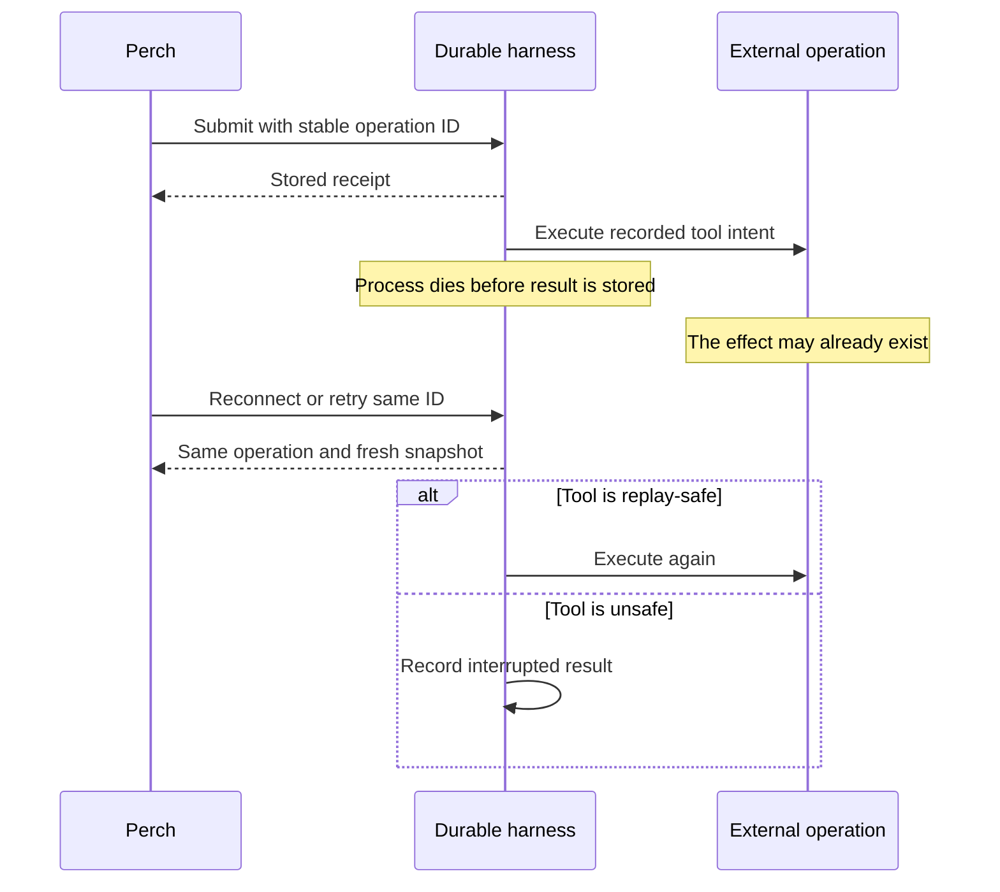

# Pi Durable as a foundation for Perch

> Perch 0.5 follow-up: the [durable backend and native connection](DURABLE-BACKEND.md) now implement this direction. This document preserves the earlier architecture and experiment findings.

**Evaluation and local experiment · 7 October 2026**

**Use Pi Durable for Perch's own persistent assistant, with Linux execution available when a task needs it. Keep Pi CLI, OMP, and OpenCode as independent harness connections.** This gives the app a durable conversation engine without making a running Linux process the owner of every conversation.

The recommendation is based on current upstream documentation, the published source for **Pi Durable 1.0.4 / Agents SDK 0.26.0**, and [three passing local process-crash tests](../experiments/pi-durable/README.md). The experiment is isolated from the mobile app. No Cloudflare service or paid model was used.

## Four choices, rather than one fixed stack

| Concern | Examples | What the choice changes |
| --- | --- | --- |
| Model access | OpenCode Go, a provider API, a self-hosted model | Inference, credentials, model features, allowance |
| Harness | Pi Durable, Pi CLI, OMP, OpenCode | Conversation behavior, tools, extensions, approvals |
| Execution environment | Local directory, home server, Cloudflare Sandbox | Where files, commands, builds, and previews run |
| Presentation | Perch chat and artifact readers | How the person follows work and uses the output |

Changing an execution host can preserve the same harness. Changing a harness may change capabilities and transcript semantics, so it is an explicit connection choice. A provider catalog entry does not establish account access or transport compatibility.

Pi Durable itself is portable: it ships memory, Node SQLite, and JSONL storage, a storage interface, and an execution-environment interface. Its core can run on a home server. Cloudflare's `PiHarness` supplies Durable Object SQLite integration and wake-up behavior. [1][2]

## What it gains over Pi CLI in a container

| Capability | Pi CLI in a Cloudflare container | Pi Durable with `PiHarness` |
| --- | --- | --- |
| Phone disconnects | Our existing bridge keeps the process running while its host survives | Submitted work is stored independently of a phone connection |
| Process dies mid-task | Relaunch the CLI, restore session files, inspect the interruption, and arrange continuation | Persisted tasks resume from their last committed step |
| Retried submission | Requires an application-level operation ledger around the CLI | Stable `operationId` deduplicates admission; the core calls this `requestId` |
| Several conversations | CLI processes/session management and bridge support must be arranged | Create, list, fork, queue, steer, and inspect conversations through harness APIs |
| Long waits | Keep the runtime alive or build external scheduling/restart behavior | Durable pending tasks plus Cloudflare alarms supply wake-up behavior |
| Tool execution | Existing CLI tools and its installed extensions | Typed tools with explicit replay policy and durable per-call state |
| Artifacts | Files are on container disk until exported or checkpointed | The harness can keep artifact metadata durably; file bytes can live independently in R2 |
| Existing Pi setup | Best compatibility with CLI config, packages, terminal extensions, MCP setup, and login flows | A distinct SDK integration; reuse must be checked or implemented |

The CLI remains useful for attaching to a familiar development environment. Pi Durable's advantage is that conversation work has a recorded lifecycle the application can inspect and recover. The same durable core can run outside Cloudflare, so this is not solely a hosting feature. [1][2][3]

## Recovery has precise boundaries

The real core's `harness/tool` implementation records the final arguments and replay policy before execution. Recovery reruns the call only if both its stored policy and the currently installed tool say `safe`. Otherwise it records that the call was interrupted and may have partially run. Tools can retain an identifier through `api.memo()`. [3]

**Deduplicating an input does not make every external effect exactly once.** The model can respond to an interrupted unsafe result by requesting a new tool call. For actions that must not repeat, the operation itself needs an idempotency key, a recorded receipt, or a way to inspect whether it already happened. A durable memo preserves an identifier; it does not make a network API or filesystem write part of the transcript transaction.

An interrupted model request also runs again. The committed partial remains as an aborted entry, so recovery can consume more tokens and produce a different completion. Streaming progress defaults to commits no more often than every 100 ms; the uncommitted tail can be lost. Compaction reduces model context while retaining older entries in storage. [3]

Cloudflare's documented wake job heartbeats every 30 seconds while work remains and splits long waits across alarms. Its 15-minute alarm limit can still interrupt a single exceptionally long model request. These are documented/runtime-source observations, not results from our local experiment. [2][4]

## What still needs an adapter

| Area | Pi Durable gives us | Work Perch still owns |
| --- | --- | --- |
| Chat transport | Snapshot and committed events | Authentication, HTTP/WebSocket framing, reconnect, stable display IDs |
| History | Conversations, forks, stored entries | Titles, account/workspace index, search, retention and export |
| Model selection | Pi AI registry and per-conversation provider/model references | Expose configured models and actual capabilities; keep credentials off the phone |
| Approvals | Hooks can block tools; custom tasks and documents can hold state | Durable approval requests and explicit resume decisions; a blocked call is not a ready-made waiting approval |
| Tools | Typed arguments, streamed output, structured details, memoized state | Useful tools, permissions, validation, external effect reconciliation |
| Skills | Cloudflare adapter loads instructions and resources | Any skill scripts need an execution tool; reading a skill does not run its scripts |
| MCP | Agents SDK has a separate MCP client with persisted connections and OAuth support | Map discovered tools into Pi's registry and preserve their access/replay policy |
| Linux workspace | Portable execution-environment interface; core supplies Node implementation | A Cloudflare Sandbox implementation with file, command, cancellation, and restore behavior |

Pi Durable extensions are named objects containing tools, prompt sections, hooks, wrappers, and tasks. Pi CLI extensions use a different runtime API with commands, lifecycle events, terminal components, and CLI services. Existing extension code is not automatically compatible. The durable package supplies `read`, `write`, `edit`, and `bash`, but those tools fail without an execution environment; image reading is not supported by those built-in durable file tools yet. [3][5][6]

The CLI's `mcp.json` handling includes local stdio servers and Streamable HTTP. A Durable Object cannot directly launch a stdio child process. Remote MCP fits the Agents SDK client; a stdio server belongs in Linux execution or a separately hosted bridge. [6][7]

## Provider reuse: keep the direct path

`PiHarness` accepts a normal Pi AI `Models` registry. We can retain Pi's direct provider implementations and custom compatible endpoints. The same model choice can therefore be used on a home server or in a cloud runtime, provided its authentication and transport work there. [2][3]

The separate **`agents/models/pi-ai` Cloudflare provider is optional**. Its documented routes are:

| Supported API family | Route |
| --- | --- |
| `cloudflare-ai` | Workers AI binding |
| `anthropic-messages` | AI Gateway Messages endpoint |
| `openai-responses` | AI Gateway Responses endpoint |
| `openai-completions` | AI Gateway Chat Completions endpoint |

It currently excludes API families including Google/Vertex, Bedrock, Azure Responses, OpenAI Codex, and Mistral Conversations. It can also drop reasoning formats that are not OpenAI's `reasoning_effort` on the Chat Completions route. Sending every provider through this gateway would reduce coverage. [8]

Pi AI supplies provider authentication interfaces, but the application owns credential storage and login orchestration. Pi CLI auth files, local OAuth callbacks, ambient AWS/Google credentials, and shell-based key resolution need host-specific treatment in a Durable Object. Provider reuse does not imply automatic import of every CLI login. A normal direct provider is the appropriate default for OpenCode Go; do not change its billing route implicitly. [3][6][8]

## Recommended hybrid

| Persistent assistant | Execution tools | Artifact storage | Best use |
| --- | --- | --- | --- |
| Pi Durable on a home server, Node SQLite | Node execution environment | Local files or an object store | Self-hosted foundation with ordinary Linux compatibility |
| Pi Durable in a Durable Object | HTTP tools and direct object writes | R2, metadata in SQLite | Research, writing, API automation, document creation |
| Pi Durable in a Durable Object | Cloudflare Sandbox when requested by a tool | R2 plus temporary workspace disk | Coding, data work, multi-file web previews |
| Existing Pi/OMP/OpenCode process | Its configured tools | Host files, exported through adapter | Preserve an established harness and its plugins |

Use the **same Perch conversation and artifact presentation contract**, with explicit capabilities at each connection. Avoid starting a second general agent loop around an already-running OMP or OpenCode session.

For the cloud version, begin with one Durable Object per top-level conversation, as Cloudflare recommends for isolation and addressing. Use the root Pi session there; child/fork conversations can remain within the object's ownership tree. A separate account index can list conversations. Shared repository access still needs workspace coordination because several conversations can edit the same files. [2]

### Let artifacts outlive the execution process

Give a produced artifact its own stable ID, media type, filename, revision/content hash, origin session/tool reference, and content location. This is a proposed Perch artifact contract, not a Pi feature already wired into the app.

1. Store completed bytes in an object store, then commit a manifest referring to them.
2. Use idempotent object keys and reconcile an upload whose manifest commit was interrupted.
3. Let the phone render Markdown, source, or a self-contained page from that content.
4. Start a Linux preview server only for an artifact that needs a real project runtime.

R2 stores files; a preview server executes a project. Give previews separate hostnames and access checks, with management routes and app credentials kept away from their origins. A stopped sandbox loses processes; snapshots preserve the filesystem, not live execution, and expire after 30 days unless restored. Export important artifacts independently of snapshots. [9][10]

## Cost and operating limits

Pi Durable can avoid keeping a Linux instance alive for conversations that only call models and HTTP tools. It does **not** make active agent work free: Durable Objects bill wall-clock duration while running or unable to hibernate, including time with pending model I/O. Idle objects eligible for hibernation do not incur duration charges. [11]

Containers bill provisioned memory and disk while running, plus active CPU and applicable egress, and require Workers Paid. Linux workspaces and preview servers still incur those costs in the hybrid. Model inference remains a separate provider cost or subscription allowance. Actual savings need workload measurements, not an assumption that every Durable Object run is cheaper. [12]

Durable Objects have bounded CPU, memory, row sizes, and per-object storage; keep large artifact bytes in R2. SQLite rows are limited to 2 MB, and paid objects have a 10 GB storage limit. The current harness also lacks conversation deletion and a stream replay cursor. On reconnect, send a fresh snapshot. Cancellation must be honored by tools; a tool ignoring its abort signal can hold a session busy. [2][4]

## Evidence and next implementation gates

| Evidence | Status |
| --- | --- |
| Exact Pi Durable 1.0.4 core, SQLite, real process kill/reopen | **Passed: 3 scenarios** |
| Input deduplication, surviving queue, provider session identity | **Passed in all 3 scenarios** |
| Safe replay and artifact identity/content | **Passed** |
| Unsafe tool result and interrupted model continuation | **Passed** |
| PiHarness 0.26.0 SQLite integration and wake behavior | Published source and documentation inspected |
| PiHarness on celld 0.6.1 | Two real runtime runs passed, including alarm-driven continuation after deleting local runtime data while work was pending; see [execution results](PI-CELLD-RESULTS.md) |
| Cloudflare runtime restart, alarms, deployment, account separation | Not exercised |
| Real provider/OAuth, remote filesystem, hosted preview | Not exercised |
| Mobile Pi Durable adapter | Not implemented by this experiment |

The next vertical slice should wire durable submit/snapshot/history to Perch with a document-writing tool and a protected artifact download. Then implement approval persistence before broader effects, and a sandbox execution environment for file/build/preview work. Pin the experimental packages and review migrations on upgrade. Retain the CLI adapters throughout.

## Sources

1. [Earendil: Pi Durable announcement](https://earendil.com/posts/pi-durable/), 1 October 2026.
2. [Cloudflare: PiHarness](https://developers.cloudflare.com/agents/harnesses/pi/), updated 5 October 2026.
3. [Pi Durable 1.0.4 package](https://www.npmjs.com/package/@earendil-works/pi-durable/v/1.0.4): published README, `dist/harness/tool.js`, harness types, SQLite adapter; exact dependency integrity is in the experiment's lockfile. Corresponding [upstream source](https://github.com/earendil-works/pi/tree/v1.0.4/packages/durable). Pi AI 1.0.4's `models` and `auth/types` define provider/credential interfaces.
4. [Durable Object limits](https://developers.cloudflare.com/durable-objects/platform/limits/).
5. [Cloudflare: Pi extensions](https://developers.cloudflare.com/agents/harnesses/pi/extensions/).
6. [Pi CLI extension documentation](https://github.com/earendil-works/pi/blob/v1.0.4/packages/coding-agent/docs/extensions.md), [MCP](https://github.com/earendil-works/pi/blob/v1.0.4/packages/coding-agent/docs/mcp.md), and [providers](https://github.com/earendil-works/pi/blob/v1.0.4/packages/coding-agent/docs/providers.md), read from the installed 1.0.4 package.
7. [Cloudflare MCP client](https://developers.cloudflare.com/agents/model-context-protocol/apis/client-api/); also inspected Agents 0.26.0's published `docs/mcp-client.md`.
8. [Cloudflare: Pi AI model provider](https://developers.cloudflare.com/agents/models/pi-ai/), updated 5 October 2026.
9. [Separate preview hostnames](https://developers.cloudflare.com/sandbox/previews/serve-previews-on-their-own-hostnames/).
10. [Sandbox lifetime](https://developers.cloudflare.com/sandbox/concepts/lifetime/) and [container snapshots](https://developers.cloudflare.com/containers/guides/snapshots/).
11. [Durable Object pricing](https://developers.cloudflare.com/durable-objects/platform/pricing/).
12. [Container pricing](https://developers.cloudflare.com/containers/platform/pricing/).
