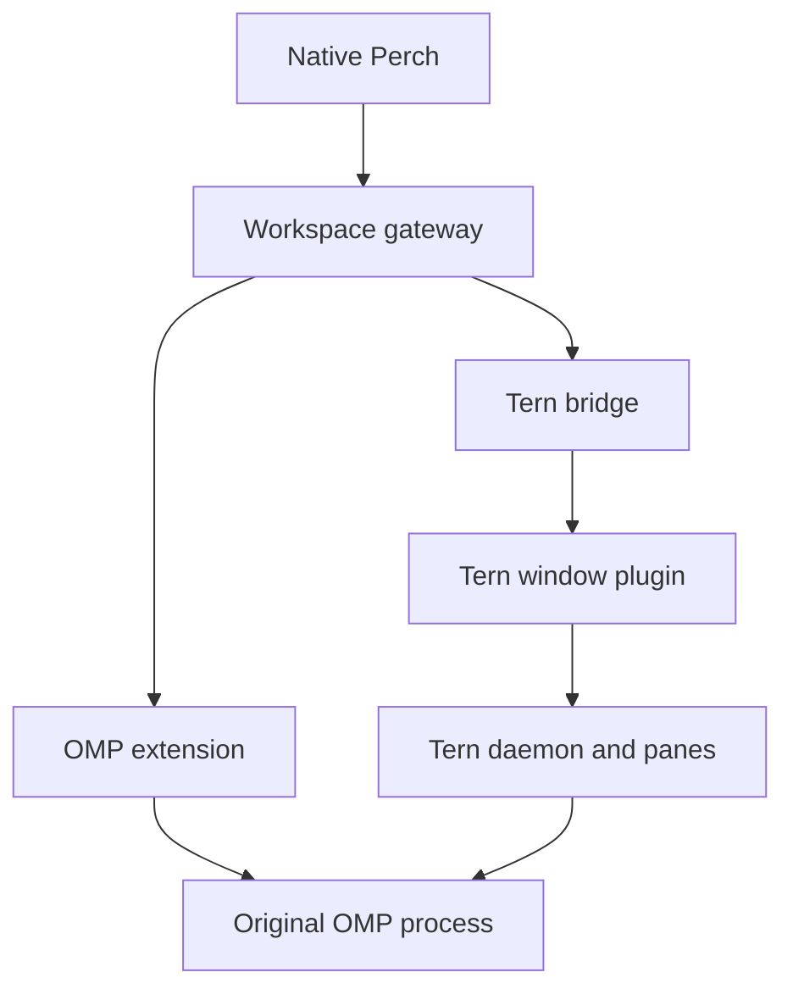
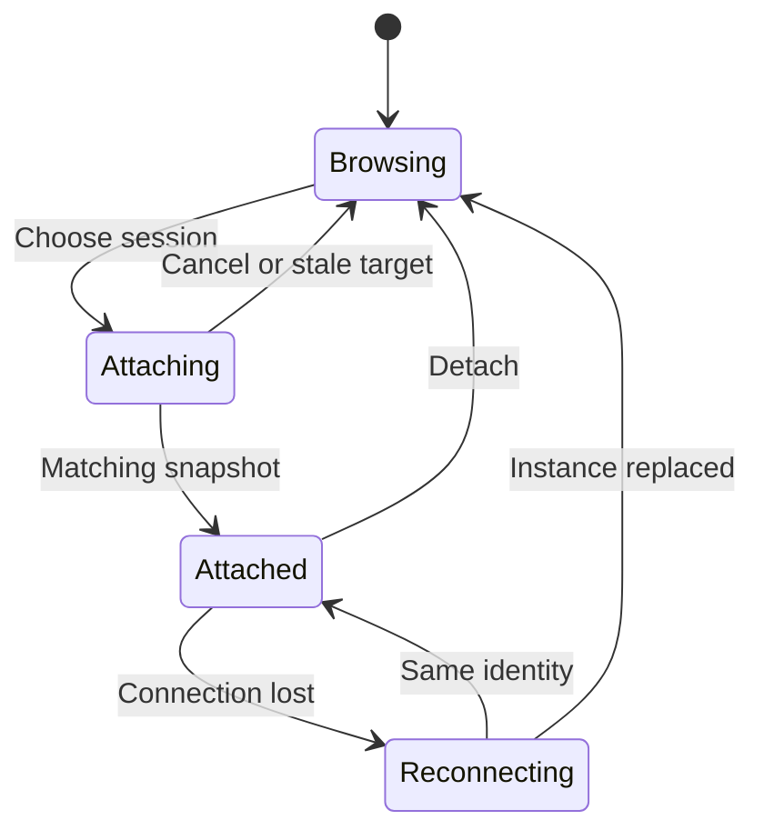

# Native remote workspaces

**Decision:** Perch attaches to a host-owned session. The phone presents its
conversation and outputs; the original harness continues to run on the host.

**Status:** accepted design; first slice implemented in Perch 0.7. This document
defines the first slice separately from later TSP and terminal work. See the
verification record at the end for what has actually run.

The [0.8 owner-request follow-up](REMOTE-REQUESTS.md) extends this first slice
with supported Tern/OMP approvals and plan review. This document retains the
0.7 milestone boundaries; later request support does not imply a native Add
remote host transport or a window-independent daemon client.

## The experience

Pair with a workspace once. Open its remote connection, see the sessions already
running there, and choose **Attach**. Read the conversation, send a message,
interrupt work, and inspect generated Markdown, HTML, or code using Perch's
existing artifact readers. Closing Perch leaves the host session running.

The initial screen remains New chat, with a sidebar and a composer at the bottom
of an attached conversation. Opening a remote connection first shows its session
browser. It must not select an arbitrary agent or create a replacement process.
On a narrow screen, the sidebar opens as a drawer. No bottom navigation is added.

| Action | Meaning |
| --- | --- |
| Attach | Observe and control a selected, already running session |
| Detach | Leave that session and return to the host browser |
| Interrupt | Ask the selected running harness to stop its current work |
| Reconnect | Read the same session's latest state after a transport interruption |
| Resume saved history | Start or recover a harness from a persisted conversation; a separate future action |
| Terminate process | End the host program; intentionally absent from this first client |

The long-term views are **Chat**, **Pane**, **Terminal**, and **Files**. They are
different views of host work, not independent agents. The first slice implements
Chat and the existing transcript-derived artifact views. It does not label a
text capture as a terminal emulator or a complete TSP renderer.

## Ownership and module boundary

The two adapter routes are complementary. The OMP extension exposes the live
harness without Collab's guest policy. The Tern plugin supplies workspace and
pane context and can operate an OMP surface through Tern's native agent API.
Both speak Perch's small remote-session contract. A paired workspace can
advertise both as connections under the same origin and device credential.

The first release does not guess that an OMP extension and a Tern pane describe
the same process. Merging those listings requires an explicit shared identity
from the host. Until then, the selected connection is the authority for its view.

| Module | Owns |
| --- | --- |
| `src/workspace` | Pairing, saved workspace access, discovery and connection choice |
| `src/session/remote` and its driver | Protocol validation, session selection, polling, receipt reconciliation |
| `sessionStore` | One immutable active snapshot and guarded user actions |
| assistant-ui external runtime | Native presentation of that snapshot and session-scoped drafts |
| Workspace gateway | Device authentication and restricted routing to configured loopback adapters |
| OMP extension | Access to the original process's public extension context |
| Tern plugin and bridge | Window-scoped inspection, bounded snapshots and targeted agent commands |
| Harness | Providers, tools, model execution and authoritative history |

Neither the gateway nor the phone adds a second transcript or agent loop. The
gateway must never launch another OMP process against the same session file to
simulate attachment. Runtime recovery and transcript portability are separate
features; swapping the model or deployment does not make harness state portable.

## Interfaces we can use now

### OMP: an extension inside the running harness

The pinned OMP extension API exposes message/tool/session events, a read-only
session manager, user-message delivery, abort, and model selection. The adapter
reads the current branch and projects its records, overlays in-flight message
events, and hands commands back to the same public context. Model selection uses
only models advertised by that context and is disabled while work is active.

Conversation identity comes from `ctx.sessionManager.getSessionId()`. It is
separate from provider-session identity, runtime identity, and process generation.
The extension must refresh its context when OMP changes sessions.

`sendUserMessage` returns before the resulting agent turn completes. A receipt
therefore means **forwarded to the harness interface**, not completed, persisted,
or successfully processed by a provider. Do not pass slash-command text through
this API and claim it ran a host command.

The extension must be loaded into OMP. It cannot inject itself into every
uninstrumented TUI already running. Such a session can use Tern's native agent
surface or the existing Collab adapter; loading the extension may require an OMP
restart or an explicit supported extension reload on the host.

Public extension events do not provide a universal interceptor for all native
questions or an approval callback. Questions, branch changes, arbitrary host
commands, subagent control, and full TUI reconciliation remain later work.

### Tern: a window plugin and a local bridge

The supplied Tern 0.6.0 beta generates declarations for `cx.agents:list`,
`transcript`, `ask`, and `interrupt`, as well as workspace, pane, and surface
inspection. Its `ask` declaration describes an atomic TSP send for a supported
native OMP surface, including queuing until the surface can accept input. The
plugin uses these targeted APIs, not pasted shell commands or a public raw
`tern ctl` endpoint. The first implementation checks the live OMP composer in
the same callback and submits only when `sendable` is true. It deliberately
avoids Tern's deferred prompt queue so a queued phone action cannot outlive the
bridge's view of it.

The plugin runs on a window's UI thread with a short callback budget. Its local
HTTP exchanges are asynchronous. It posts bounded snapshots and receives a
bounded command batch from a loopback service. Each callback uses its fresh
`cx`; no expired context is retained across callbacks.

This is a window-backed bridge. Closing that window removes the bridge even
when the daemon still owns running panes. Ordinary `tern serve` is a deterministic
test environment with fixture state, not a proven attachment to the user's
restored desktop. Headless fixture verification must retain that distinction.

Tern pane identifiers are scoped to a window and can include remapped host
bits. The bridge treats them as opaque values and maps them into its own
generation-bound IDs. It does not claim to know the underlying OMP conversation
file ID when the public Tern API does not expose it.

## The first protocol

`perch-remote` version 1 is Perch's adapter contract. It is not OMP RPC, Collab,
TSP, or Tern's private daemon transport. Both initial adapters advertise
`synchronization: "snapshot"`.

| Endpoint | Result |
| --- | --- |
| `GET /perch/health` | Host identity, adapter type, epoch, synchronization mode and limitations |
| `GET /perch/sessions` | Bounded catalog of current runtime sessions |
| `GET /perch/sessions/{id}` | One authoritative projected snapshot with a revision |
| `POST /perch/sessions/{id}/commands` | Prompt, interrupt, or advertised model selection |
| `GET /perch/sessions/{id}/operations/{commandId}` | The known forwarding receipt, without resubmitting the command |

Each session has an opaque route ID, runtime ID, generation, title, project,
state, and harness identity. A known conversation ID, PID, model, and Tern
location are optional metadata. Commands carry the expected epoch, generation,
and conversation ID when available. The adapter rejects stale identities before
calling the harness.

A snapshot contains its catalog entry, messages, tools, advertised models,
read-only flag, explicit command capabilities, truncation flag and notices. All
snapshots and individual fields are bounded and validated before native rendering.
Recent output takes priority when a transcript exceeds the budget; the UI must
say that the view is partial. Omitted history remains on the host.

### Attachment and reconnect

The catalog does not authorize an immediate send. Only a matching session
snapshot does. A selection change retains the previous view until the new
snapshot is validated, then swaps identity and transcript together. Detaching
invalidates pending requests so an old response cannot reattach the phone.

Polling reads coherent projected snapshots with monotonically ordered revisions
within an epoch. Intermediate streaming states may be coalesced or missed. This
is sufficient for a first native chat view; it is not a lossless event log or an
atomic upstream snapshot-plus-subscription guarantee.

Reconnect reads health, catalog, and the selected session. A new host epoch or
runtime generation requires a new explicit attachment. A replaced instance is
never silently substituted, even if it has the same display name. The app never
resends a prompt, question answer, or terminal keystroke as part of reconnect.

### Command receipts

Command IDs are deduplicated for the lifetime of the adapter's bounded receipt
table. Reusing an ID with different input is an error. Once receipt capacity is
exhausted, a host must reject new commands rather than evicting IDs and quietly
allowing duplicates. An adapter restart creates a new epoch.

| Receipt | Interpretation |
| --- | --- |
| `pending` | The adapter recorded the operation; forwarding is unresolved |
| `forwarded` | The same-process interface was invoked or the Tern plugin acknowledged dispatch |
| `rejected` | The adapter knows it did not admit this action |
| `unknown` | The effect cannot be established; inspect the host before a new action |

Record the operation before invoking the harness. A phone timeout may occur
after the host accepted the command. Reconnect checks its receipt; a missing
receipt does not authorize a retry. An accepted Tern command whose plugin
acknowledgment disappears must remain unresolved, not be redispatched to a
reloaded plugin. These rules reduce duplicate execution but do not promise
exactly-once effects across process crashes or external tools.

## Access, artifacts and Android behaviour

Provider and infrastructure credentials stay on the host. The phone retains
the existing workspace credential in native SecureStore. The gateway replaces
that credential with each adapter's private loopback token and exposes only the
listed routes. No browser redirect, arbitrary upstream URL, raw control socket,
filesystem path, or plugin execution endpoint is added to the public gateway.

The OMP extension and Tern bridge authenticate local requests too. Their
configuration stays outside the checkout with owner-only permissions. Unknown
browser origins are rejected. Pairing grants access to the configured workspace;
it does not silently widen an existing Collab invitation's guest permissions.

Generated Markdown and fenced source continue through the current artifact
model. Known complete file-write inputs can become artifacts; a tool's success
message cannot stand in for file bytes. HTML stays isolated with the existing
script opt-in. Arbitrary host file browsing, immutable remote file revisions,
and content-addressed download routes remain a separate milestone.

On Android, the existing keyboard-inset owner keeps the composer above the IME.
The remote driver does not resize a desktop PTY when the phone keyboard opens.
Android can suspend networking or kill the app; host execution must not depend
on a continuously connected foreground client. Pixel 8a/GrapheneOS still needs
device qualification for keyboard composition, suspend/resume and networking.

## What persistence means

| Interruption | Expected result |
| --- | --- |
| Phone disconnects or closes | OMP continues; a later attachment reads current host state |
| Perch gateway restarts | Host process continues; transport reconnects and reconciles identity |
| Tern window closes | Initial Tern plugin disappears; do not imply the underlying agent stopped |
| OMP process exits | Live runtime is gone; persisted conversation history may be resumable |
| Machine crashes | Tool subprocesses, in-memory jobs and unresolved UI promises are not checkpointed |
| Pi Durable cell restarts | Its separately implemented recovery contract applies, not this adapter's |

SQLite history plus object storage does not by itself checkpoint a running
terminal program. A later daemon-based bridge or supervised OMP launcher can
improve availability. Neither should inherit Pi Durable's guarantees by name.

## Subsequent milestones

1. Qualify owner controls through a TUI-aware session port: shared questions,
   model and branch transitions, explicit command dispatch and subagent views.
2. Add a native TSP subset for text, Markdown, code, tool cards, choices and forms.
   Show unsupported nodes honestly; do not execute arbitrary host UI code.
3. Add real VT rendering with a native terminal component. Preserve emulator
   state, ordered bytes and resize ownership; a text dump is not a checkpoint.
4. Attach through a documented daemon-level transport so the desktop window can
   close independently. Evaluate host supervision and history restoration there.
5. Link OMP and Tern identities explicitly, then offer one workspace view with
   Chat, Pane, Terminal and Files around the same selected runtime.

## Verification record

The first acceptance test is: run OMP on the host, choose its existing runtime
from Perch, send and interrupt work, disconnect Perch, then reattach to the same
process without another prompt being submitted. Repeat through the Tern bridge
where the actual beta supports a native OMP fixture.

Implementation results, commands and remaining limits are recorded in
[REMOTE-WORKSPACE-RESULTS.md](REMOTE-WORKSPACE-RESULTS.md). Required checks exercise public protocol and
lifecycle seams: authentication, explicit selection, identity replacement,
lost receipts, command deduplication, callback lifetimes and detach races. A
deterministic upstream runtime fixture supplies stronger evidence than a
handwritten HTTP mock, but is still not a user's provider or physical phone.

## Source grounding

Reviewed 10 October 2026. Pin implementation assumptions to these versions.

- [Tern window plugin API](https://docs.stencil.so/tern/reference/api-window.html)
  and [runtime architecture](https://docs.stencil.so/tern/concepts/architecture.html).
- [Tern scripts and fixture environment](https://docs.stencil.so/tern/scripts/index.html).
- [Tern SDK declarations at `3fe9124`](https://github.com/stencil-hq/tern-sdk/blob/3fe91247617744635cabb93f4561bd17ac26ca61/plugins/tern.d.luau).
  Also checked against declarations generated by the supplied Tern 0.6.0 beta
  (`0e39682`); the binary is not redistributed in this repository.
- [OMP public extension API at `b07a1c1`](https://github.com/can1357/oh-my-pi/tree/b07a1c146d0d12cfc855a2c65d52f892ef319040/packages/coding-agent/src/extensibility/extensions)
  and [extension authoring guide](https://omp.sh/docs/extension-authoring), OMP 18.8.7.
- [OMP Collab](https://omp.sh/docs/collab) for the existing guest connection and
  its distinct capabilities.
- [Perch's current design](DESIGN.md), [session boundary](../src/session/README.md),
  [workspace setup](WORKSPACE-SETUP.md), and [artifact isolation](ARTIFACTS.md).
