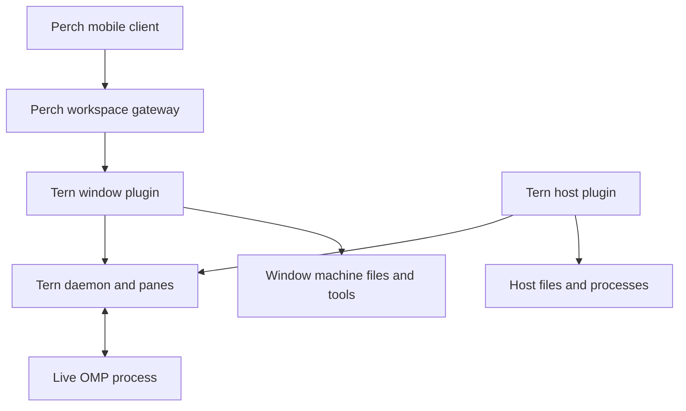

# Tern integration API inventory

Research date: **2026-10-10**. This reference inventories the Tern side of a
Perch ↔ Tern ↔ OMP integration. It distinguishes an API's existence from Perch
using it, and from an operation being verified against a running host.

## Evidence and version boundary

| Evidence | Exact version | What it establishes |
| --- | --- | --- |
| Supplied Linux beta | **Tern 0.6.0 (`0e39682`)** | The user's available executable and its generated plugin declarations |
| Supplied declarations | `tern plugin types` output; SHA-256 `dfb4c9f419dd8a37bd9305c46c8422299b7376b4b5da27c1684bc74637790bbe` | The API declared by that executable; availability is not a runtime test of every method |
| Public SDK | [`3fe91247617744635cabb93f4561bd17ac26ca61`](https://github.com/stencil-hq/tern-sdk/tree/3fe91247617744635cabb93f4561bd17ac26ca61), committed 2026-10-09 12:54:52 UTC | The current public source examined; its sync records source commit `2dff1d4d23f17aa198f18f8482facb0605b5bf3b` |
| Public documentation | [Tern Plugin SDK](https://docs.stencil.so/tern/), retrieved 2026-10-10 | Documented behavior; these pages do not pin themselves to the supplied executable |
| Perch runtime qualification | [Actual Tern/OMP verification](../server/tern-remote/VERIFICATION.md) | Only the exercised catalog, transcript, prompt, interruption, approval and plan paths |

The supplied SDK file was inspected at
`/workspace/scratch/b1d2212c27ee/tern-beta/types/tern.d.luau`; the executable at
`/workspace/scratch/b1d2212c27ee/tern-beta/tern/tern`. These beta resources are not
redistributed here. Public symbol names below also link to the public SDK.

**Notation:** **Used** means used by Perch's Tern adapter; **Available** means
present in the supplied SDK but not exposed in Perch; **Partial** means Perch
uses a subset; **Newer SDK** means absent from the supplied declarations;
**Gap** means no matching public operation was found in the inspected surface;
**Unverified** means the available evidence does not establish runtime support.
A gap is not a statement that an upstream change or another adapter is impossible.

## 1. Where integration can attach

| Surface | Runs where | What it gives Perch | Current status |
| --- | --- | --- | --- |
| Window plugin, `window.luau` | Each open Tern window | Agent conversations, structured pane reads, targeted TSP events, hosts, documents and desktop capabilities | **Used**, through the loopback bridge |
| Host plugin, `host.luau` | The machine's session daemon | Host pane hooks, writes, custom blocks, command lenses, local files/processes/network | **Available**; Perch has no Tern host half |
| TSP | The program's PTY stream | Semantic UI documents and program-owned input handlers | **Partial**; Perch reads selected OMP structures through the window SDK |
| Ordinary Tern CLI | Host-side executable and its selected sessions/window | Inventory, launch/layout, input, capture, process and event operations | **Available** for a different host adapter; current production path does not shell out |
| Developer control endpoint, `tern ctl` | Explicit local control endpoint | Test scenarios, inspection, screenshot/geometry and staged UI state | **Tests only**; not a production mobile protocol |
| Remote service, `tern remote` | Service in front of session daemons | Remote host lifecycle, bootstrap, trust, discovery and diagnosis | **Partial indirectly**: panes on already attached hosts can be seen by Perch |
| Web service, `tern web serve` | Machine serving the daemon and page | Browser replica, if its separately required assets are available | **Unused**; supplied distribution lacks the ready-to-use web dist encountered earlier |
| Public Rust/Python/Go/TypeScript TSP SDKs | An application drawing into a terminal | Program-side node builders, framing, input parsing and reconciliation | **Available**; not a ready-made Android Tern daemon client |

The supplied archive contains exactly two entries, `tern` and `tern/tern`:
there is no separate web asset directory in that archive. The presence of a
`web serve --assets` command is not evidence that the matching distribution
has been supplied. Perch's native bridge does not use it.

A window's plugin can act on panes on attached remote hosts. Its filesystem and
process APIs still run on the window's machine. A remote host's host plugin
runs on that remote machine. Host plugins do not receive `WindowCx` or its
`agents`, `session:surface`, `docs`, or host-management methods. Moving the
existing window plugin into `host.luau` therefore does not make its current
semantic session connection window-independent. [Architecture][architecture]
[Shared API][shared]

## 2. Hosts, session containers and pane identity

These APIs are in both the supplied and public declarations. A **Tern session**
is a named collection of tabs/panes. It is not an OMP conversation or OMP's
branching session history. [Supplied SDK: `ManagedSession`, `SessionInfo`,
`ManagedHost`; public declarations][types]

| Capability | Exact API | Perch status | Integration consequence |
| --- | --- | --- | --- |
| Discover connected hosts | `cx.hosts:list()`, `current()` | **Partial**: list names and pane ownership | Hosts include local/remote kind, address, connection state, identity details, RTT, session/pane membership |
| Add remote host | `cx.hosts:add(address)` | **Available** | Desktop awaitable for `user@host:port`, with optional user/port; suitable for a future phone form that delegates to the host window |
| Confirm a host identity | `cx.hosts:trust(host, fingerprint)` | **Available** | First contact can remain `verify`; the chosen fingerprint must match and be independently verified |
| Switch host | `cx.hosts:switch(host)` | **Available** | Changes the desktop window's shown session; unnecessary merely to inspect a compatible pane |
| Disconnect remote host | `cx.hosts:disconnect(host)` | **Available** | Forgets/disconnects the remote connection while its programs continue; local host cannot be disconnected |
| Launch remote terminal | `cx.hosts:terminal(host, {cwd?, command?})` | **Available** | Creates and focuses a shell tab on a connected host; returns a pane id |
| Named session lifecycle | `cx.sessions:list/current/create/switch/rename/close/lock/unlock` | **Available** | Includes sessions on every attached host; close ends programs and is a raw operation that ignores interactive close guards |
| Pane and tab inventory | `cx.session:panes/tabs/pane/sessions/tab_of` | **Partial** | Current phone catalog filters to agents; SDK can describe terminal/file/browser/git/database/notebook/board/process/screen/profile/plugin panes too |
| Locate a pane | `cx.session:resolve`, `find_tab`, `find_session`, `focused` | **Available** beyond current direct identifiers | IDs and resolve specs are lookup handles, not persistent OMP history identifiers |
| Read tab topology | `cx.session:layout(tab)` | **Available** | Split tree, floating panes, zoom and focus |
| Discover creatable block types | `cx.session:block_types()` | **Available** | Native types and Ready plugin types on the current host |

`ManagedHost.state` is `connecting`, `connected`, `stalled`, `verify`,
`reconnecting`, or `failed`. A trustworthy Add host UI must preserve the separate
connection and fingerprint-verification states. `add` does not authorize an
automatic `trust` call. [Supplied SDK: `HostsCx`, `ManagedHost`; public declarations][types]

Pane IDs are passed back unchanged and scoped to their window. A pane ID,
process ID, Tern session ID and OMP conversation ID are different identities.
Perch currently adds its own registration and pane-generation scope rather
than inventing an OMP session-file identity. See the
[existing adapter's identity limits](../server/tern-remote/README.md#snapshot-and-identity-limits).

### Can an OMP extension identify the Tern pane it runs in?

There are useful inputs for a future combined adapter, but no qualified join
yet. The supplied CLI help describes `tern whoami --json` as the pane's
**identity chain**. The inspected public documentation does not specify its
JSON fields, so this inventory does not claim that the command returns a pane
ID, process ID or canonical OMP conversation ID.

The public spawn-hook documentation explicitly names pane environment values:
daemon panes receive `TERN_IDENTITY`, `TERN_PANE`, `TERN_PANE_SOCKET` and
`TERN_WINDOW_KEY`; a window running panes without a daemon instead supplies
`TERN_WINDOW_PANE` with `TERN_WINDOW_SOCKET`. An OMP extension running as a
descendant can use inherited values as **candidate registration metadata**.
The environment can be overridden, so it is not authentication or proof that a
specific process still owns the pane. [Host hooks][hooks]

A combined adapter should join its independently reported OMP session identity
to a current host/window/pane incarnation, and validate that association through
the host bridge. Remote pane numbering in window Lua is translated and must not
be equated blindly with a raw environment value. A reconnect, replaced process,
nested shell/container, or SSH hop can change or invalidate the association.
This is a proposed correlation design, not an existing Perch feature or a tested
`whoami` contract. No additional host/runtime experiment was performed here.

## 3. Agent conversation API

The `AgentsCx` method signatures are unchanged between the supplied beta and the
public SDK revision. This is Tern's small conversation interface over agent
panes, not OMP's entire application API. [Supplied SDK: `AgentBlock`,
`AgentMessage`, `AgentsCx`; public declarations][types]

| Exact API | Exposed information or action | Perch status |
| --- | --- | --- |
| `cx.agents:list()` | Pane, launch command/model when known, cwd, `idle/working/waiting_input/exited`, last message, possible delivery error | **Used** |
| `cx.agents:start({prompt, cwd, command?, how?})` | Open a new agent block and retain its initial prompt until ready | **Available**; Perch currently attaches to an existing pane |
| `cx.agents:ask(agent, text)` | Submit/queue one prompt; native OMP uses atomic TSP `send` when supported and ready | **Used with extra readiness guards** |
| `cx.agents:wait(agent, {timeout?})` | Desktop awaitable for idle and last assistant text | **Available**; Perch uses snapshots/polling |
| `cx.agents:transcript(agent, {last?})` | User/assistant text and tool presentation metadata/output; default 50 messages, maximum 1000 | **Partial**: Perch takes a bounded recent tail |
| `cx.agents:interrupt(agent)` | Send Ctrl-C without closing the block | **Used** |
| `cx.agents:stop(agent)` | Close the block and end its program | **Available**; not the same as interrupt |

The generated declarations explicitly say native prompts queue until
`sendable:true`, including across a launching VM reset. Perch refuses a send
unless the current normal OMP composer is ready, to avoid leaving an unexpected
queued prompt. One public documentation paragraph describes `ask` as paste plus
Enter; use the supplied executable's declarations and actual runtime proof for
the native OMP path. [Prompt guard and measured behavior][perch-readme]

### Information this API does not provide

| Desired information | What the inspected API actually supplies | Correct route |
| --- | --- | --- |
| Canonical OMP conversation/session-file id | No such field in `AgentBlock` or `AgentMessage` | OMP in-process/session API; correlate it explicitly with the pane |
| Canonical message/entry/tool-call ids | Presentation rows without canonical entry ids | OMP session/event adapter |
| Original message timestamps | No timestamp field | OMP session data; do not synthesize timestamps from polling time |
| Full provider/model catalog and authentication state | Optional currently displayed model only | OMP model/provider/auth APIs |
| Change the running OMP model | No `setModel` in `AgentsCx` | OMP control interface, or a separately qualified OMP picker workflow |
| Fork, branch, compact or navigate OMP history | No corresponding `AgentsCx` methods | OMP session controls |
| Token/cost/context metrics | No structured metric contract in `AgentBlock` | OMP events/state; selected TSP fields may provide display-only metrics |
| Thinking/reasoning blocks | `transcript` deliberately omits thinking/chrome | OMP content model or an explicit additional TSP projection |
| Complete original JSON tool arguments/results | Tools retain what OMP rendered; no mandatory arguments/result schema | OMP tool events or artifact contract |

The absence is from this API, not from OMP or from every possible Tern plugin.
Reading an OMP file with `tern.fs` would still require discovering the correct
file and associating it with the live pane; it is not a canonical identity
lookup supplied by Tern. [Supplied SDK: `AgentBlock`, `AgentMessage`, `PaneInfo`][types]

## 4. Structured UI reads and input

| Exact API | What it reads/writes | Perch status |
| --- | --- | --- |
| `cx.session:read(pane, ReadOpts?)` | Kind-specific bounded model summary or text; no focus change or browser evaluation | **Available** beyond current specialized transcript path |
| `cx.session:surface(pane, SurfaceOpts?)` | TSP tree for the live surface, or newest retained surface; `main`, `dock`, `layer` | **Used** for composer readiness and owner requests |
| `cx.session:view(pane, SurfaceOpts?)` | Mounted accessibility subtree, without actionable node IDs or bounds | **Available**; not a general action locator |
| `cx.session:event(pane, event)` | Targeted TSP event to the live program | **Partial**: qualified approval/plan/simple-choice activation |
| `cx:run(pane, text)` | Raw typed bytes into a pane | **Available**; not used as an approval fallback |
| `cx.session:settle(pane, milliseconds?)` | Await shell completion from OSC 133, then output text | **Available**, desktop only |

`SurfaceOpts` selects an optional root node, depth, node count and text cap.
`ReadOpts` selects text/table output, terminal scrollback, file starting line,
line/row limits and text cap. Default surface nodes are 500, maximum 5000; depth
maximum is 64. A capped tree carries `more`; a retained tree is not necessarily a
currently actionable request. [Supplied SDK: `SurfaceOpts`, `ReadOpts`,
`SurfaceTree`, `TspNode`, `ViewNode`][types]

### Current semantic mapping into native phone controls

| OMP owner surface | Current Perch behavior | Remaining work or boundary |
| --- | --- | --- |
| Stock approval picker | Native full bounded context and current enabled choices; explicit answer | No preselection; incomplete context remains read-only |
| Plain fallback Approve/Deny selector | Qualified native choice | Filtering, marking, timers and compound controls remain unsupported |
| Plan review | Native Markdown/source, selected strategy/model detail, current enabled options | Strategy editing and annotations need their own operations |
| Refine plan | Send the real Refine action, return to the ordinary composer | Feedback is a separate explicit prompt |
| Simple single-choice picker | Native choice where its complete known structure is supported | Unknown/custom layouts require another mapper |
| General `ui.input` / `ui.editor` | Host-action notice | Pinned OMP reports `sendable:false`; no atomic submit through current TSP `send` |
| Section annotation editor/chooser | Read-only | Must model the owner state machine and submission behavior |
| Arbitrary custom TSP UI | Not rendered as a full interactive phone surface | A broader TSP renderer or named semantic adapter is possible |

These support statements come from Perch's code and recorded actual OMP/Tern
checks, rather than the mere existence of `session:event`.
[Request mapper](../server/tern-remote/plugin/requests.luau)
[Verification](../server/tern-remote/VERIFICATION.md)

**Acknowledgement boundary:** TSP has frame acknowledgements for UI rendering.
It has no generic request-id + expected-document-revision + accepted-answer
transaction for OMP decisions. Perch checks the current tree before dispatch,
but cannot make that a transaction inside a different process. A forwarded
activation is not proof of a completed tool or durable side effect.
[Input events][input] [Owner request analysis](TERN-REMOTE-CONTROLS-RESEARCH.md)

## 5. Files, documents and artifact data

These are especially useful for improving artifact consumption without routing
every action through a shell. They still need a Perch artifact transport and
phone UI. None is currently exposed by the Tern adapter as a file API.
[Supplied SDK: `DocsCx`, `BlockRead`, `CanvasCx`, `NotebookCx`, `GitCx`, `tern.fs`][types]

| Available surface | What it can give us | Important qualification |
| --- | --- | --- |
| `cx.docs:read(path, {from?, lines?})` | Exact text, including line endings and unsaved edits when the document is open | Desktop awaitable; defaults to the whole document. No explicit host or pane-id parameter. Cross-host document access is **unverified** |
| `cx.docs:outline(path)` / `search(path, query)` | Markdown headings and source positions; literal search matches | Good for outline and jump-to-section navigation |
| `cx.docs:open` / `new_note` | Open/reveal a document or create a session-owned Markdown note | Opens host UI; does not download a file into Perch |
| `cx.docs:write/edit/append/save` | Whole replacement, literal or section edits, append and confirmed save | Shared open-buffer undo/dirty/autosave behavior; closed-file operations are separate disk writes |
| `cx.session:read(filePane, options)` | `host`, `path`, file kind/mode/load/dirty, paged lines, caret/selection, image/hex metadata when available | Bounded displayed/model content; image metadata is not a guaranteed binary payload |
| `tern.fs.read(path, max_bytes?)` | Exact raw file bytes on the plugin context's machine | Window half reads its own machine, host half its host. This does not become remote merely because a remote pane is focused |
| `tern.fs.list/exists/mkdir/write/remove` | Directory and file operations on that machine | No built-in workspace allowlist or immutable artifact identity |
| `cx.git:diff/status/log` | Patches, changed paths and repository history | Local desktop repositories; not arbitrary remote Git through the focused host |
| `cx.notebook:cells(nb)` | Full cell sources and outputs, including MIME maps/base64 payloads | Loaded notebook, stable cell IDs only during that loaded instance |
| `cx.canvas:get(pane)` / `list()` | Persistent panel metadata and UI trees | Panels cannot contain input/editor/image kinds; this is not a browser or notebook output system |
| `BlockCx:blob(bytes, mime)` | Store content-addressed image data for a plugin's TSP nodes | A producer API; no corresponding public `WindowCx` blob-download method is declared |
| Raw TSP `b` and `q:blobs` | Publish image blobs and ask whether hashes already exist | Presence query is not a generic file/blob retrieval API |

### Exact text is not the same as an immutable artifact

`docs:read` intentionally chooses the current editable document, including
unsaved changes. A file's on-disk bytes can differ. An output that Perch promises
to export exactly should instead have an explicit host, path or opaque artifact
id, content version/hash, MIME type and bounded read route. This is a proposed
Perch contract; Tern does not already supply that whole artifact API.

Similarly, the current native plan Source tab reconstructs OMP's displayed plan
sections and title. It is not an original-file download. Fetching the exact plan
file requires the additional route and correct host association described above.
[Current request design](REMOTE-REQUESTS.md)

## 6. Desktop workspace capabilities available for later integration

Every row here is **Available but not exposed by Perch's Tern adapter**, unless
marked otherwise. Most methods are desktop-only; check the exact declarations
before promising operation on a mobile Tern runtime. [Supplied SDK][types]

| Capability family | Useful Perch feature | Scope / limit |
| --- | --- | --- |
| `cx.layout` | Remote workspace organizer: create tabs/splits, move, float/dock, name/color/order, snapshot/restore/arrange | Arranges panes; does not migrate processes between machines. Cross-host moves refuse |
| `cx.board` | Read and edit Markdown task boards, check tasks, move cards/lane organization | Local Markdown files; opaque card/lane IDs survive API edits but not external reload/reopen |
| `cx.git` | Native change list and diff review, staging, commit, branches, stashes | Local repositories; no Git fetch/pull/push methods in this declared API |
| `cx.notebook` | Notebook reader, cell editing, execute one/all, kernel status/restart | Actual kernel executions; no declared input-answer or interrupt method here |
| `cx.db` | SQLite table/schema explorer, bounded query results and explicit writes | Local existing database; default read-only. Connections are VM-local; no declared close/export/download method |
| `cx.browser:call(op)` | Browser preview/session controller, DOM snapshot and element actions | Real desktop browser pages; headless DOM snapshot fails. Not embedded directly into Perch |
| `cx.procs` | Local task manager, process details, stop/signal/profile | Always window machine; no socket/port inventory in its sampler |
| `cx.screen` | Start/stop view/control sharing and inspect status | Discovers local displays. Status supplies frame dimensions, not a complete native-phone video transport |
| `cx.settings` | Discover and edit Tern preferences, installed themes and key bindings | Tern preferences, not OMP provider credentials/catalog; headless changes are ephemeral |
| `cx.actions` | Discover named palette commands and route explicit actions | Includes availability and effective keys. Generic action execution is broader authority than current Perch operations |
| `cx.canvas` | Persistent status panel, review dashboard or handoff checklist in Tern | Window-authored, replicated native UI panel; ownership governs updates/actions |
| `cx.whiteboard` | Diagram/whiteboard reader and shape edits | **Newer SDK only**; absent from supplied declarations |

The public browser interface shares the `tern browser` operation envelope.
Named operations include `open`, `state`, `goto`, `nav`, `events`, `close`, `eval`,
`capture`, `input`, `snapshot` and `act`; read-only `blocks` is also described.
`act` supports `click`, `fill`, `press`, `select`, `check`, `uncheck`, `hover`,
`scroll`. A browser's snapshot refs are invalidated by navigation. Treat these
as a separate adapter capability rather than passing arbitrary browser JSON
through Perch's approval endpoint. [Supplied `tern browser --help`; `BrowserCx`][types]

## 7. Host plugins, extension registration and shared facilities

| Extension point | Exact surface | Example integration | Status |
| --- | --- | --- | --- |
| Custom pane type | `tern.block.define(id, BlockDef)` | Durable host artifact catalog or task dashboard | **Available** |
| Block lifecycle | `init`, `view`, optional `title`, `key`, `event`, `resize`, `save` | Restore a dashboard's saved JSON state, handle native actions | **Available**; latest SDK adds `features` for `edit/undo` |
| Block effects | `BlockCx:render/save/exit/frame/blob`, inherited `toast/open/copy` | Update a report, persist state and show an image | **Available** |
| Command lens | `tern.lens.define(id, LensDef)` | Convert compiler/test output into structured diagnostics/artifacts | **Available** |
| Lens lifecycle | `open`, `line`, `finish`, `view`, optional `event` | Consume captured output lines and update a native view | **Available**; matching is a manifest decision, not an arbitrary output subscription |
| Host pane access | `tern.pane.list()`, `tern.pane.write(pane, text)` | Host catalog or explicit terminal fallback | **Available**; no host-side surface reader declared |
| Spawn filter | `tern.on("spawn", fn)` | Set controlled environment or launch wrapper for new panes | **Available**; synchronous filter, not interception of every OMP tool call |
| Host lifecycle | `command_started`, `command_finished`, `cwd`, `title`, `pane_exited` | Availability/status notifications and end-of-command artifacts | **Available** |
| Window lifecycle | `window_start`, `focus`, `pane_created/closed`, `tab_created/closed`, `command_started/finished`, `cwd`, `title`, `canvas_action` | Keep host catalog and pane generations up to date | **Partial**: current adapter uses lifecycle invalidation and registration |
| Palette command | `tern.command(def)` | Pairing status, open Perch settings | **Available** |
| Key binding / command override | `tern.bind`, `tern.override` | Open a phone handoff panel, replace a built-in command | **Available** |
| File/link routing | `tern.route.open`, `tern.route.link` | Open an artifact with the right native viewer or plugin block | **Available** |
| Chrome formatting | `tern.chrome.tab_title/window_title/status/refresh` | Surface phone connection state in Tern | **Available** |
| Styling | Manifest `styles`, `tern.css(name, source)` | Match Tern-side Perch controls to the workspace | **Available** |
| Files/network/processes/storage | Shared APIs below | Transport commands and snapshots; persist plugin settings | **Partial**: Perch uses the needed bounded reads, HTTP and encoding |

The plugin manifest exposes `schema`, `id`, `name`, `version`, `description`,
`icon`, `host`, `window`, `styles`, `blocks`, and `lenses`. Block metadata is
`id/title/icon/files/palette`; lens metadata is `id/match`. Host catalogs carry
available block types, lens claims, styles and load problems to replicas.
[Manifest][manifest]

Tern plugins execute with the rights of the daemon/window user. The SDK is not a
per-operation authorization system; Perch's workspace authentication,
read-only setting and narrow command schema provide the phone-facing boundary.
A capability in Tern is not permission to expose unrestricted execution to every
phone client. [Trust model][security]

### Shared API inventory

| Namespace | Exact members | Important behavior |
| --- | --- | --- |
| Runtime metadata | `tern.context`, `tern.plugin.{id,name,dir,data}`, `tern.runtime.{os,jit}` | Distinguish host/window and resolve plugin storage |
| Logging | `tern.log.debug/info/warn/error` | Structured host logging target; global print is info |
| JSON | `tern.json.encode/decode/array/null` | Explicit array/null representation; not arbitrary Luau object serialization |
| Binary encoding | `tern.base64.encode/decode` | Standard or URL-safe encodings |
| Time | `tern.now`, `tern.timer`, `TimerHandle:cancel`, `tern.sleep` | Monotonic time and asynchronous delays; ordinary timers die with the VM |
| Environment | `tern.getenv` | Environment of this context's process |
| Storage | `tern.kv.get/set` | JSON file shared by plugin halves/windows on the same machine; not a transactional database |
| Secrets | `tern.secrets.get/set` | Window plugin system keychain; ephemeral in headless mode; not a host/plugin-general credential broker |
| Files | `tern.fs.read/write/list/exists/mkdir/remove` | Synchronous I/O on this machine; optional bounded regular-file read |
| Process | `tern.process.run(argv, options?, callback?)` | Direct argv; callback or awaitable; bounded captured output; unavailable on iOS |
| Network | `tern.fetch(url, options?, callback?)` | Whole-response HTTP(S), bounded response body, callback or awaitable |
| Async result | `Awaitable:next(fn)` | Fresh window callback context; Carly can use `await` |
| Output parsers | `tern.parse.columns/packed/json_tree/location/size` | Convert common terminal output into structured data |

There is no declared Luau HTTP listener, WebSocket client/server, streaming-fetch
body, filesystem watch, or generic window↔host RPC function. An external helper
process can supply missing transport capabilities. Current Perch uses chained
HTTP exchanges precisely because `fetch` supplies complete responses.
[Supplied SDK shared declarations][types] [Current bridge][perch-readme]

## 8. Carly integration and persistence

Carly is Tern's built-in assistant. These are **Tern extension surfaces**, not
already a Perch remote-conversation interface. [Supplied SDK: `tern.carly`,
`TaskSpec`, `TaskInfo`, `ExportCall`][types]

| Exact API | What can be built | Boundary |
| --- | --- | --- |
| `tern.carly.export(name, {sig, doc}, fn)` | Named Tern tools callable from Carly, such as a Perch handoff/export | JSON arguments/results, up to 16 exports per plugin, asynchronous reply handle |
| `tern.carly.context(fn)` | Add selected workspace/artifact context to a Carly question | Small request contribution: 400 characters per plugin, 1600 total |
| `cx:ask_carly(text)` | Ask Carly about a selected report or pane | Opens/submits a shown question; no public transcript-subscription method here |
| `tern.carly.schedule(spec)` | Durable timed reminders or event checks, optionally starting Carly turns | Desktop window-owned scheduling |
| `tern.carly.tasks()` / `cancel(id)` | List/manage scheduled tasks | Includes all windows' tasks; built-in heartbeat id 0 is not deletable |
| `tern.carly.on_canvas(fn)` | Handle Carly-owned native panel actions | Carly's conversation VM only; not a general plugin registration |
| `ExportCall:reply/fail/wait`, `.cancelled` | Async completion of exported calls | Handle can survive a callback; scoped `cx` cannot |

Task definitions and JSON check state can survive reloads/launches, but tasks
run in the window that created them. A window reopen can run a `resume` check.
This is useful persistence, not proof of a daemon-only durable OMP execution
engine. [Carly scheduling][carly]

Other persistence mechanisms have different meanings:

| Mechanism | Persists | Does not establish |
| --- | --- | --- |
| Session daemon and TSP replicas | Pane screens/surfaces while programs keep running across window detach | Surviving process execution after a daemon/host crash |
| Restored terminal state | Kept inline/flow output and blobs; new shell after daemon stop | A resumed OMP instruction pointer or unresolved owner callback |
| `BlockDef.save` / `BlockCx:save` | Custom plugin state supplied back to `init` | Generic serialization of another program |
| `tern.kv` | Plugin JSON values | Transactional compare-and-set or exactly-once work |
| `cx.canvas` | Native panel content across reload/restart | A still-running action handler without a loaded window owner |
| Carly scheduled tasks | Task definitions, check state and run history | Always-running cloud/container agent execution |

TSP snapshots are presentation recovery. Execution recovery still belongs to
OMP plus its host process/service design. [TSP persistence][persistence]

## 9. TSP protocol and renderer surface

TSP **version 1** is a documented program↔terminal protocol. Its public SDKs are
MIT-licensed separately from the closed Tern application. The TypeScript
package in the inspected repository is `@stencil-hq/tern` **0.1.0**, requiring
Node ≥22; this verifies repository contents, not publication of any package to
a registry. [Public SDK README][sdk] [TypeScript manifest][ts-package]

### Protocol inventory

| Part | Exact names | Perch status |
| --- | --- | --- |
| Program-to-terminal verbs | `q`, `o`, `f`, `b`, `t`, `s`, `x` | Window Tern parses these; Perch has no full wire parser/replica |
| Terminal-to-program verbs | `r`, `e` | Perch sends selected semantic events through `session:event` |
| Queries | `hello`, `blobs` | No direct phone handshake |
| Program features | `edit`, `undo`, `send` | Perch uses OMP's supported ready composer send path |
| Terminal features | `blobs`, `settle`, `adopt`, `dock`, `program-palette`, `reduce-motion`, `aside`, `scroll`, `styles`, `flow` | Not separately negotiated by Perch |
| Surface modes | `inline`, `screen`, `flow`; block surfaces also appear in SDK reads | Current projection consumes the live OMP surface |
| Regions | `main`, `dock`, `layer` | Transcript/readiness/request mapping |
| Frame operations | `add`, `set`, `text`, `splice`, `move`, `del`, `settle`, `focus`, `reveal`, `scroll`, `suspend`, `resume` | Host handles rendering; Perch does not replay all operations |
| UI/user events | `toggle`, `select`, `activate`, `action`, `change`, `focus`, `edit`, `undo`, `send` | `activate` and prompt submission are qualified subsets |
| Lifecycle/transport events | `ack`, `resize`, `theme`, `motion`, `visible`, `error`, `gone` | Not exposed as a phone event stream |

These names are inventoried from public [`wire.ts`][wire]. TSP carries UI over
the PTY; it does not by itself specify Tern's remote-host authentication,
daemon attachment or session-management network protocol. [Transport][transport]

### Complete current node vocabulary

| Family | Kinds |
| --- | --- |
| Layout | `col`, `row`, `card`, `section`, `rule`, `spacer` |
| Text and source | `text`, `md`, `code`, `diff`, `ansi`, `rows`, `math` |
| Media/data | `image`, `kv`, `table`, `tree` |
| Labels/navigation | `badge`, `kbd`, `icon`, `list`, `item`, `tabs`, `picker` |
| Progress/motion | `spinner`, `shimmer`, `elapsed`, `rate`, `progress`, `meter`, `chart`, `effort` |
| Input/chrome | `editor`, `input`, `status`, `seg`, `toast`, `overlay` |
| Agent/workflow | `tool`, `agent`, `checklist`, `prefs`, `block` |
| Fixed HTML subset | `el` |

The SDK supplies typed props/builders for this vocabulary; `block` is Tern's own
kind rather than an ordinary program builder. Common nodes include stable
IDs/keys, roles, text, semantic tones, visibility, actions, links, accessibility
names and layout hints. Perch currently preserves selected semantic content,
not every node's rendering/interaction. [Public `wire.ts`][wire]
[Typed props][props]

The public TSP SDKs offer layered building blocks:

| SDK layer | TypeScript entry points / class methods | Why it matters |
| --- | --- | --- |
| Wire | `encodeMessage`, `encodeJson`, `chunks`, `splitMessage`, `decodeReply`, `decodeEvent`, `blobId`, `encodeBlob` | Reusable protocol parsing/encoding primitives |
| Input | `InputParser`, `KeyDecoder` | Separate TSP replies/events from ordinary terminal input |
| Nodes | `Node`, `node`, `span`, `toJson`, `fromJson`, `ui`, `html`, JSX runtime | Program-side view construction |
| Reconciliation | `Tree`, `View`, `REGIONS` | Diff a new semantic view into operations |
| Session | `connect`, `Session.handshake/open/surface/blob/blobs/next/close` | Program-side terminal handshake and stream lifecycle |
| Surface | `Surface.render/stylesheet/palette/focus/reveal/scroll/settle/suspend/resume/send/close/acknowledge/gone/dispatch` | Program-side state, updates and event dispatch |
| Helpers | `print`, `ask`, `plain`, `bar`, `css` | Static output, forms, fallback and styling |

These libraries primarily make programs **emit** native terminal UI. They are
useful material for a future phone renderer, but they are not a packaged Tern
renderer or authenticated daemon client. [TypeScript entry point][ts-index]

### Boundaries a renderer must preserve

- Only a live listening program receives ordinary input events. Retained output
  does not imply an answerable request. [Input][input]
- `send` requires the program feature and a live editable target with
  `sendable:true`; an arbitrary editor is not automatically a submit endpoint.
  [Handshake][handshake]
- TSP native editing uses UTF-16 offsets and a current-text-length check.
  This is not a cryptographic revision or durable command receipt. [Input][input]
- Raw JavaScript/raw HTML execution is not a TSP capability. `el` is a fixed
  element/attribute subset and Markdown HTML is literal text. Perch's isolated
  HTML preview is a separate product feature. [TSP security][persistence]
- TSP display acknowledgements and atomic visual frames do not roll back failed
  application actions or prove business-operation completion. [Frames][frames]

## 10. CLI, service and tooling surfaces

The following commands were read from the supplied beta's help. Their existence
is not an assertion that every command works with all windows closed.
Ordinary command help scopes operations to `--window KEY`, the caller's pane
window, or the first window. `tern whoami --json` exposes a pane's identity chain,
not an OMP conversation id. [Supplied executable: `tern --help`, per-command help]

| Family | Commands | Role for Perch |
| --- | --- | --- |
| Inventory | `ls`, `inspect`, `whoami`, `process` | Alternative host-side inventory/diagnostics |
| Sessions / launch | `new session`, `new tab`, `split`, `run`, `-e` | New sessions/panes and command launch |
| Arrangement | `move`, `pip`, `dock`, `rename`, `focus`, `close`, `kill`, `keep-open` | Workspace manipulation |
| Wait / input | `wait --until exit/prompt/idle=MS`, `send keys/text/paste/mouse` | Terminal fallback controls; not semantic approval guarantees |
| Capture | `capture --html/--ansi --scrollback --surfaces` | Text/HTML output capture; `--surfaces` adds main-region text, not the entire interactive tree |
| Event stream | `events --filter KIND,...` | JSONL until interrupted; available for a host adapter, not used by current Perch |
| Browser | `browser JSON --timeout SECONDS` | Structured desktop browser operations |
| File opening | `open --split/--tab/--preview --wait PATH` | Reveal files in Tern; not file download |
| Plugin lifecycle | `plugin list/reload/dir/install/remove/link/unlink/types`, `--json`, `--window` | Install, inspect, reload and obtain exact declarations |
| Daemon | `daemon --socket PATH` | Retain panes between windows |
| Remote service | `remote serve/host-key/install/update/trust/setup/doctor/hosts/discover` | Service, host setup, fingerprint, version updates and diagnosis |
| Web service | `web serve --listen --token --assets --allow-origin --access` | Browser replica server requiring matching assets |
| Developer mode | `--control`, `serve`, `ctl`, `shot`, `help dev` | Local development/qualification, not mobile production API |

`remote serve` declares `--user`, `--listen`, `--state-dir`, `--access`,
`--authorized-keys`, `--relay`, `--pkarr`, `--no-iroh`. `remote setup` accepts an
SSH destination, but the service is not therefore just a raw SSH terminal.
The inspected public TSP SDK repository does not provide a supported full
remote-daemon wire/client implementation. Direct native attachment needs an
upstream contract or another authorized bridge. [Supplied remote help; public SDK tree][sdk]

The public scenario `remote` family can stage a fingerprint, state, SSH setup
progress, peers or aliases; staged `connected` is not a network connection.
`remote loopback` is different: it attaches a real local in-process daemon for
testing. The optional loopback test was blocked by Unix-socket permissions in
this environment, so actual external SSH/tunnel behavior remains unverified.
[Remote scenarios][remote-scenarios]
[Existing verification](../server/tern-remote/VERIFICATION.md)

## 11. What the current integration cannot provide through its chosen boundary

| Desired feature | Classification | What would change it |
| --- | --- | --- |
| Use current Perch Tern adapter after its last Tern window closes | **Unavailable through this adapter** | A supported daemon-side read/event API, direct client, or headless OMP adapter |
| Direct Android Add remote host / daemon attachment | **Not implemented; client transport not found in public SDK** | Window-delegated Add host is available now; direct attachment needs further upstream interface work |
| Run the supplied Linux x86-64 Tern binary natively on Pixel ARM64 Android | **Not supported by this supplied binary/platform** | An Android port/build or remote use; public support matrix does not list Android |
| Run Luau window plugins inside Tern's web tab | **Explicitly unavailable** | Different runtime/product architecture; host-produced views can still replicate |
| Add arbitrary executable HTML/JS to a TSP node | **Explicitly unavailable by TSP design** | Separate isolated web/artifact surface |
| Exact OMP history, request or tool metadata never emitted in TSP | **Unavailable from presentation alone** | OMP extension/control/session API, possibly joined with the Tern pane |
| Atomic expected-plan-revision answer transaction | **Missing upstream request contract** | OMP acknowledged resolver with revision and idempotency semantics |
| General OMP editor submit despite `sendable:false` | **Unavailable through atomic TSP send in pinned OMP** | Explicit supported handler/upstream extension; terminal key fallback has different semantics |
| Arbitrary remote binary file through the local window's `tern.fs` | **Wrong host boundary** | Host-side file service/host plugin or verified Tern remote-file API |
| Turn Tern layout snapshot or TSP snapshot into durable OMP execution | **Not what these APIs store** | OMP persistence and supervisor/checkpoint design |
| Move a live process from one Tern host to another with `layout:move` | **Explicitly refused** | Start/resume on another host; process migration is a different system |
| Obtain native live UI action IDs from `session:view` | **Not returned** | Use semantic `session:surface` or another supported block API |

The support matrix names macOS, Linux, Windows, iOS and web. iOS runs window
halves interpreted and no host halves/process spawning. This is evidence for
Tern's iOS client boundary, not an Android SDK promise. [Platform matrix][matrix]

## Appendix A. Complete window method index

This index lists all **130 methods in the 16 supplied `WindowCx`
subcontexts**, plus its **8 direct methods**. Exact argument/result declarations are
in the [public SDK][types]; version differences are below. Grouping does not
mean Perch exposes all of them.

| Namespace | Every declared method |
| --- | --- |
| `cx.session` | `sessions`, `layout`, `find_tab`, `find_session`, `tab_of`, `pane`, `read`, `surface`, `view`, `event`, `panes`, `tabs`, `focused`, `resolve`, `block_types`, `settle` |
| `cx.sessions` | `list`, `current`, `create`, `switch`, `rename`, `close`, `lock`, `unlock` |
| `cx.hosts` | `list`, `current`, `add`, `switch`, `trust`, `disconnect`, `terminal` |
| `cx.agents` | `list`, `start`, `ask`, `wait`, `transcript`, `interrupt`, `stop` |
| `cx.layout` | `new_tab`, `split`, `focus`, `close`, `move`, `resize`, `tab`, `move_to_tab`, `move_to_new_tab`, `float`, `dock`, `even`, `name_tab`, `color_tab`, `order_tab`, `rename_session`, `snapshot`, `restore`, `arrange` |
| `cx.docs` | `open`, `read`, `outline`, `write`, `edit`, `append`, `save`, `new_note`, `search` |
| `cx.canvas` | `open`, `set`, `get`, `list` |
| `cx.board` | `open`, `boards`, `read`, `add`, `move`, `check`, `edit`, `remove`, `add_lane`, `rename_lane`, `remove_lane` |
| `cx.git` | `repo`, `status`, `log`, `diff`, `stage`, `unstage`, `commit`, `branches`, `checkout`, `create_branch`, `stash_push`, `stash_pop`, `open` |
| `cx.notebook` | `open`, `cells`, `run`, `add`, `edit`, `kernel_status`, `kernel_restart` |
| `cx.db` | `open`, `tables`, `schema`, `query`, `exec` |
| `cx.browser` | `call` |
| `cx.procs` | `list`, `find`, `children`, `signal`, `open`, `profile` |
| `cx.screen` | `displays`, `share`, `stop`, `status` |
| `cx.settings` | `get`, `set`, `set_many`, `list`, `describe`, `themes`, `keybinds`, `bind`, `unbind` |
| `cx.actions` | `list`, `run`, `keys`, `describe` |
| Direct `cx` | `run`, `open`, `new_block`, `command`, `action`, `ask_carly`, `toast`, `copy` |

The declaration file contains other exported data types for options/results,
not additional independent runtime APIs. Host contexts, shared `tern` methods,
registration hooks and protocol verbs are indexed in sections 7–10.

### Complete Luau view-builder index

`tern.ui` declares `span`, `link`, `path`, `text`, `col`, `lines`, `row`, `card`,
`section`, `rule`, `badge`, `kv`, `table`, `meter_cell`, `meter_parts_cell`, `tree`,
`list`, `code`, `diff`, `md`, `meter`, `progress`, `bars`, `spark`, `ansi`,
`diagnostic`, `test_summary`, `overflow`, `node`, `el`.

These are helpers over the node vocabulary; the lower-level `node` constructor
can build kinds that lack their own convenience function. Returning a node tree
to Tern is distinct from rendering that tree in React Native. [Supplied `tern.ui`][types]

### Tern and OMP vocabulary compatibility

The current Tern SDK lists **44** kinds. Pinned OMP **18.8.7** at
`b07a1c146d0d12cfc855a2c65d52f892ef319040` lists **42** in
[`packages/wire/src/tsp.ts`][omp-wire]. The exact difference is:

| Kind in Tern, absent from pinned OMP's kind constant | Consequence |
| --- | --- |
| `block` | Tern's shell-command/lens output kind; a generic Tern client needs the block's data and presentation rules, not just OMP chat nodes |
| `el` | Tern's fixed HTML element/form subset; a generic client needs these element props and form events, beyond OMP's current node set |

OMP reads the terminal's advertised kinds/features into its native context and
can choose component fallbacks; the static 42-kind constant is not the complete
vocabulary of every Tern surface. Reusing OMP's internal tree validator would
not automatically validate all 44 Tern kinds: it rejects kinds outside its own
constant. A future general Perch renderer must negotiate/track the target
vocabulary and give unknown controls an explicit unsupported state rather than
silently enabling an incomplete form. [OMP native backend][omp-native-backend]
[OMP internal tree validator][omp-native-apply]

OMP can optimistically start with its own assumed vocabulary before the real
hello arrives, then re-describe components if the advertised vocabulary differs.
Known components check support, but that does not prove every arbitrary custom
component implements a fallback. Capability negotiation is necessary and still
needs representative renderer tests.

## Appendix B. Supplied beta versus current public SDK

An exact textual comparison of the two declaration files found the following
changes. Unlisted method signatures in Appendix A are the same. No new beta
binary was installed or assumed.

| Change in public SDK `3fe9124` | Supplied 0.6.0 declarations | Qualification |
| --- | --- | --- |
| `cx.whiteboard:open/read/edit` | Absent | **Newer SDK only**, desktop; current HTML Window API page did not yet describe it |
| Whiteboard data types | Absent | Query by shape IDs/area; state includes view/selection/styles; ordered edits form one undo step |
| Whiteboard edit operations | Absent | `add`, `move`, `resize`, `rotate`, `text`, `style`, `delete`, `lock`, `unlock`, `group`, `ungroup`, `duplicate`, `order`, `align`, `distribute`, `layout`, `flip`, `look`, `paper`, `show` |
| Whiteboard shapes | Absent | `rect`, `ellipse`, `diamond`, `triangle`, `text`, `arrow`, `line`, `polygon`, `curve`, `ink`, `highlight`, `image`, `group` |
| `cx.layout:park/unpark` | Absent | **Newer SDK only**; keeps programs alive while parking/dealing panes |
| `PaneInfo.parked` | Absent | Read indication for parked panes |
| `PaneKind` adds `canvas`, `carly` | Absent in union | The supplied binary's developer help can mention canvas UI; that does not establish the newer callable API |
| `BlockDef.features` | Absent | Opt into `edit` and `undo` for host-defined block fields |
| `cx.canvas` wording | Called persistent native canvas | Public SDK distinguishes `tern.canvas` UI panels from `cx.whiteboard` shape canvases |
| Canvas argument validation wording | Less explicit | Public declaration explicitly rejects unknown fields and empty changes |
| Layout snapshot/arrange wording | Tabs/trees/floats | Public SDK includes parked panes and can deal parked blocks into an arrangement |
| `ExportCall:wait` return type | `userdata` | Public SDK names an opaque `ExportWait`; no new method |

Two documentation/declaration mismatches also matter:

1. Public Window API prose says `agents:ask` pastes then presses Enter. Both
   declaration versions specify atomic native OMP `send`, which Perch measured.
2. Public Carly guide/reference prose says an export value is capped at 16 KiB;
   both declaration versions describe **1 MiB** encoded replies. This inventory
   does not claim a runtime-tested size limit. Keep payloads small until the
   actual deployment is qualified.

## Sources

- [Public plugin declarations at the pinned SDK revision][types]
- [Supplied executable and actual integration evidence](../server/tern-remote/VERIFICATION.md)
- [Architecture][architecture], [platform matrix][matrix], [shared API][shared],
  [host API][host-api], [window API][window-api], [manifest][manifest],
  [trust/security][security]
- [Carly exports and scheduling][carly]
- [TSP transport][transport], [handshake][handshake], [frames][frames],
  [input][input], [persistence/security][persistence], [elements][elements],
  [SDKs][sdks]
- [Tern remote scenarios][remote-scenarios]
- [Current Perch Tern adapter][perch-readme]

[types]: https://github.com/stencil-hq/tern-sdk/blob/3fe91247617744635cabb93f4561bd17ac26ca61/plugins/tern.d.luau
[sdk]: https://github.com/stencil-hq/tern-sdk/tree/3fe91247617744635cabb93f4561bd17ac26ca61
[ts-package]: https://github.com/stencil-hq/tern-sdk/blob/3fe91247617744635cabb93f4561bd17ac26ca61/typescript/package.json
[ts-index]: https://github.com/stencil-hq/tern-sdk/blob/3fe91247617744635cabb93f4561bd17ac26ca61/typescript/src/index.ts
[wire]: https://github.com/stencil-hq/tern-sdk/blob/3fe91247617744635cabb93f4561bd17ac26ca61/typescript/src/wire.ts
[props]: https://github.com/stencil-hq/tern-sdk/blob/3fe91247617744635cabb93f4561bd17ac26ca61/typescript/src/props.ts
[architecture]: https://docs.stencil.so/tern/concepts/architecture.html
[matrix]: https://docs.stencil.so/tern/concepts/support-matrix.html
[shared]: https://docs.stencil.so/tern/reference/api-shared.html
[host-api]: https://docs.stencil.so/tern/reference/api-host.html
[window-api]: https://docs.stencil.so/tern/reference/api-window.html
[manifest]: https://docs.stencil.so/tern/reference/manifest.html
[security]: https://docs.stencil.so/tern/concepts/security.html
[carly]: https://docs.stencil.so/tern/guides/carly.html
[transport]: https://docs.stencil.so/tern/protocol/transport.html
[handshake]: https://docs.stencil.so/tern/protocol/handshake.html
[frames]: https://docs.stencil.so/tern/protocol/documents.html
[input]: https://docs.stencil.so/tern/protocol/input.html
[persistence]: https://docs.stencil.so/tern/protocol/operations.html
[elements]: https://docs.stencil.so/tern/elements/index.html
[sdks]: https://docs.stencil.so/tern/protocol/sdks.html
[remote-scenarios]: https://docs.stencil.so/tern/scripts/remote.html
[hooks]: https://docs.stencil.so/tern/guides/hooks.html
[omp-wire]: https://github.com/can1357/oh-my-pi/blob/b07a1c146d0d12cfc855a2c65d52f892ef319040/packages/wire/src/tsp.ts
[omp-native-backend]: https://github.com/can1357/oh-my-pi/blob/b07a1c146d0d12cfc855a2c65d52f892ef319040/packages/tui/src/native/backend.ts
[omp-native-apply]: https://github.com/can1357/oh-my-pi/blob/b07a1c146d0d12cfc855a2c65d52f892ef319040/packages/tui/src/native/apply.ts
[perch-readme]: ../server/tern-remote/README.md
