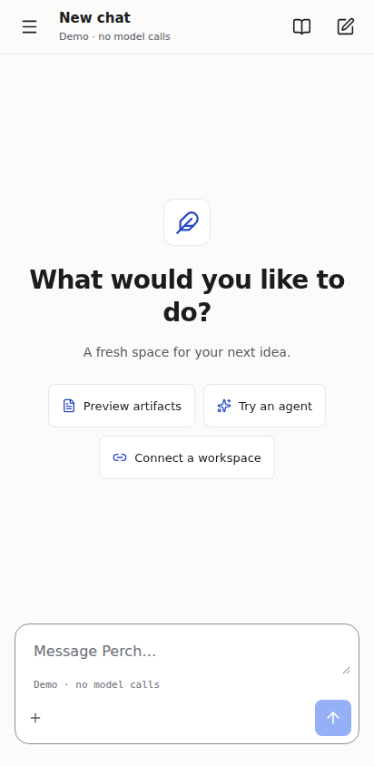
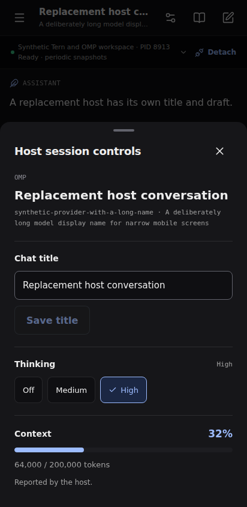

# More of Tern and OMP in Perch 0.9

**Release scope:** Perch 0.9.0, Android version code 10. This extends the
[previous integration inventory](TERN-OMP-INTEGRATION-MAP.md) with working
native controls, captured host files and offline diagrams.

## What the phone can do

| Phone feature | OMP extension route | Tern window route |
| --- | --- | --- |
| Attach to an existing process | Existing | Existing |
| Prompt, interrupt, reconnect without replay | Existing | Existing |
| Model selection | Existing host catalog | Not exposed |
| Thinking selection | **New**, current model's advertised efforts | Not exposed |
| Chat title | **New**, host-confirmed rename | Not exposed |
| Context estimate | **New**, public `getContextUsage` | Not inferred from rounded terminal labels |
| Current branch usage and cost | **New**, reported persisted assistant usage | Not exposed |
| Tool catalog | **New**, public descriptions and active state | Not exposed |
| Actual saved-file snapshots | **New**, supported built-in writes on Linux | Transcript-derived artifacts only |
| Owner approvals and plan choices | Remain with the host/Tern route | Existing supported owner requests |
| Show current pane on desktop | Not exposed | **New**, explicit `cx.layout:focus` |

The controls appear through **Host session controls** in the chat header or
Connection settings. Capabilities come from the attached host. Old adapters
that do not advertise the optional features retain their existing behavior.

Thinking and title changes wait for idle, no queued prompt or host decision,
and no unresolved command receipt. OMP still applies its own thinking ceiling;
the phone shows the resulting level from a fresh snapshot. Rename waits for the
host's asynchronous persistence API. Neither change is displayed optimistically.

**Show in Tern** stays available during work and requests. It only reveals the
current pane. Read-only access, offline state, an opening session, an unavailable
pane, or an unresolved prior command still blocks it. It cannot answer a dialog.

### Added remote protocol surface

These are host-adapter paths. The paired workspace gateway forwards them under
the selected connection. They extend Perch's projection protocol; they are not
new upstream OMP RPC or Tern daemon endpoints.

| Existing or new route | Addition in 0.9 |
| --- | --- |
| `GET /perch/sessions/{id}` | Optional `insights`, `storedArtifacts`, and `thinkingSelection`, `sessionRename`, `focusSession` capability flags |
| `POST /perch/sessions/{id}/commands` | `set-thinking` with `provider`, `modelId`, `level`; `rename-session` with `title`; `focus-session` with no action-specific fields |
| `GET /perch/sessions/{id}/operations/{operationId}` | Existing receipt lookup also covers the new commands |
| `GET /perch/sessions/{id}/artifacts/{artifactId}` | New bounded, authenticated delivery of a captured file by opaque ID |

Commands retain their operation ID, host epoch, session generation and attached
conversation ID. OMP supplies thinking and rename; Tern supplies focus. Missing
optional capability flags mean unavailable. The full definitions and validators
are in [the shared remote contract](../src/harness/remote.ts).

## Reuse instead of rebuilding

| Need | Implementation |
| --- | --- |
| Chat ownership | Existing assistant-ui external store, with OMP/Tern as the owners |
| Session facts and settings | Public OMP extension APIs and `SessionManager.getBranch()` |
| Desktop focus | Tern's window SDK, through the existing authenticated bridge |
| Saved-file display | Existing `StoredArtifact` manifest, reader, SHA-256 and export path |
| Diagrams | **Official Mermaid 12.1.0** browser build, bundled offline |
| Markdown/code | Existing native Markdown and lowlight/highlight.js readers |
| File access and bounded caching | Bun/Node filesystem and crypto APIs; no new file-serving framework |

The [package research](INTEGRATION-REUSE-RESEARCH.md) records why the smaller
Beautiful Mermaid alternative was rejected: some syntax can be skipped by its
partial parsers. The official engine owns grammar validation in this release.
OMP's `RpcClient` and the ACP SDK remain candidates for a future **managed
process** adapter, distinct from attaching to the process already in a terminal.
KaTeX and Papa Parse are researched follow-ups, not installed features.

## Artifacts you can inspect

Mermaid artifacts have **Preview / Source**, fit and zoom. Markdown diagrams
render on demand, so long reports do not mount a WebView for every fence.
The renderer and its dependencies are local; no CDN or model credentials are
needed. Source, copy and export preserve the full diagram text. Preview limits
are 20,000 characters and Mermaid's 200-edge bound. These do not constitute a
general CPU-time limit for every diagram family.

A successful supported OMP write can add an actual **Host file snapshot**.
The extension checks the built-in tool's provenance and copies stable UTF-8
bytes inside the project. An opaque artifact ID selects that copy; HTTP callers
cannot supply a filesystem path. Downloads are bounded and checked against the
manifest's byte count and SHA-256 before opening.

This cache currently requires Linux descriptor-path verification. It holds
at most 32 files, 2,000,000 bytes per file, and 8 MiB total. Files that cannot be
captured have no saved-file manifest. Captures clear on OMP generation changes
and process exit. This does not turn the OMP extension into a durable runtime,
file browser, historical file index, or repository editor.

The [artifact contract](ARTIFACTS.md) describes the shared HTML and Mermaid
isolation, source preservation and download rules.

## Visual direction

Perch adopts Tern's documented neutral surfaces, cobalt controls and 6/8/12/16
corner scale. OMP's compact activity separation informs the chat: open assistant
prose, outlined user turns, status-colored tool rows and monospace metadata.
Touch targets remain 44–48 dp and the traditional sidebar/bottom-composer layout
is unchanged. The [visual design note](TERN-OMP-VISUAL-DESIGN.md) records exact
tokens and source references.

This is a native adaptation of the documented design language. Perch does not
read or synchronize a user's selected Tern/OMP theme, embed TUI components, or
copy the beta's fonts. Its own name and icon remain.

### Rendered app

These captures show the production Expo web export at 412 × 844. The control
panel uses synthetic host data to check long labels and session replacement;
it is not a screenshot of a physical Android device or a user's live session.

| New chat, light | Host controls, dark |
| --- | --- |
|  |  |

## Update an existing host

Update the same Perch checkout used by your adapters, install the locked
dependencies, and restart the workspace gateway:

```sh
git pull --ff-only
bun install --frozen-lockfile
```

For **OMP remote**, reload the extension using the host's supported extension
reload flow, or start an owner OMP process with the same `--extension` path and
private configuration. Do this when it is safe to replace the running host
session. The app does not inject an extension into an arbitrary live process.
The [OMP setup guide](../server/omp-remote/README.md) supplies the full command.

For **Tern remote**, rerun the host setup to copy the updated plugin, retain its
existing credentials, then reload the linked plugin and restart the bridge:

```sh
bun server/tern-remote/setup.mjs
tern plugin link "$HOME/.config/perch/tern-plugin"
bun server/tern-remote/index.mjs
```

Use your existing process/service manager for restarts; do not run a second
listener on the same port. The gateway must be updated too, because it now
allows the scoped artifact download route. Existing pairing credentials remain
valid. Reconnect the phone and explicitly attach to the current session.

Install the 0.9 Android prototype from the existing [GitHub release channel](https://github.com/phibkro/perch/releases).
Obtainium continues to use `perch-prototype-arm64.apk`, prereleases enabled,
and the existing `dev.perch.assistant` package/signing identity.

## Verified boundaries

The [runtime qualification record](RUNTIME-QUALIFICATION-2026-10-10.md) identifies
the supplied Tern 0.7.0 (`9ca00e4`) and OMP 18.8.7 executable by SHA-256. It
separates actual process tests from protocol fixtures and browser checks.

The uploaded OMP executable runs the production extension in an isolated
workspace with a synthetic loopback provider. The expanded fixture exercises
rename, thinking selection, stale-model rejection, context, tools and a stock
file write with exact captured-byte download. It makes zero paid model calls.
Separate Tern tests exercise actual owner approval/plan handling and pane focus.

Automated phone-store, gateway and server tests cover identity changes,
read-only access, missing capabilities, stale model choices, asynchronous
rename, duplicate/lost receipts, file containment and late artifact downloads.
Real Chromium fixtures cover the actual exported app and isolated Mermaid
frames. These are not physical Pixel/GrapheneOS interaction or performance tests.

The final app fixture passes 11 scenarios in light and dark at 412 × 844,
including long-label layout, progress/disclosure accessibility attributes,
capability removal, host-confirmed edits and focus during work or a question.
The separate Mermaid fixture passes 13 rendering and isolation cases.

All 12 required local Android workflow gates pass, together with app type
checking, a frozen Bun install, packaged third-party notice verification and
the Android version/signing-key guard. GitHub repeated the required checks and
passed the standalone ARM64 build, enabled lint and release-asset checks.

### Published Android release

[Perch 0.9.0](https://github.com/phibkro/perch/releases/tag/v0.9.0) was published
on 10 October 2026 from commit `bbd545d375c9e4d102eae0cbfe5efb0fc590e7e7`.
The [workflow](https://github.com/phibkro/perch/actions/runs/38059416790) passed
all three jobs on its first attempt. It took 15 minutes 30 seconds overall;
the native build and lint step took 13 minutes 7 seconds.

| Downloaded APK property | Independently verified value |
| --- | --- |
| Version / Android version code | `0.9.0` / `10` |
| Package | `dev.perch.assistant` |
| ABI | ARM64 only; 21 native libraries |
| Size | 58,894,158 bytes (**56.17 MiB**) |
| SHA-256 | `37e27e36ce7736d5cccf70446a7ab3588c2a4903bdc52b2525be83b0f7619a43` |
| Signature | APK v2 verified; same prototype certificate as 0.8 |
| Android SDK | Minimum 24, target/compile 36; not debuggable |
| Native alignment | 16 KiB ZIP offsets and ELF load alignments verified |

Download the [ARM64 APK](https://github.com/phibkro/perch/releases/download/v0.9.0/perch-prototype-arm64.apk),
[checksums](https://github.com/phibkro/perch/releases/download/v0.9.0/SHA256SUMS),
or [release metadata](https://github.com/phibkro/perch/releases/download/v0.9.0/release-metadata.json).
The existing Obtainium source and APK filename continue to apply. These binary
checks do not establish installation or behavior on a physical Pixel 8a or
GrapheneOS device.

The APK is **10.53 MiB larger than 0.8.0**. Almost all of that increase comes
from Mermaid being embedded as a UTF-16 string in the uncompressed Hermes
bundle. The [package research](INTEGRATION-REUSE-RESEARCH.md#measured-cost-in-the-released-android-apk)
records the exact comparison and a future separate-asset packaging option.

Evidence: [independent release verification](verification/0.9/independent-verification.json),
[timing and size measurements](verification/0.9/timing-size-summary.json), and
[11-scenario exported-app report](verification/0.9/session-controls-browser.json).
The first report distinguishes CI's generated-bundle comparison and official
`zipalign` execution from independent signature, manifest, ZIP, ELF and packaged-byte
inspection. Its notices digest matches the committed source blob.

## What still needs a deeper connection

The OMP extension and Tern window are still two explicit routes. Tern's public
window projection does not yet provide a verified binding to OMP's canonical
conversation ID. Perch therefore does not join them by process title, pane name
or a guessed PID mapping. A qualified binding is needed before OMP metadata and
Tern owner approvals can be safely offered as one automatically joined session.

Tern's uploaded 0.7 archive still returns **No web client here** from `web serve`;
this native integration does not use that web distribution. Direct Add remote
host transport, daemon-only access after the last window closes, arbitrary TSP
UI, new host sessions, branch/compaction controls, and a full remote editor are
separate integration slices.
