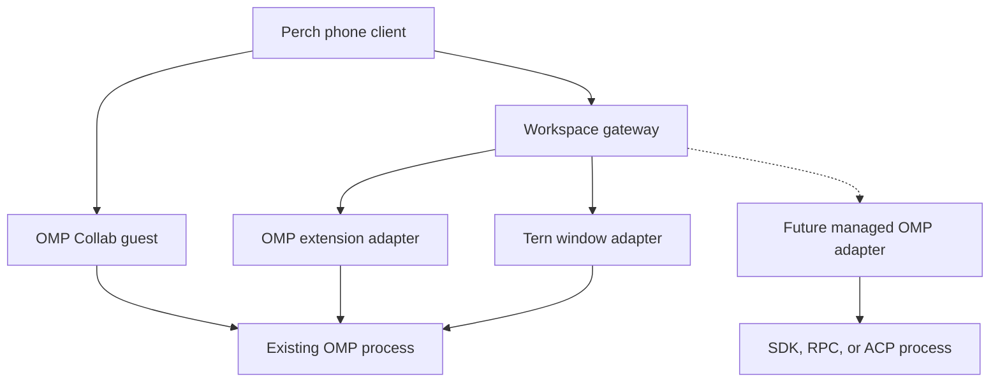

# Perch, Tern, and OMP: integration surface map

> **Version note:** This inventory records the pinned pre-0.9 baseline.
> [Perch 0.9 additions](TERN-OMP-0.9.md) cover the new session controls,
> captured file downloads, pane focus and diagrams.
> [Runtime qualification](RUNTIME-QUALIFICATION-2026-10-10.md) adds the supplied
> Tern 0.7 and OMP executable evidence.

**Audit date:** 10 October 2026. **Perch baseline:** 0.8.0 / Android code 9,
commit `3f2fef0bc6457dd8eee7f2359867beaa5fd974e4` (application release source
`61bf8cbfb39409b590f84ad3c38b4ff324683d51`). This is an inventory and development
map, not a claim that the upstream SDKs are already exposed through Perch.

## Read the map

Most missing features are implementation gaps. A smaller group needs a different
connection or an upstream API change. A promise such as exactly-once external
effects after a crash cannot be obtained from a UI event or a transcript backup.

| Status | Meaning |
| --- | --- |
| **Shipped** | Implemented in Perch 0.8 on the named route |
| **Partial** | Implemented with the stated content, scope, or control limits |
| **Available** | An upstream interface exists; Perch does not yet expose it |
| **Blocked here** | The named interface cannot provide this behavior as currently designed; another route or upstream change is needed |
| **Unverified** | Documentation or declarations are insufficient to establish support in the supplied runtime |

Availability and evidence are separate. A public declaration establishes an API
contract, not successful execution on the user's device. The existing runtime
and Android verification records are [VERIFICATION.md](VERIFICATION.md) and
[ANDROID-BUILD.md](ANDROID-BUILD.md).

### Versions behind the findings

| Component | Inspected baseline | Separately checked newer source |
| --- | --- | --- |
| Perch | 0.8.0, Android code 9; source commits above | No application changes in this audit |
| Tern | Supplied 0.6.0 beta, build `0e39682`; generated Luau declarations | Public SDK `3fe9124` from 9 October 2026; declaration differences, not a newer runtime test |
| OMP | Pinned checkout `b07a1c1` and separately installed package 18.8.7 | Main `d46bd42` from 10 October 2026; the key SDK, RPC, ACP, extension and Collab contracts are unchanged |

The OMP checkout and installed package share a version string but differ in
some UI details. The inventories distinguish them and link the earlier runtime
qualification. Capability negotiation remains necessary even when version
strings match.

### Reference set

| Reference | Scope |
| --- | --- |
| [Tern API inventory](TERN-API-INVENTORY.md) | Exact shared, host, window, scripting, Carly, and TSP families; supplied-beta versus public-SDK differences |
| [OMP API inventory](OMP-API-INVENTORY.md) | Exact SDK, extension, RPC, ACP, Collab, TSP, persistence, tool, and configuration families |
| [Perch implementation audit](PERCH-INTEGRATION-AUDIT.md) | What the shipped adapters and native UI actually project or allow |
| [Remote request design](REMOTE-REQUESTS.md) | Existing approval and plan-review ownership, delivery, and setup contract |

The inventories cover integration-facing exported families and their members.
Private helper functions, provider implementation internals, and development-only
test utilities are not additional supported mobile APIs.

## 1. The connection determines which controls exist

Tern's session daemon owns panes. A Tern window has a replica and the richer
window-plugin context. OMP owns the agent conversation, tools, and decisions.
These are distinct identities: a Tern saved workspace, a Tern pane, an OMP
conversation, and a Perch workspace connection are not interchangeable.
[Tern architecture][tern-architecture] [Perch remote protocol][perch-remote]

The diagram shows process ownership and integration choices. It does not imply
that Perch currently combines the Tern and OMP adapters into one attached
session. They are separate source choices. The dashed managed-runtime route
does not yet exist for OMP in Perch.

| Route | What it connects to | Current Perch use | Main boundary |
| --- | --- | --- | --- |
| Tern window plugin + Perch bridge | An existing native OMP pane, through its Tern window | **Shipped** | Needs that window; selected TSP shapes and bounded transcript projection |
| Perch OMP extension + bridge | Public extension context inside an existing interactive OMP process | **Shipped** | Richer OMP state and model APIs, but no public resolver for all stock owner dialogs |
| OMP Collab guest | An existing session shared by its OMP owner | **Shipped, partial** | Guest permissions and the subset projected by Perch; host-local commands remain host-only |
| OMP SDK | OMP session embedded in a Bun host process | **Available** | The host creates/owns the session; importing the SDK does not attach to another interactive process |
| OMP RPC / RPC-UI | An OMP subprocess controlled over JSONL stdin/stdout | **Available** | Requires a long-lived host adapter; same wire in RPC-UI, with UI-capable behavior |
| OMP ACP | An OMP subprocess using Agent Client Protocol over stdio | **Available, conditional** | Requires implemented client capabilities; different process ownership and plan-confirmation caveats |
| Tern raw daemon client / Android remote-host transport | Direct participation as a Tern client | **Unverified / not implemented** | No stable public third-party attachment wire contract was established by this audit |

[Sources: Perch implementation audit](PERCH-INTEGRATION-AUDIT.md),
[OMP SDK][omp-sdk], [RPC][omp-rpc], [ACP][omp-acp], [Collab][omp-collab].

## 2. Shipped route comparison

This table describes Perch's behavior, not everything the upstream product can
do. In particular, a field in an upstream wire schema does not mean the native
app renders it or has a button that invokes it.

| Capability | Tern route | Standalone OMP extension route | OMP Collab route |
| --- | --- | --- | --- |
| Attach to the existing live process | Shipped | Shipped | Shipped, after sharing |
| Browse host agent sessions | Partial: agent panes in registered windows | One instrumented main process per configured adapter | One shared room |
| Add a remote machine in Tern | Available upstream; no phone control | Not this route | Not this route |
| Read conversation | Bounded rendered transcript | Bounded current-branch messages | Shared transcript and live updates |
| Canonical OMP conversation ID | Not supplied by the Tern transcript API | Supplied by OMP | Present for the shared session |
| Message IDs and timestamps | No original IDs/timestamps; snapshot projection uses local IDs | Real timestamps; Perch derives IDs from role, timestamp and ordinal | Host entry IDs and stabilized assistant-stream IDs; real timestamps |
| Submit ordinary text | Shipped while idle and the native composer is ready | Shipped while idle | Shipped while idle with write access |
| Send guidance while running / follow-up queue | No native control | No native control | No native control despite richer upstream protocol |
| Interrupt | Shipped | Shipped | Shipped with write access |
| Change provider/model | Not exposed | Shipped through OMP's available model catalog | Host-local model command is unavailable to guests |
| Change thinking level / model roles | Not exposed | Upstream extension APIs available; no Perch controls | No host control |
| Answer stock tool approvals | Shipped for recognized TSP selectors | Blocked: public observation is not an owner resolver | Partial: shared selector questions; guest/client limitations apply |
| Answer native plan-review choices | Shipped for recognized complete plan views | Blocked: native owner callback is private to InteractiveMode | Separate owner overlay is not a shared generic question |
| Edit plan strategy, section annotations, or general native text dialogs | Not implemented; some atomic submissions unsupported upstream | No stock owner-dialog resolver | Shared generic editor answers exist; not full plan-overlay control |
| Native request inbox across all sessions | Not implemented | Not implemented | Not implemented |
| Subagent hierarchy and controls | No projection | No projection | Summary/status shown; richer wire controls are not exposed |
| Image/file attachment upload | No | No | No native upload control |
| Thinking, token usage, cost | Not exposed as structured native state | Not exposed as structured native state | Richer wire information is dropped by the current projection |
| Extract Markdown/code/HTML from assistant text | Shipped | Shipped | Shipped |
| Capture complete supported write-tool content | No raw tool-argument projection | Partial: exact recognized `write` input; outcome is separate | Partial: exact recognized `write` input; outcome is separate |
| Read any arbitrary host file by path | No | No | No |
| Persist/replay every external effect after a host crash | No | No | No |

Exact bounds, methods, and evidence for this comparison are in the
[Perch implementation audit](PERCH-INTEGRATION-AUDIT.md). The source and native
runtime checks are recorded separately from device and external-host tests.

### The Perch contract that exposes those routes

The phone does not currently speak OMP RPC or the complete TSP wire protocol.
Tern and the OMP extension expose Perch's own authenticated HTTP contract.
Collab uses its guest library. One workspace address and pairing code can
discover the configured connections, but the selected connections remain
separate adapters rather than a joined Tern + OMP session.

| Surface | Current contract | Extension needed for a broader client |
| --- | --- | --- |
| Discovery | `GET /perch/workspace`, `perch-workspace` v1 | Add an explicit binding between corresponding Tern and OMP entries |
| Remote health and catalog | `GET /perch/health`; `GET /perch/sessions` | Richer capabilities, host/process discovery and lifecycle operations |
| Snapshot | `GET /perch/sessions/:sessionId` | Canonical message/tool IDs, paging, thinking, usage, agents and artifact references |
| Commands | `POST /perch/sessions/:sessionId/commands`: `prompt`, `interrupt`, `set-model`, `answer` | New named commands for the other host capabilities; no arbitrary-method forwarding |
| Receipts | `GET /perch/sessions/:sessionId/operations/:operationId` | Durable records and explicit outcome reconciliation |
| Native state | `SessionStore` connection, selection, prompt, interrupt, answer, model, reconnect and detach methods | Multiple active sessions, request inbox, richer forms and the new control methods |
| Cross-harness methods | `createSession`, `loadArtifact` exist in the store | Neither Tern nor OMP currently implements these capabilities |

Remote commands carry session/generation identity and operation IDs; answers
also carry request/revision and opaque choice identity. This protects the
current projection but does not add an atomic expected-plan-revision check to
the downstream TSP handler. [Exact contract and routing](PERCH-INTEGRATION-AUDIT.md#2-perchs-public-integration-boundary)

## 3. Tern SDK families

The supplied **Tern 0.6.0 (`0e39682`)** declares **130 methods across 16 window
subcontexts**, plus eight direct window-context methods. Public SDK commit
`3fe91247617744635cabb93f4561bd17ac26ca61` adds five methods and a seventeenth
subcontext. These counts come from the declarations; they are not counts of
Perch features or runtime-tested methods. The exact member index and declaration
fingerprint are in [TERN-API-INVENTORY.md](TERN-API-INVENTORY.md).

### Window APIs

| Family and representative exact methods | What it could give Perch | Perch status / boundary |
| --- | --- | --- |
| `cx.hosts:list/current/add/trust/switch/disconnect/terminal` | Add a machine, review its fingerprint, monitor connection state, start a terminal there | **Partial:** current adapter only uses `list` for host names and pane ownership. Add/trust UI is an implementation gap |
| `cx.sessions:list/current/create/switch/rename/close/lock/unlock` | Manage named Tern workspaces and their tabs/panes | **Available.** These are Tern session containers, not OMP conversation branches; close ends their programs |
| `cx.session:panes/tabs/pane/sessions/layout/resolve/block_types` and lookup helpers | Browse all pane kinds and topology | **Partial:** Perch lists detected agent panes and resolves their labels |
| `cx.agents:list/start/ask/wait/transcript/interrupt/stop` | Discover/start agents, prompt, await completion, read conversation, interrupt or terminate | **Partial:** list, bounded transcript, guarded ask and interrupt. No start/wait/stop UI. Stop closes the program; interrupt does not |
| `cx.session:read/surface/view/event/settle` | Structured block data, live or retained TSP trees, accessibility read, targeted actions, shell completion | **Partial:** surface/event for supported OMP requests and composer readiness. Retained content alone is not an actionable request; accessibility `view` does not provide action node IDs |
| `cx.layout` creation, split/focus/move/resize, float/dock, labels, snapshot/restore/arrange | Remote workspace organization | **Available.** Moving a pane does not migrate its process to another host |
| `cx.docs:open/read/outline/search/write/edit/append/save/new_note` | Native document browser/editor, Markdown outline and source navigation | **Available.** Reads can contain unsaved buffer text. Cross-host path resolution is unverified; no explicit host parameter |
| `cx.canvas:open/set/get/list` | Persistent Tern-side status panels or artifact dashboards | **Available.** This native UI panel API excludes input/editor/image nodes; it is not an HTML preview server |
| `cx.board:open/boards/read/add/move/check/edit/remove/add_lane/rename_lane/remove_lane` | Native task-board companion | **Available.** Local Markdown board files; scoped card/lane identity |
| `cx.git:repo/status/log/diff/stage/unstage/commit/branches/checkout/create_branch/stash_push/stash_pop/open` | Review changes, patches, branches and commits | **Available.** Local repositories; no declared fetch/pull/push methods in this API |
| `cx.notebook:open/cells/run/add/edit/kernel_status/kernel_restart` | Read/edit notebook cells, rich outputs and execution state | **Available.** Loaded notebook and real kernel; no declared interrupt or input-answer method in this subcontext |
| `cx.db:open/tables/schema/query/exec` | SQLite explorer and structured query results | **Available.** Local database, read-only by default; no declared export/download/close API |
| `cx.browser:call(op)` | Browser preview state, navigation, snapshots, capture, input and element actions | **Available.** Controls a desktop browser; not a phone-embedded browser stream |
| `cx.procs:list/find/children/signal/open/profile` | Host process and resource monitor | **Available.** Runs on the window machine, not automatically the focused remote host |
| `cx.screen:displays/share/stop/status` | Start/stop desktop screen sharing | **Available.** A control API is not itself a complete native Android media client |
| `cx.settings:get/set/set_many/list/describe/themes/keybinds/bind/unbind` | Tern settings and shortcut editor | **Available.** These are Tern preferences, not OMP model/provider settings |
| `cx.actions:list/run/keys/describe` | Discover and invoke desktop actions | **Available.** Broader authority than the current narrowly defined Perch commands |
| Direct `cx:run/open/new_block/command/action/ask_carly/toast/copy` | Terminal input, opening content, block creation and Tern-side feedback | **Available** beyond the current adapter; raw input is a separate, weaker interaction contract |
| `cx.whiteboard:open/read/edit`; `cx.layout:park/unpark` | Shape-based whiteboards and temporarily parked panes | **Newer public SDK only:** absent from the supplied beta declarations; runtime support unverified |

All exact methods, result fields and platform qualifications are indexed in
[the Tern inventory](TERN-API-INVENTORY.md#appendix-a-complete-window-method-index).
The supplied and public SDK delta is explicit; a newer website page is not proof
that the installed beta implements a method.

### Plugin hooks, shared services, and TSP

| Extension surface | Available contract | Perch status / example |
| --- | --- | --- |
| Host custom blocks | `tern.block.define`; `init/view/title/key/event/resize/save`; block render/save/frame/blob effects | **Available:** a host artifact index or task panel. No host half is installed by the current adapter |
| Host command lenses | `tern.lens.define`; `open/line/finish/view/event`, manifest command matches | **Available:** turn test/build output into structured diagnostics and artifacts |
| Host lifecycle / spawn hook | `spawn`, command start/finish, cwd/title change, pane exit; `tern.pane.list/write` | **Available:** launch metadata and notifications. Not an interception API for every OMP tool call |
| Window lifecycle | Window, focus, pane/tab, command, cwd/title and canvas-action events | **Partial:** Perch uses registration and pane-generation invalidation |
| Window registration | `tern.command/bind/override`, `route.open/link`, `chrome.*`, `css` | **Available:** pairing status, artifact links and Tern-side UI. Does not create native Perch components |
| Shared services | JSON/base64, logging, time/timers, filesystem, processes, HTTP fetch, key/value data, output parsers | **Partial:** Perch uses the needed configuration and HTTP exchange primitives. No declared Luau HTTP listener, WebSocket, streaming fetch, file watch or generic host↔window RPC |
| Secret storage | `tern.secrets.get/set` | **Available in window context:** system keychain; not a general cross-host credential broker |
| Carly tools and context | `tern.carly.export/context`; `cx:ask_carly`; asynchronous export replies | **Available:** connect Tern's built-in assistant to named Perch functions. No Perch Carly conversation adapter exists |
| Carly task scheduling | `tern.carly.schedule/tasks/cancel` | **Available:** persisted schedules/check state, executed by their creating window. Not durable OMP process execution |
| TSP document protocol | Handshake, surfaces, regions, atomic visual frames, blob publishing, styles, reconciliation, retention | **Partial:** Tern processes the wire; Perch receives selected projections, not the whole replica |
| TSP input | `select/activate/action/change/focus/edit/undo/send` plus lifecycle events | **Partial:** supported owner activation and ready composer submission. Not arbitrary widget control |
| TSP node vocabulary | Layout/text/code/diff/math, tables/trees/charts/images, tool/agent/checklist cards, pickers/preferences/forms/editors | **Partial:** selected conversation/decision semantics only. Perch has no generic TSP renderer |
| Public TSP SDKs | Rust, Python, Go, TypeScript: encoding, parsing, builders, reconciliation and program-side session/surface classes | **Available:** reusable protocol components, not a ready-made Android renderer or Tern daemon client |
| CLI and remote service | Inventory, whoami/process, events, launch/input/capture, plugin management, remote setup/serve/trust/doctor/discovery | **Available for a different host adapter.** Current production bridge does not shell out to these commands |
| Developer `serve/ctl/shot` | Local window control and fixture/scenario execution | **Used for verification only.** Headless test defaults are not a production detached-session guarantee |
| `tern web serve` | Separate web replica service and matching assets | **Not used.** The supplied archive lacks the separate web assets; it also does not provide a browser Luau runtime |

[Sources: Tern host API][tern-host], [shared API][tern-shared],
[window API][tern-window], [TSP][tern-protocol], and the
[complete CLI/SDK inventory](TERN-API-INVENTORY.md).

Current public Tern declares **44 TSP node kinds**; OMP declares **42**. Tern's
additional kinds are `block` and `el`. Reusing OMP's validator unchanged would
not make a complete Tern renderer. Handshake capabilities and fallbacks matter,
not just membership in either declaration file.

TSP's `el` kind is a fixed HTML-like element vocabulary. It does not execute
arbitrary HTML or JavaScript. Tern's native `math`, `diff` or `chart` node also
does not mean Perch has that renderer; each phone presentation must be built or
mapped explicitly. [TSP inventory](TERN-API-INVENTORY.md#9-tsp-protocol-and-renderer-surface)

## 4. OMP SDK and protocol families

The full method, command, event, and widget inventory is in
[OMP-API-INVENTORY.md](OMP-API-INVENTORY.md).

### In-process SDK, session state, and storage

These interfaces are available to a service that owns the OMP session. The
current Perch extension runs inside an existing process but has a narrower
public context; it does not receive the live `AgentSession` merely by importing
the package.

| Family / representative API | What it could give Perch | Current status / qualification |
| --- | --- | --- |
| `createAgentSession`, discovery helpers, `CreateAgentSessionOptions` | A managed agent service with explicit workspace, tools, extensions, credentials and policy | **Available**, no Perch SDK runtime. Bun/native host dependencies; not an Expo runtime import |
| `prompt`, `steer`, `followUp`, `abort`, queue getters/mutations | Editable queued messages, steering and turn controls | **Partial via other routes:** idle text and interrupt already work; queue/steer UI missing |
| `subscribe`, run state, message/thinking/tool events, command metadata | Complete streaming timeline and status | **Partial:** current projection drops richer fields. `agent_end` can precede a continuation; completion is more than one event name |
| `newSession`, `switchSession`, `fork`, `branch`, `navigateTree`, `moveSession` | New chats, resume, branch explorer and workspace changes | **Available**, not native controls on these routes. These are owner operations, not arbitrary-PID attachment |
| Model registry, `getAvailableModels`, `setModel`, thinking/role/tier methods | Model, provider, effort, planning/execution roles and account-aware choices | **Partial:** OMP extension route supplies model catalog/change; other controls missing |
| Auth storage, OAuth account pools, login/provider discovery | Host credential onboarding and account management | **Available host-side.** No full native login/account-management flow; provider-specific redirect/setup requirements remain |
| Tool catalog/activation, MCP refresh, skill/command discovery | Discover and configure the agent's capabilities | **Available**, not a Perch capability-management screen |
| Context usage/breakdown, stats, allowance reports, compaction, retry/cache/handoff | Explain context and quota; manage maintenance | **Available**, no native controls or structured usage display |
| Plan handler/mode, goals, todos, advisors | A complete plan/task/advisor workflow in a runtime Perch owns | **Available conditionally.** Installing a handler in a new owned session does not resolve a dialog owned by an existing InteractiveMode |
| Subagent registry, async-job snapshots/inspect/cancel, side turns and IRC | Agent hierarchy, jobs and side conversations | **Available** through appropriate host APIs; Collab currently exposes only the subset described above |
| Shell/Python execution, client bridge, lifecycle/disposal | Controlled host execution and app services | **Available** for a managed host; requires distinct operations and lifecycle ownership |
| `SessionManager` catalog, metadata, entry/tree/branch reads, labels, drafts | Canonical history, pagination and draft recovery | **Partial:** current OMP extension reads the active branch/identity; full catalog/tree/draft UI absent |
| File/memory/SQL/Redis/indexed storage contracts | Conversation persistence and custom storage backend | **Available upstream**, no durable Tern/OMP service implemented here. Transcript backends leave artifact/blob data separate |
| `ArtifactManager`, blob store, HTML/text exports | Exact saved outputs, attachment bytes and exports | **Available host-side**, no Tern/OMP manifest or byte-download route in Perch |

[SDK and SessionManager inventory](OMP-API-INVENTORY.md#1-sdk-a-service-that-owns-omp),
[storage and recovery](OMP-API-INVENTORY.md#2-storage-history-artifacts-and-recovery).

### Extensions and host customization

| Extension family | Available surface / example | Perch status / limitation |
| --- | --- | --- |
| Tools and fallback handlers | `registerTool`, file write/delete fallbacks, schemas and tool result content | **Available:** app-connected tool or artifact publisher. Legacy custom-tool adapters do not preserve every modern renderer/approval metadata field |
| Commands, shortcuts and flags | `registerCommand`, `registerShortcut`, `registerFlag`, command/flag discovery | **Available:** host actions and explicit pairing command. Native command picker not exposed |
| Model providers | `registerProvider`, `unregisterProvider`, model registry and provider auth/usage hooks | **Available:** custom/self-hosted provider integration. Registration and credential execution stay in OMP |
| Session actions | Send user/custom messages, append entries, name sessions, model/thinking/tier changes, select tools | **Partial:** extension bridge uses a small subset; remaining actions need contract/UI work |
| General context | Read-only session view, cwd/model/agent state, idle/pending status, abort, context/compaction and async snapshots | **Partial:** read state and idle submission are used. General context is narrower than command context or AgentSession |
| Command context | Wait for idle, new/switch/branch/navigate/reload operations | **Available**, not exposed by current mobile extension bridge |
| Lifecycle/input/context/provider events | Observe lifecycle or transform inputs, context and provider payloads where the event contract permits | **Partial:** Perch listens to state/message/tool changes. Each event has its own return semantics |
| Tool events | Tool-call validation/blocking, result transforms, execution/progress observations | **Partial:** useful for semantic tool state and artifacts; not every event is a veto or decision callback |
| Approval events | `tool_approval_requested`, `tool_approval_resolved` | **Observation only.** Cannot answer the stock dialog; use its actual owner channel |
| Native-friendly dialogs | `select`, `confirm`, `input`, `editor`, `askDialog` through a mode's UI bridge | **Available with mode-specific support.** RPC/ACP can carry forms in their own process; Collab can share some current host dialogs |
| Custom UI | Message/thinking renderers, widgets, status, custom components, composer shapes, editor/theme/terminal hooks | **Host UI extension points.** Native Perch equivalents need semantic adapters; terminal component factories do not serialize themselves to Android |
| Event bus, exec, logs, ephemeral turns and optional context helpers | Extension-to-extension services and host automation | **Available**, not a ready-made authenticated phone API |

The inventory lists **all 48 extension event names** with observation,
transformation, and blocking distinctions. Declared support also has exceptions:
`resources_discover` has no AgentSession invocation in the inspected source, and
interactive `setHeader`/`setFooter` are no-ops. `ctx.invokeTool` delegates only to
a same-name native built-in; it is not a general tool execution API. The
extension `setLabel` implementation sets the extension's display label; its
declared session-entry label overload is not implemented by that path.
[Full extension inventory](OMP-API-INVENTORY.md#5-extensions-integration-with-an-existing-omp-process)

### RPC, ACP, and Collab

| Route | Complete family coverage in the inventory | Current Perch use / important restriction |
| --- | --- | --- |
| RPC / RPC-UI: **67 commands** | Negotiation; prompts/queue; sessions/state; forms; commands/history; todos; host tools/URIs; subagents/event filters; host voice; models/thinking; maintenance/retry; shell; stats/export; branching/paging; login/logout; composer prediction; side questions | **Not implemented.** Custom JSONL stdio, not JSON-RPC 2.0; must supervise a process and keep it alive beyond phone disconnection |
| RPC callbacks | Request-ID-based UI questions, tool calls/cancellation/progress, host URI requests, state/discovery events, subagent and voice events, chunked output | **Available:** strong managed-runtime bridge. Host URI callbacks are agent-to-host requests, not a phone artifact-download API; live voice uses host microphone/speakers |
| ACP core | Initialize/authenticate; new/load/list/resume/fork/close; prompt/cancel/update; model/thinking/mode; attachments | **Not implemented.** JSON-RPC stdio; capability/version negotiation needed, with some unstable methods |
| ACP client services | File reads/writes, terminal lifecycle, operation permission, extension/tool elicitation forms | **Available:** reusable native-client contracts. The ACP host decides where files/commands execute; they do not automatically run on Android |
| ACP OMP extensions | Cross-project/session catalog, usage, extension catalog/toggle, speech providers; client-supplied MCP | **Available**, OMP-specific surface beyond standard ACP. ACP does not load OMP's on-disk MCP catalog by default |
| Collab guest replication | Shared messages/model state/thinking/usage/tools/todos, writable input/interrupt and shared questions | **Partial:** Perch renders only some of this data and control surface |
| Collab agent controls and discovery | Agent transcripts/chat/kill/revive; local `collab list --json` and `collab link ... --json` | **Available**, richer agent controls/local catalog not wired into Perch. Host-only model/history/maintenance commands remain unavailable to guests |

For exact commands and callbacks, see [RPC](OMP-API-INVENTORY.md#3-rpc-all-67-commands),
[ACP](OMP-API-INVENTORY.md#4-acp-standardized-host-owned-conversations), and
[Collab](OMP-API-INVENTORY.md#6-collab-the-original-process-with-deliberately-limited-guest-powers).

**Plan and question qualification:** the inspected ACP source installs a plan
handler when plan mode starts. If the client lacks `elicitation.form`, its
approval helper returns success without presenting a plan question. When forms
are present, it sends only the first 12 plan lines plus an ellipsis. Separate
tool permissions still apply; this is specifically the plan-confirmation
fallback. An ACP-based Perch runtime should require forms and full-plan retrieval
before it promises the present review workflow. This source behavior is present
in both the pinned baseline and checked current main.
[ACP source qualification](OMP-API-INVENTORY.md#4-acp-standardized-host-owned-conversations)

RPC has a different conditional behavior: its opt-in multi-question `ask` timeout
selects the recommended option, or the first option when none is recommended.
That is an ask-dialog behavior, not a tool-approval policy. RPC also has no
dedicated command for resolving an existing InteractiveMode owner plan overlay.
[RPC limits](OMP-API-INVENTORY.md#rpc-limitations-that-affect-the-product)

### Other integration seams

| Surface | Available scope | What remains for Perch |
| --- | --- | --- |
| MCP | Connection lifecycle, tools, resources, prompts, notifications, transports and auth hooks | Host service catalog, capability changes, login flow and native presentation. OMP's reverse request handler supports `ping`/`roots/list`; it rejects MCP sampling and elicitation. ACP form elicitation is a separate protocol |
| Discovery/configuration | Skills, prompts, commands, rules, context files, plugins/marketplaces, settings/provenance/watch handles, capability registry | Native catalog and host-mediated settings actions. Capability-source providers are a different concept from model providers |
| Agents, tasks and jobs | AgentRegistry, task execution, buses, advisors, async jobs | Unified host/session/job identity and native drill-down controls |
| Local process supervisor | Start/list/logs/wait/send/stop/restart/mode/describe | Can support host automation; it is not an existing complete remote OMP session server |
| Lower-level packages | `pi-ai` provider streaming/auth/usage plus media APIs; `pi-agent-core` agent loop | Useful building blocks for a separate runtime; bypassing the coding-agent layer also leaves its policies and session services to the integrator |
| Internal resource schemes | Artifacts, attachments, local files, agents/history, skills/rules, MCP, process/SSH, config and other OMP resources | Resolve selected resources on the host and return scoped bytes. Some schemes perform actions; they are not interchangeable passive HTTPS download URLs |

[Host integration and resource inventory](OMP-API-INVENTORY.md).
Newer OMP main adds context-file configuration and some native code/tool/run
presentation fields, but no new attach API or stock owner-dialog resolver in
the compared core interfaces. The full version delta is recorded at the top of
the OMP inventory.

## 5. Artifact integration

An artifact integration has three independent parts: discover a useful output,
obtain its complete content and revision, and render that content on the phone.
An existing renderer does not prove the source adapter supplies its input.

| Artifact or operation | Perch 0.8 | Useful upstream route / remaining work |
| --- | --- | --- |
| Markdown prose, headings, lists, tables, strikethrough | **Shipped** | Text/fences on all routes; exact original file requires another content route |
| GFM task lists | **Partial** | Chat has a custom checkbox tokenizer; artifact/plan Markdown reader does not use it |
| Mermaid diagrams | **Source only** | Add a diagram renderer; no harness change needed when complete source is already received |
| LaTeX/math | **No math renderer** | Add a renderer; Tern having a math node does not supply one to React Native |
| HTML with inline CSS | **Shipped** isolated preview | Complete assistant fence or recognized complete write input |
| Inline HTML JavaScript | **Partial** | Explicit enable after generation; no remote imports/network/app tool bridge |
| SVG | **Source only** as a standalone artifact | Dedicated SVG reader missing; inline SVG inside HTML may use the HTML reader |
| JSON | **Highlighted code** | Object-tree viewer missing |
| CSV/TSV | **Plain source** | Table/grid reader missing |
| Code and diff | **Highlighted source** | No side-by-side diff, patch apply, compiler, dependency installation or multi-file project runner |
| Bitmap images | **Partial** | Data images and explicitly loaded URLs inside Markdown; message-image and binary artifact transport missing on these routes |
| PDF, office, archives, arbitrary binary, audio/video | **No dedicated artifact transport/reader here** | Need typed binary delivery and format-specific readers; generic text extraction is insufficient |
| OMP complete `write` input | **Partial: OMP remote and Collab** | Exact proposed `path`/`content`, not proof of successful disk write. Tern tool summaries do not carry it |
| Exact original file or plan | **Not supplied by these routes** | Host-side file/URI adapter, scoped identity and revision/hash. Tern plan Source contains displayed sections, not original bytes |
| Live document with unsaved changes | **Available upstream, not exposed** | `cx.docs:read` provides editable text; label it as current buffer state, not an immutable generated output |
| Notebook cells and rich outputs | **Available upstream, not exposed** | Tern `cx.notebook:cells` can supply source and MIME outputs; native notebook/output renderer needed |
| Artifact version history and provenance | **Not implemented for Tern/OMP** | Associate artifact revisions with canonical OMP message/tool IDs and content versions |
| Copy/export available text | **Shipped** | Native cache file and share sheet; cannot recover text omitted before reaching Perch |

The detailed [reader × source matrix](PERCH-INTEGRATION-AUDIT.md#artifact-fidelity)
records exact format and policy boundaries. Current rendering is capped at
200,000 characters and highlighting at 50,000. Those limits are separate from
the smaller upstream transcript/snapshot bounds.

The strongest artifact route would expose an explicit host, opaque artifact ID,
MIME type, byte length and revision/hash, then download those bytes. OMP tool
events can identify an output; Tern's document API can supply live editing state;
a host file service can supply exact saved bytes. These are complementary
sources. Perch's existing Pi Durable manifest/download design provides an
internal precedent, but is not implemented by the Tern or OMP adapters.
[Artifact design](ARTIFACTS.md)

## 6. What is blocked, and what would change that

These are narrow limitations. None should be expanded into a claim that every
future Perch architecture must have the same restriction.

| Desired behavior | Actual limit | What would make it supportable |
| --- | --- | --- |
| Add a Tern remote host from the phone | Missing Perch control, not missing Tern API | Bridge `hosts:add` and the separate fingerprint-trust flow; display real connection states |
| Connect directly to the Tern daemon as an Android client | No documented complete third-party client transport established in the inspected public SDK | Obtain a supported upstream attachment contract/client SDK, or use an explicit alternate bridge |
| Keep the existing Tern adapter working with its window closed | Its structured read/event APIs are window-owned; host plugins lack them | Upstream daemon semantic API or another OMP-side transport. Moving the same Luau code to `host.luau` is insufficient |
| Switch an existing interactive OMP process to SDK/RPC/ACP by starting another process | A new process does not own the original process's callbacks or execution state | Instrument the original owner, or explicitly create/resume a separately managed session |
| Submit every stock OMP text editor using TSP `send` | Tested stock input/editor report `sendable:false`; native editing is not atomic submit | Supported upstream submit handler, another owner route, or separately specified terminal automation |
| Approve exactly the plan revision seen on the phone atomically inside OMP | TSP `activate` lacks the expected revision/decision transaction | Owner request API with identity, revision, acknowledged resolution and deliberate duplicate handling |
| Recover canonical IDs, thinking, complete tool arguments or original bytes from a projection that omitted them | The information is absent | OMP semantic/session/tool channel or explicit file API; do not infer authoritative identity from text |
| Mutate through a Collab view-only invitation or run host-only commands as a guest | Intentional guest authority boundary | A separately authorized owner connection; not a UI flag or permission bypass |
| Read an arbitrary remote file through the local window's `tern.fs` | That API accesses the window machine | A remote host-side file route or a separately verified remote-file API |
| Run Luau window plugins in the Tern web client | Web client explicitly has no window-plugin Luau runtime | Host-produced behavior or a different runtime implementation |
| Drop the supplied Linux x86-64 Tern executable or Bun OMP SDK into Expo's current JS runtime | Wrong executable architecture/platform or JS runtime | Supported native port/runtime packaging or remote execution; no drop-in compatibility established |
| Recreate native semantic controls reliably from pixels/ANSI alone | No authoritative request IDs, handlers, revisions or complete semantic state | TSP or explicit application API; OCR/key automation has weaker guarantees |
| Restore an in-flight agent by copying only a transcript, TSP snapshot or SQLite file into R2 | Stored history/presentation does not serialize arbitrary execution, open tools and provider requests | Explicit recovery protocol, durable operations, tool state and artifact/workspace restoration |
| Guarantee exactly-once arbitrary external effects after an ambiguous host crash | A network receipt or database checkpoint alone cannot establish what an external system did | Effect-specific idempotency or reconciliation; some ambiguous effects require a human decision |

### Current operating bounds

The current Tern bridge registers at most eight windows, captures up to 32 agent
entries per window, and keeps one inspected pane transcript per window. It is
not a global approval inbox or an independent stream for every connected phone.
Tern transcript projection is the last 64 rows, within a 160 KB recent-text
budget. Complete decisions must fit the mapper's combined, stricter 60 KB
view budget; the larger shared protocol limit does not override it.

Command receipts are in memory. The Tern bridge retains at most **1,024**
operation records per epoch and the OMP extension **4,096**. They deliberately
do not evict old IDs; a full ledger blocks new IDs until a new adapter epoch.
Waiting or reconnecting does not reclaim that space. A durable operation ledger
and explicit rollover/recovery policy are development work, not current support.
[Implementation bounds](PERCH-INTEGRATION-AUDIT.md)

### Evidence still missing

The recorded tests do not establish physical Pixel/GrapheneOS behavior, real
external SSH/tunnel connections, arbitrary remote document reads, every new
public-SDK method, or process recovery after a real host failure. Current public
declarations and platform notes are evidence to design against, not substitutes
for those integration trials.

## 7. Development order

This is a proposed order, not work already implemented by this audit.

| Priority | Build | Why it serves this app |
| --- | --- | --- |
| 1 | One Perch session that explicitly joins Tern pane identity to the OMP extension's canonical session identity | Keeps existing owner dialogs while adding reliable history, model metadata, and semantic tool data under one workspace connection |
| 2 | Exact artifact manifest/download route with host scope, revision/hash and MIME type | Removes transcript-size/fence dependence and makes source/export trustworthy; enables binary readers later |
| 3 | Model/thinking controls, subagent transcripts/actions, context/usage and history paging | Most underlying controls already exist; the missing work is Perch contract, projection and UI |
| 4 | Tern host management and session/pane lifecycle | Uses existing add/trust and session APIs; makes the phone useful without preparing every pane at the desktop |
| 5 | Shared request inbox and complete form/plan interaction contract | Approvals across sessions, explicit cancellation, full form answers, annotation/strategy editing and better stale-request semantics |
| 6 | Durable command receipts and bounded, explicit recovery | Enables prolonged self-hosted operation without finite in-memory ledgers becoming a hidden stop condition |
| 7 | Rich artifact readers: Mermaid/math, JSON/CSV, diffs, images/PDF and notebook outputs | Presentation work can proceed separately once each format has complete source bytes |
| 8 | Separate managed OMP runtime through SDK, RPC-UI or ACP | Offers window-independent sessions that Perch owns from creation; label these separately from attachments to a live desktop process |

The combined attachment should have one authoritative binding between pane,
host process, OMP conversation, and generation. It should not guess that two
sources are the same session because their titles or current text match. Each
operation still routes to the owner that can actually perform it: Tern for
workspace/owner UI, OMP for canonical session/model/tool state, and a file service
for artifact bytes. This preserves the user's one-workspace setup while keeping
capability differences explicit.

Tern exposes candidate association data through spawn environment variables
such as `TERN_IDENTITY`, `TERN_PANE`, `TERN_PANE_SOCKET` and `TERN_WINDOW_KEY`,
with a different no-daemon/window set. `tern whoami --json` also offers identity
inspection, but this audit did not establish its complete JSON schema. An OMP
extension can report its environment alongside the canonical OMP session ID.
The bridge must still validate the host/window/pane incarnation: inherited or
overridden environment values are not authenticated identity, and remote and
window pane-ID namespaces must not be assumed equal.
[Tern hooks and identity](TERN-API-INVENTORY.md)

## Sources

[tern-architecture]: https://docs.stencil.so/tern/concepts/architecture.html
[tern-window]: https://docs.stencil.so/tern/reference/api-window.html
[tern-host]: https://docs.stencil.so/tern/reference/api-host.html
[tern-shared]: https://docs.stencil.so/tern/reference/api-shared.html
[tern-protocol]: https://docs.stencil.so/tern/protocol/index.html
[tern-input]: https://docs.stencil.so/tern/protocol/input.html
[omp-sdk]: https://omp.sh/docs/sdk
[omp-rpc]: https://omp.sh/docs/rpc
[omp-acp]: https://omp.sh/docs/acp
[omp-collab]: https://omp.sh/docs/collab
[omp-extensions]: https://omp.sh/docs/extension-authoring
[perch-remote]: https://github.com/phibkro/perch/blob/61bf8cbfb39409b590f84ad3c38b4ff324683d51/src/harness/remote.ts
