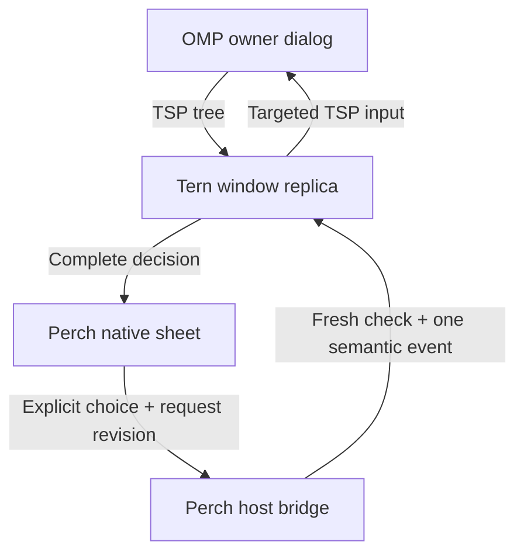

# Tern remote hosts and owner decisions

Research date: 2026-10-10. Examined the supplied Tern **0.6.0 (`0e39682`)**
Linux binary and its generated declarations, official Tern documentation, and
OMP **18.8.7** source at
[`b07a1c146d0d12cfc855a2c65d52f892ef319040`](https://github.com/can1357/oh-my-pi/tree/b07a1c146d0d12cfc855a2c65d52f892ef319040).

## What the current connection means

Perch 0.7 pairs with its workspace gateway. Its Tern source is a window plugin
and local HTTP bridge; it is not an implementation of Tern's native remote-host
transport. The plugin can see compatible agent panes on hosts already attached
to that Tern window. Tern explicitly documents that local window plugins apply
to remote panes as well as local ones. Closing that window removes the Perch
bridge even when the daemon keeps its programs alive. [T1][P1]

| Connection the user wants | Existing capability | Implementation boundary |
| --- | --- | --- |
| Phone → self-hosted Perch workspace → Tern window | Implemented in 0.7 | Pair the workspace, choose Tern, attach a pane. |
| Phone → existing Tern window → an already attached remote machine | Supported by the SDK window boundary | Enumerate agent panes without assuming a local pane id; display the actual host name from `cx.hosts:list()`. |
| Type `user@host` in Perch and connect through Tern's remote transport | Not implemented in Perch 0.7 | Requires a native transport client, or a new explicit operation on the host-side Tern window. |
| Phone connects while every Tern window is closed | Not implemented by this adapter | Window APIs are unavailable in a daemon-only plugin. |
| Answer tool approval and plan decisions through Collab relay | Not provided by this Perch adapter | Read the owner TSP decision and return its exact semantic event through the existing Tern bridge. |

The first, third, fourth and fifth rows describe this repository's boundaries,
not limitations of all possible Tern clients. [P1][P2]

## What Add remote host actually exposes

The binary's main help describes `tern remote` as a network service in front of
session daemons. Its subcommands include `serve`, `install`, `setup`, `trust`,
`host-key`, `hosts`, `discover`, and `doctor`. `setup` accepts an SSH destination;
`serve` has separate listen, access, authorized-key, relay, pkarr, and Iroh
options. These are evidence of a remote service and an SSH setup flow, not a
published mobile client transport specification. Do not describe the entire
connection as a raw SSH terminal solely because bootstrap can use SSH. [B1]

The supported window SDK already has a host lifecycle interface. [T2][B2]

| API | Exact purpose |
| --- | --- |
| `cx.hosts:list()` | Local and attached remote hosts, connection state, identity chain, measured RTT, and pane/session membership. |
| `cx.hosts:current()` | The current session's host. |
| `cx.hosts:add(address)` | Desktop asynchronous connection; address is `user@host:port` with user/port optional. Resolves on connection and fails on connection failure/disconnect. |
| `cx.hosts:trust(host, fingerprint)` | Pin the independently verified fingerprint currently presented by first contact. A mismatch is an error. |
| `cx.hosts:switch(host)` | Show the connected host's last session. |
| `cx.hosts:terminal(host, options)` | Open and focus a shell on that host; returns its pane id. |
| `cx.hosts:disconnect(host)` | Disconnect and forget a remote host while its programs keep running. The local host cannot be disconnected. |

First contact can remain in `verify` state. A host record includes
`detail.fingerprint`; adding a host does not silently trust it. A future Perch
Add host sheet must preserve this distinction and bind the user's confirmation
to the host address and fingerprint. Perch must not call `trust` merely because
an `add` request is pending. [T2][B2]

The documented remote scenario commands stage Add remote host, SSH setup
progress, tailnet peers, and SSH-config aliases for tests. They are not the
production network protocol. `remote loopback` is the useful exception for
verification: it attaches a real in-process daemon locally. Setting a staged
host to `connected` alone does not establish a working connection. [T3]

### Recommendation

Keep workspace pairing as the phone's access boundary. Show which Tern host
owns each pane using `ManagedHost.panes` membership. Adding an upstream Tern
host through `cx.hosts:add` can be a later, separate setup action. A direct
Android daemon client should wait for a supported remote transport contract;
the window SDK does not itself provide that contract. This is an architectural
recommendation based on the documented boundaries, not a claim that a direct
client is impossible. [T1][T2][B1]

## The owner decision path

TSP carries semantic component trees and input in the terminal stream. The
program owns input state and decision handlers; Tern renders the tree. A
window plugin can read that live tree with `cx.session:surface` and send a
specific event with `cx.session:event`. Neither operation requires a browser
distribution or the Collab relay. [T4][T5]

The shipped SDK's `surface` result is a capped `SurfaceTree`: surface identity
and role, plus `main`, `dock`, and `layer` roots. Nodes have `id`, `k`, optional
properties `p`, children `c`, and omitted-descendant count `more`. It can return
a retained surface when no live one exists; therefore role alone is insufficient
to authorize an answer. The adapter also requires a currently listed,
non-exited agent and the unchanged pane generation. [T5][B2][P2]

`surface` accepts `root`, node/depth limits, and `max_chars`. Reading the
`layer` and `dock` regions directly keeps a long transcript from consuming the
decision's node budget. The first implementation uses bounded reads and makes
incomplete or unsupported requests non-actionable. [T5][P2]

## Exact OMP controls

The shapes below come from the pinned upstream implementation and captured
installed OMP 18.8.7 runtime. The checkout and package have the same version
label but differ in some newer selector options; the captured runtime is the
execution evidence. These are not generic promises about every TSP program.
[O1][O2][O3][O5][P4]

| Owner control | Shape | Supported response |
| --- | --- | --- |
| Tool approval, normal picker | Hoisted `picker`, e.g. `s.^picker`; title/subtitle, `items` with ids `0`, `1`, labels `Approve`, `Deny`, confirm/close actions. | `activate` targeting that picker, with its raw picker item id. |
| Selector fallback | `omp.overlay.hook-select` card; component-qualified `list` and `item` ids. | `activate` targeting the exact list and full current item id. This adapter supports only the unfiltered, unmarked Approve/Deny pair without slider or countdown. |
| Plan review | `omp.overlay.planReview`; `omp.plan.body` Markdown sections; `omp.plan.options` list; optional `omp.plan.strategy` and separate `.sliderDetail` model text. | `activate` on the exact current plan option. Disabled choices remain disabled; the selected strategy and model detail are preserved in the request. |
| Plan annotations or an in-progress submission | Plan sheet with annotation editor/chooser or committed spinner. | Read-only; finish on the host. |
| Extension `ui.input` / `ui.editor` | Hook input/editor with native field reporting `sendable:false`. | No atomic remote answer in this pinned build. |

Tool approval is an owner UI select call in `ExtensionToolWrapper`: it offers
Approve and Deny, and only the exact Approve choice permits execution. The
remote bridge uses that existing decision; it does not modify approval policy
or mark a tool approved from a transcript notice. [O1]

Plan review offers the owner's current execution, context, refine, and save
choices. The option set and disabled indices can depend on host state. Selecting
Refine plan resolves the real plan review and leaves feedback to the normal
composer. Section annotation editing and strategy switching need additional
controls; a generic text answer cannot replace those state machines. [O2][O4]

The owner keeps plan options mounted while its existing-annotation chooser is
open. That state is indicated by `.chooser` / `.chooserHead`, distinct from the
`omp.plan.feedback` editor role. Both must block remote plan answers. OMP moves
a sole top-level plan heading into the sheet title; the body contains the
remaining Markdown sections. Complete presentation therefore includes both
title and body, not a claim of byte-identical reconstruction of the plan file.
[O2][P2]

### Request identity and stale responses

OMP's native reconciler assigns each component instance a monotonically
allocated base-36 id. Nested wire ids are based on that component plus its
key path. A new identical approval therefore has a different component id;
the title or the word Approve is never an adequate request identity. Unmounted
component bases are removed from native routing. [O3]

The Perch mapper keeps node ids and event details private. The phone receives
opaque request and revision identifiers plus a complete bounded presentation.
The host re-reads the decision in the same callback that prepares its event,
compares identity/revision, validates the enabled option, and reserves the
request before entering the effectful API. Pending, forwarded, and unknown
answers cannot be replayed with a fresh command id. A changed request revision
does not clear the consumed reservation for the same component. [P2]

There is a material remaining limit: OMP's TSP `activate` event has **no expected
document revision**. Its native router resolves the component and choice when
the event arrives. A fresh Tern read and event send are not an atomic
cross-process compare-and-resolve. If OMP changes a mounted plan between those
steps, the upstream protocol cannot reject solely on Perch's old document
revision. A strict owner transaction requires an upstream request id/revision
and acknowledged `answer` API. This limitation must remain explicit. [O3]

## Evidence and reproducibility

- Tern binary help and generated type declarations confirm that this beta has
  host lifecycle, `surface`, and `event` APIs. [B1][B2]
- The production plugin's actual-beta regression covers its existing catalog,
  transcript, atomic Unicode prompt, reconnect, and interruption path. [P3]
- The installed OMP verifier drives real InteractiveMode decisions with an
  in-memory mock provider and an inert fixture tool. It verifies that Deny
  prevents execution, Approve executes the fixture once, a stale component id
  cannot answer a replacement approval, and Refine plan uses the owner handler.
  Its terminal recorder is not a Tern binary or a physical device. [P4]
- Full bridge/production-plugin results and any actual Tern + OMP chain checks
  are recorded separately in [the Tern verification notes](../server/tern-remote/VERIFICATION.md).
- The complete actual Tern + installed OMP chain passed through the production
  plugin and bridge: Deny, a replacement Approve, plan Refine, a separate Unicode
  feedback prompt, and approval to continue in the original process/session.
  It uses six mock-provider calls and no paid provider. Some software-rendered
  retries hit the beta's 50 ms plugin callback budget; the verification notes
  retain that limitation. [P5]

## Sources

- [T1: Tern architecture](https://docs.stencil.so/tern/concepts/architecture.html)
- [T2: Tern window API — sessions and hosts](https://docs.stencil.so/tern/reference/api-window.html#sessions-and-hosts-cx)
- [T3: Tern remote-host scenarios](https://docs.stencil.so/tern/scripts/remote.html)
- [T4: Tern Surface Protocol](https://docs.stencil.so/tern/protocol/index.html)
- [T5: Tern window API — pane reads and trees](https://docs.stencil.so/tern/reference/api-window.html#pane-reads-and-trees)
- [T6: Tern input and events](https://docs.stencil.so/tern/protocol/input.html)
- B1: supplied Tern 0.6.0 executable, `tern --help` and `tern remote --help`,
  inspected 2026-10-10. No beta binary is bundled in this repository.
- B2: that executable's `tern plugin types` output, `SurfaceOpts`, `SurfaceTree`,
  `HostsCx`, `ManagedHost`, `SessionCx`; artifact fingerprint recorded in
  [verification](../server/tern-remote/VERIFICATION.md).
- [O1: OMP tool approval wrapper](https://github.com/can1357/oh-my-pi/blob/b07a1c146d0d12cfc855a2c65d52f892ef319040/packages/coding-agent/src/extensibility/extensions/wrapper.ts)
- [O2: OMP plan review overlay](https://github.com/can1357/oh-my-pi/blob/b07a1c146d0d12cfc855a2c65d52f892ef319040/packages/tui/src/overlays/plan-review-overlay.ts)
- [O3: OMP native reconciler](https://github.com/can1357/oh-my-pi/blob/b07a1c146d0d12cfc855a2c65d52f892ef319040/packages/tui/src/native/reconcile.ts)
  and [native event router](https://github.com/can1357/oh-my-pi/blob/b07a1c146d0d12cfc855a2c65d52f892ef319040/packages/tui/src/native/backend.ts)
- [O4: OMP InteractiveMode](https://github.com/can1357/oh-my-pi/blob/b07a1c146d0d12cfc855a2c65d52f892ef319040/packages/coding-agent/src/modes/interactive-mode.ts)
- [O5: OMP hook selector](https://github.com/can1357/oh-my-pi/blob/b07a1c146d0d12cfc855a2c65d52f892ef319040/packages/tui/src/overlays/hook-selector.ts)
- [P1: Perch remote workspace design](REMOTE-WORKSPACE-DESIGN.md)
- [P2: Perch semantic request mapper](../server/tern-remote/plugin/requests.luau),
  [window plugin](../server/tern-remote/plugin/window.luau), and
  [bridge](../server/tern-remote/bridge.mjs)
- [P3: Perch actual-beta verifier](../server/tern-remote/test/verify-tern.mjs)
- [P4: Installed OMP owner-request verifier](../server/tern-remote/test/verify-omp-owner-requests.mjs)
- [P5: Actual Tern and OMP owner-request chain](../server/tern-remote/test/verify-tern-omp-owner.mjs)
