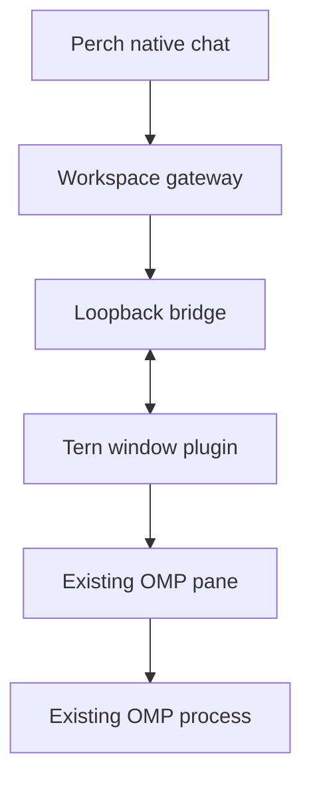

# Tern remote sessions

This adapter lets Perch discover and attach to an **existing OMP pane in Tern**.
It reads Tern's structured conversation view and sends a prompt through the
native composer. The phone uses the same process as the desktop window.

The implementation uses a Tern window plugin and a small loopback bridge. It
does not require `tern web serve` or its missing web distribution. It does not
expose Tern's general `ctl` endpoint to the phone.

## What the first slice provides

| Action | Behavior |
| --- | --- |
| Browse | Lists up to 32 agent panes in each of up to eight Tern windows |
| Attach | Reads a bounded structured transcript from the selected pane |
| Send | Calls `cx.agents:ask` once while the native OMP composer is ready |
| Interrupt | Calls `cx.agents:interrupt`, leaving the program alive |
| Reconnect | Reads current host state; never resubmits a command |
| Artifact reading | Existing Perch readers derive documents/code from the supplied conversation text |

The plugin currently inspects one pane per window at a time. Multiple windows
have separate registrations, opaque session IDs, generations, command routes,
and read targets. Selecting a pane on the phone does not focus or rearrange it on
the desktop. The catalog contains agent panes, not every file, terminal, browser,
or database block Tern supports.

## Host setup

Requirements: Bun 1.4.2 or newer, a desktop Tern build with the documented
`cx.agents` API, and OMP using its native TSP surface. The user's supplied
**Tern 0.6.0 (`0e39682`)** exposes the required methods. We do not redistribute
the closed beta binary.

Run these commands from the Perch checkout on the machine showing the Tern window:

```sh
bun server/tern-remote/setup.mjs
tern plugin link "$HOME/.config/perch/tern-plugin"
bun server/tern-remote/index.mjs
```

Setup retains existing credentials when run again. It creates:

| File | Purpose |
| --- | --- |
| `~/.config/perch/tern-remote.json` | Private bridge configuration and two separate credentials |
| `~/.config/perch/tern-plugin/plugin.toml` | Our Tern plugin manifest |
| `~/.config/perch/tern-plugin/window.luau` | Our plugin implementation |
| `~/.config/perch/tern-plugin/connection.json` | Private loopback URL and plugin credential |

The bridge binds only `127.0.0.1:4782`. The existing Perch workspace gateway
authenticates the phone and forwards the allowed remote-session routes. Add a
Tern remote source with the workspace host setup; its local upstream is
`http://127.0.0.1:4782` and its adapter credential is `token` from the private
bridge config. `pluginToken` is only for the local Tern plugin. Model/provider
credentials remain in the existing OMP process.

Keep the configured Tern window open. Link or reload the plugin, then start OMP
in any ordinary Tern shell pane, or use an existing compatible OMP pane. Return
to its conversation view if a modal screen hides the native composer.

Custom locations are supported:

```sh
bun server/tern-remote/setup.mjs --config /private/perch/tern.json --plugin-dir /private/perch/tern-plugin
bun server/tern-remote/index.mjs --config /private/perch/tern.json
```

The config and connection file must be regular files owned by the current user.
Setup uses mode `0600`, refuses final-component symlinks, and rejects secret
paths inside the Perch checkout, including through linked directories. The
bridge rejects HTTP requests carrying a browser `Origin`; browser clients use
the authenticated workspace gateway. If the machine uses an HTTP proxy,
its `NO_PROXY` setting must include `127.0.0.1` because Tern honors proxy settings.
`readOnly: true` in the bridge config disables both mutations.

## Ownership and recovery



The bridge owns connection state, a bounded snapshot, and command receipts.
Tern and OMP own the live process and conversation. Each registration gets a
fresh bridge UUID. Every pane ID is scoped to that UUID. Window command-start,
command-finish, and pane-close events invalidate the pane's incarnation so a
quick program replacement does not inherit a pending command.

The private plugin protocol posts an ordered snapshot exchange about every
750 ms. The loopback server holds each response for that interval, and the
plugin chains fetch callbacks. Each exchange can return at most one new command. A fetched command is
never returned again, even if its HTTP response or callback receipt is lost.
An exchange failure starts a fresh plugin registration. A silent registration
expires after ten seconds.

| Event | Outcome |
| --- | --- |
| Phone loses its socket or closes | The existing agent continues; a later attach reads a fresh snapshot |
| Tern window closes | Its registration expires; the daemon may keep its programs alive |
| Plugin reload or transport failure | A new registration gets new IDs; pending old commands are not transferred |
| Command expires before delivery | Receipt is `rejected` |
| Command was fetched but no receipt arrives | Receipt is `unknown`; inspect the host before an intentional retry |
| Tern API throws during invocation | Receipt is `unknown`; the failure does not prove the call had no effect |
| Tern API returned without error | Receipt is `forwarded`, which does not prove a completed model turn |
| Bridge process restarts | New host epoch; in-memory receipts are lost; no automatic command recovery |
| OMP or its host crashes | This adapter supplies no execution checkpoint or automatic restart |

Command IDs are retained for the bridge process's lifetime. Repeating an ID with
the same input reads its receipt; different input is rejected. The ledger stops
accepting new IDs at **1,024**, without evicting older identities. Prompt bodies
are discarded after delivery or rejection; receipt fingerprints are hashes.

### The prompt guard matters

The beta's `cx.agents:ask` can queue a prompt until its composer becomes ready.
That queue may survive a plugin VM reload. Perch checks the live `omp.session`
dock for an editable composer beneath the normal **`omp.editor`** wrapper with
**`sendable: true`**, then calls `ask` in the same synchronous callback. The
wrapper check excludes shell/Python composers and unrelated modal inputs. If
that check fails, Perch rejects the prompt. It
does not use Tern's waiting queue. Tern still performs its own native-protocol
validation, including the OMP program's support for atomic `send`.

## Snapshot and identity limits

`cx.agents:transcript` supplies rendered user/assistant text and tool summaries.
It does **not** supply canonical OMP entry IDs, timestamps, or its session-file
identity. The adapter therefore omits `conversationId`, uses `createdAt: 0` for
unknown timestamps, and labels its limitation in each snapshot. Its runtime
identity names the window's pane incarnation, not a verified OS process ID.
Changing OMP's conversation within the same live process is not identified as
a separate canonical conversation by this adapter. Use the OMP in-process
adapter for that stronger identity and model control.

The plugin reads at most 64 recent messages, 64 tools per message, 64,000 bytes
per message, 8,000 bytes per tool output, and 160,000 combined text bytes per
snapshot. UTF-8 is clipped at code-point boundaries. Capped snapshots carry a
notice. A bounded identity matcher keeps IDs for unique unchanged rows and for
a growing final assistant row anchored by the same preceding row. A shifted
tail retains its identifiable rows; new or ambiguous rows receive new IDs.
Tool identities use their enclosing row and name/target. These are view
identities, not permanent OMP history IDs; an ambiguous conversation reset can
still require reopening an artifact.

An unavailable composer or an incomplete capped surface disables sending. This
is a conservative readiness check, not a complete renderer or a guarantee that
every OMP screen is supported. Native approval sheets, model selection, session
branching, tool-input artifacts, file fetches, arbitrary TSP widgets, and a real
terminal view remain separate work. Host transcripts can be much larger than
the preview and are not edited by this adapter.

## Verification

The ordinary HTTP tests require no Tern install, provider credentials, or model:

```sh
bun test server/tern-remote/test/bridge.test.mjs
```

The recorded run passed **16 tests and 133 assertions**. They use the actual
shared native protocol parsers and check authentication, browser-origin
rejection, same-ID receipts, lost replies, uncertain invocation, stale
generations, multiple windows, artifact identity continuity, read-only access,
readiness, input bounds, ledger exhaustion, and private setup files.

The optional real-binary check uses Tern's **documented deterministic headless
fixture mode**, our unchanged plugin, and a small synthetic program speaking
TSP through a real PTY:

```sh
TERN_BIN=/path/to/tern bun server/tern-remote/test/verify-tern.mjs
```

The supplied **Tern 0.6.0 (`0e39682`) passed this check on 2026-10-10** with the
production plugin. It discovered the existing synthetic conversation, delivered
one Unicode prompt to the same PTY process, read the updated transcript, avoided
replay after reconnect, rejected a non-ready composer, and interrupted without
exiting the child. See [VERIFICATION.md](VERIFICATION.md) for the exact scope and
binary fingerprints, and [verification-results.json](verification-results.json)
for the recorded machine-readable result.

The check creates temporary state, uses software rendering, and never opens the user's
saved Tern workspace or invokes a model. Its control endpoint is restricted to
this local test. This qualifies the installed beta's Luau callbacks and TSP
interaction; it is not evidence of a restored desktop, a real OMP model turn,
or a physical Android run.

## Sources checked

- Generated type declarations from the supplied Tern 0.6.0 (`0e39682`) binary,
  obtained with `tern plugin types`.
- [Window API and agent methods](https://docs.stencil.so/tern/reference/api-window.html).
- [Shared plugin API: callback context, JSON, timers, and HTTP](https://docs.stencil.so/tern/reference/api-shared.html).
- [Plugin manifest](https://docs.stencil.so/tern/reference/manifest.html).
- [Tern scripts and deterministic fixture behavior](https://docs.stencil.so/tern/scripts/index.html).
- [OMP TSP implementation at the researched source revision](https://github.com/can1357/oh-my-pi/tree/b07a1c146d0d12cfc855a2c65d52f892ef319040/packages/tui/src/native).
- [The Perch remote workspace design](../../docs/REMOTE-WORKSPACE-DESIGN.md).
